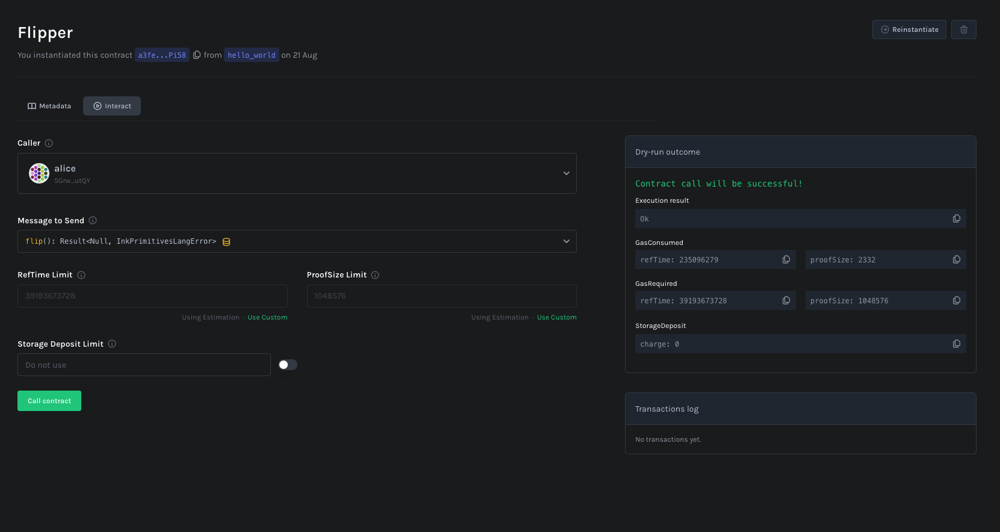

# Deploy and Interact with Contracts

## Build

Inside the directory of your projects, build the contract:

```bash
cargo contract build --release
```

Check out the [ink! documentation](https://use.ink/getting-started/building-your-contract) for detailed information on the build process and the build artifacts.

## Deploy the contract

We will use the `//Alice` signer as a default account to deploy contracts. The `Alice` account is a pre-defined and pre-funded account.

### Deploy it via the UI

- Go to [the contracts UI](https://contracts-ui.substrate.io/?rpc=ws://127.0.0.1:9944)
- Click "Upload a new contract"
- Select a name for your contract
- Upload the contract bundle, e.g., `hello_world.contract`
- Click "Next"
- Click "Upload and instantiate"

### Deploy it via the CLI

Deploy and instantiate the contract to the local testnet:

```bash
cargo contract upload --suri //Alice
cargo contract instantiate --suri //Alice --args <your-args>
```

Check out the [ink! tutorial](https://use.ink/getting-started/deploy-your-contract) for more details.

### Success

You should now see the deployed contract.



## Interact

The instantiation process returns the contract address. You can use this address to interact with the contract.

Interactions with contracts can be either be reads on the contract state or writes that trigger a state transition.

- Reads: Free calls that do not require a transaction. They are executed locally and do not change the state of the contract.
- Writes: Calls that require a transaction. They are executed on the network and change the state of the contract.

### Interact via the UI

- Go to [the contracts UI](https://contracts-ui.substrate.io/?rpc=ws://127.0.0.1:9944)
- You should see the deployed contracts in the left-hand navigation
- Click on the contract you want to interact with

### Interact via the CLI

Interact with the contract on the local testnet:

```bash
cargo contract call --contract <address> --message <function_name> --suri //Alice
```
