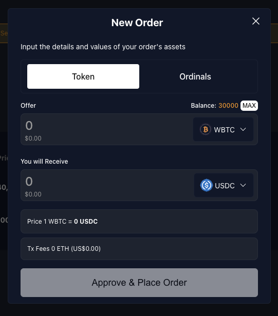
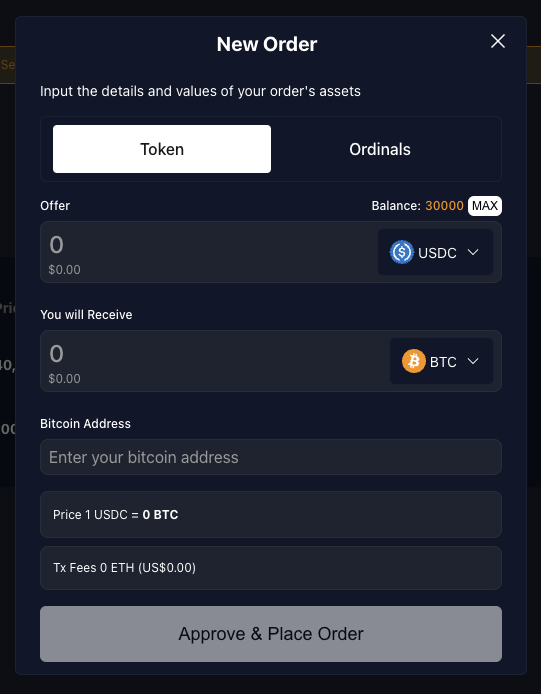
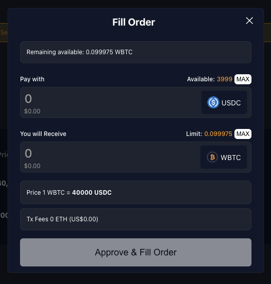
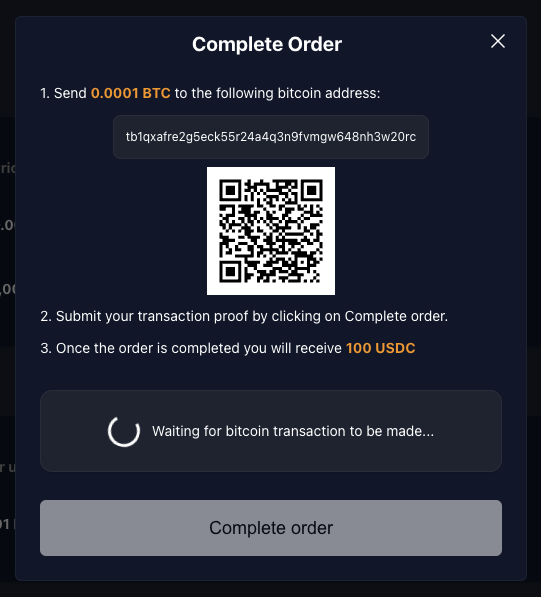

# Trustless P2P Swap BTC and ERC20 using a BTC Light Client

This example demonstrates how BOB is leveraged to build a peer-to-peer (P2P) swap application that allows two parties to swap ERC20 tokens, BTC and Ordinals without using a custodian.

:::info Example Code

You can find the code for this example [in the P2P swap demo GitHub repository](https://github.com/bob-collective/demo-p2p-swap/releases/tag/v0.0.1).

:::

## Demo

:::info Example Code

This demo is running on our [Alpha network](https://app.conduit.xyz/published/view/fluffy-bob-7mjgi9pmtg).

:::

We have created a testnet demo of the P2P swap, allowing anyone to swap BTC for ERC20 tokens, ERC20 tokens for BTC, exchange one ERC20 token for another and swap Ordinals for ERC20 tokens. The application currently supports testnet BTC, testnet USDC, and WBTC (WBTC is a placeholder for an arbitrary bridged BTC token).

## Connecting Your Wallets

The dapps supports a dual wallet connect: where you should be able to connect an EVM wallet and a BTC wallet.

- EVM Wallet: it is mandatory to install this type of wallet. Without it you won't be able to use the dapp.
- BTC Wallet: it is not mandatory, but the UX experience will drastically improve when it comes to swaping ordinals.

### Connecting EVM Wallet

:::note

When connecting to our test network the gas token ticker may be shown as something other than ETH. This can be changed to ETH in the network settings of your wallet.

:::

:::note

The UI can sometimes fail to connect if you have multiple wallets installed. If this happens you should disable all wallet extensions other than the one you want to use for the demo.

:::

- Install one of the supported EVM wallets (Metamask, Ledger, WalletConnect or Coinbase Wallet).
- Go to [demo.gobob.xyz](https://demo.gobob.xyz)
- Click 'Connect Wallet' button at the top right of the UI.
- Within the 'EVM Wallet' tab, select one of the available wallets.


#### Connecting BTC Wallet

- Install one of the supported BTC wallets (XVerse, Unisat, Leather - coming soon).
- Go to [demo.gobob.xyz](https://demo.gobob.xyz)
- Click 'Connect Wallet' button at the top right of the UI.
- Within the 'BTC Wallet' tab, select one of the available wallets.


### Creating and Funding Test Accounts

### Funding EVM Wallet

You will need two accounts for this demo, so you can try the whole flow of creating and fulfilling orders. For each account:

- Click the 'Get Gas' button to fund your account with ETH. This will be needed for transaction fees.
- After the ETH tokens have arrived in your wallet, click on the 'Get Tokens' button to fund your account with ERC20 tokens to used when adding an order.
- Import the ERC20 tokens from the following contract addresses:
  - WBTC: `0x2868d708e442A6a940670d26100036d426F1e16b`
  - USDC: `0x27c3321E40f039d10D5FF831F528C9CEAE601B1d`

:::note

The faucet is configured to mint 30,000 tokens for each currency. If you want to create orders for more than this amount, the faucet can be called multiple times.

:::

#### Known Issues

- If you have connected your wallet to an earlier version of the application, you may see an error (`No chain was provided to the request`). If this happen you should disconnect and then reconnect your wallet.
- ETH tokens need to be minted first, as ETH is required to pay the transaction fees for minting ERC20s.

### Funding BTC Wallet

#### Testnet BTC

For orders where BTC is being swapped, you will need first to fund you wallet and you can do so by using [Bitcoin testnet faucet](https://bitcoinfaucet.uo1.net/).

#### Testnet Ordinals

If you want to try swapping ordinals, you will need to inscribe them first. There are many ways to do so, such as:

- [Metamask Ordinals Demo](https://ordinals.gobob.xyz/): in-house developed demo which uses metamask snap to inscribe ordinals.
- [Testnet Unisat](https://testnet.unisat.io/inscribe): to use this dapp you will need unisat wallet.

:::note

You will need to fund your account first before inscribing.

:::

## Creating a Token Order

At the moment, you are able to create orders for tokens (such as swapping BTC for USDC). In this next section, we will try to walk you through the flow of creating these orders.

- Click on the 'Add an order' button.
  - You should be able to see a 'New Order' modal, where the tabs have 'Token' tab selected by default.
- Select the tokens you want to offer and receive
  - If creating an order to swap to BTC, you will need to add a valid Bitcoin testnet address.
- Click on 'Approve & place order'
  - The first time you create an order with each token, you will be prompted to approve a spending cap before you can submit the transaction. You will only need to do this once. There is no need to submit the form twice: as soon as the spending cap transaction has completed you'll be prompted to sign the order transaction.

You can see all the orders you have placed by clicking on the page 'Sell' tab. Orders listed under the 'Buy' tab are available for you to fulfil.




:::note

Orders are shown with a price per unit even though BTC orders cannot be partially filled. That means that if you offer 1 BTC in exchange for 25,000 USDC, you will see a price per unit of 0.00004 in 'Sell' table

:::

## Filling a Token Order

:::note

Partial fulfillment of orders is only available for swaps involving two ERC20 tokens. Swaps involving BTC can only be fulfilled in full.

:::

:::note

BTC testnet block target times are 20 minutes, so it may take several minutes before you can complete the transaction.

:::

The process for fulfilling an order is slightly different depending on whether you are swapping an ERC20 for another ERC20, or for BTC.

### Filling an ERC20 <-> ERC20 Order

We will be looking at swapping ERC20 tokens:

- Switch to the account you created for fulfilling orders.
- In the 'Buy' table find the order you created in the previous step
- Click on the 'Fulfil order' button, and enter the amount you wish to fulfil.
- You will be prompted to sign the transaction in your wallet.

If you now switch back to the account you used to create the order, you will see that amount available has decreased. If the order has been fulfilled completely, it will no longer be shown under the 'Sell' tab.



### Filling and Completing a ERC20 -> BTC order (i.e., buying BTC)

#### Filling order

- Switch to the account you created for fulfilling orders.
- In the 'Buy' table find the swap you created with your selling account offering BTC (as the seller) in exchange for an ERC20.
- Click on 'Fill Order.' The 'Pay with' and 'You will receive' fields are non-editable.
- Enter a valid testnet BTC address.
- Submit the form.


After successfully fulfilling the order, you should be able to see your accepted order in the "Accepted BTC Orders" table. In this table, there is column with a countdown, which shows you how long the other party has to send you ordered BTC amount. Once the timer reaches 0, you will be able to cancel the order. This does not happen automatically: the other party will still be able to send the BTC unless you cancel the order. Let's now look at how the order is completed.

#### Complete order

- Switch back to your selling account.
- Go to the page 'Sell' tab and now you should be able to see the order to be completed under the 'Accepted BTC Orders'.
- Once you find your order, click on the 'Complete Order' button. A 'Complete Order' modal should be visible.
- Using a BTC wallet connected to the BTC testnet, send the BTC amount to the address shown. You can scan the QR code to use a mobile wallet.
- You will be able to complete the order as soon as one confirmation has been received.
  - If you close the modal or navigate away from the app, clicking on the 'Complete Order' button again will show you the current status of the transaction.



### Filling and Completing a BTC -> ERC20 order (i.e., selling BTC)

#### Filling order

- Switch to the account you created for fulfilling orders.
- In the 'Buy' table find the swap you created with your selling account offering an ERC20 token (as the seller) in exchange for BTC.
- Click on 'Fill Order.' The 'Pay with' and 'You will receive' fields are non-editable.
- Submit the form.


After successfully filling the order a 'Complete Order' modal will show automatically. In case you close this modal, you should be able to return to it by going to your order under the 'Accepted BTC Orders' table and clicking the 'Complete Order' button.

#### Complete order

- Using a BTC wallet connected to the BTC testnet, send the BTC amount to the address shown. You can scan the QR code to use a mobile wallet.
- You will be able to complete the order as soon as one confirmation has been received.
  - If you close the modal or navigate away from the app, clicking on the 'Complete Order' button again will show you the current status of the transaction.

If you switch back to your selling account before completing the order, you will see the order in the 'Accepted BTC Orders' table under the 'Sell' tab. If the order is not completed by the buyer within the allowed time, you will be able to cancel the order.


## Demo Code

### The Contract

The contract that this example uses can be found in `src/swap/Btc_Marketplace.sol`. Example usage can be seen in its tests in `test/swap/Btc_Marketplace.t.sol`. The contract is a work in progress, with some Bitcoin-related parts being mocked. Its usage is as follows:

#### Buying BTC

- Alice calls `placeBtcBuyOrder` and specifies amounts and a Bitcoin address.
- Bob calls `acceptBtcBuyOrder`
- Bob makes the Bitcoin transfer
- Bob calls `proofBtcBuyOrder`, or Alice can call `cancelAcceptedBtcBuyOrder` after a timeout.

#### Selling BTC

- Alice calls `placeBtcSellOrder` specifying the amounts
- Bob calls `acceptBtcSellOrder` and specifies a Bitcoin address
- Alice calls `proofBtcSellOrder`, or Bob can call `cancelAcceptedBtcSellOrder`

For both buying and selling orders, if the order has not yet been accepted, Alice can withdraw the request using `withdrawBtcSellOrder`/`withdrawBtcBuyOrder`.

### Set up a Local Environment

1. Clone [https://github.com/bob-collective/bob](https://github.com/bob-collective/bob)
2. Install [Docker](https://www.docker.com)
3. Run `docker-compose up`
4. Verify that Regtest and Electrum are running by checking for the latest blocks at [http://localhost:3002/blocks](http://localhost:3002/blocks)
5. Add BOB L2 testnet to your EVM wallet and fund it with ETH using [Conduit](https://app.conduit.xyz/published/view/fluffy-bob-7mjgi9pmtg)

An example application can be found at [https://github.com/bob-collective/bob-ui-poc](https://github.com/bob-collective/bob-ui-poc). This has been built using [Viem](https://viem.sh/), [Wagmi](https://wagmi.sh/), React and Typescript, but you can interact with the smart contract using your preferred tools and frameworks.

### Funding Your Wallet with ERC20 Tokens

This can be done using the faucet buttons as described in the [Creating and Funding Test Accounts](#creating-and-funding-test-accounts) above.

#### Getting the Smart Contract ABIs in the UI

This is done using a React hook which extends Viem's `getContract` method. This allows contract member types to be inferred, rather than respecified in the application.

```ts
import { getContract } from "viem";
import { usePublicClient, useWalletClient } from "wagmi";
import { contracts, ContractType } from "../constants";
import { useMemo } from "react";

// Wrapper around ethers Contract to automatically get contract types
// with read and write objects automatically constructed from provider and signer.
const useContract = (contractType: ContractType) => {
  const publicClient = usePublicClient();
  const { data: walletClient } = useWalletClient();

  return useMemo(() => {
    const { address, abi } = contracts[contractType];

    return getContract({
      address,
      abi,
      publicClient,
      walletClient: walletClient ?? undefined,
    });
  }, [walletClient, publicClient, contractType]);
};

export { useContract };
```

This can then be called in the application:

```ts
// contracts/config.ts
const contracts = {
  [ContractType.BTC_MARKETPLACE]: {
    address: "0xd6cd079ee8bc26b5000a5e1ea8d434c840e3434b",
    abi: BtcMarketplaceAbi,
  },
} as const;

// App.tsx
const { read: readBtcMarketplace, write: writeBtcMarketplace } = useContract(
  ContractType.BTC_MARKETPLACE
);
```
