import Tabs from "@theme/Tabs";
import TabItem from "@theme/TabItem";
import SellOrdinalConnectedImageUrl from "./add-sell-ordinal-connected-order-form.png";
import SellOrdinalDisconnectedImageUrl from "./add-sell-ordinal-disconnected-order-form.png";

# Trustless P2P Swap BTC and ERC20 using a BTC Light Client

This example demonstrates how BOB is leveraged to build a peer-to-peer (P2P) swap application that allows two parties to swap ERC20 tokens, BTC and Ordinals without using a custodian.

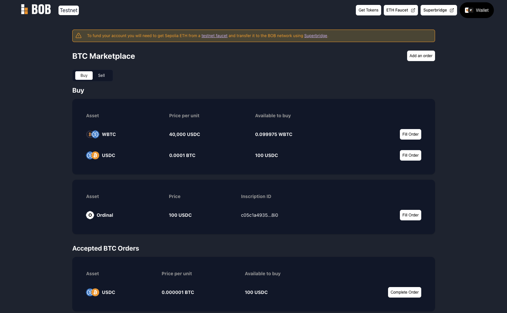

:::info Example Code

You can find the code for this example [in the P2P swap demo GitHub repository](https://github.com/bob-collective/demo-p2p-swap/releases/tag/v0.0.1).

:::

## Demo

:::info Example Code

This demo is running on our [Alpha network](https://app.conduit.xyz/published/view/fluffy-bob-7mjgi9pmtg).

:::

We have created a testnet demo of the P2P swap, allowing anyone to swap BTC for ERC20 tokens, ERC20 tokens for BTC, exchange one ERC20 token for another and swap Ordinals for ERC20 tokens. The application currently supports testnet BTC, testnet USDC, and WBTC (WBTC is a placeholder for an arbitrary bridged BTC token).

## Connecting Dual Wallets

The demo supports connecting dual wallets, which means that you should be able to connect an EVM wallet and a BTC wallet at the same time.

- EVM Wallet: it is mandatory to install this type of wallet. Without it you won't be able to try the demo.
- BTC Wallet: it is not mandatory, but the UX experience will drastically improve when it comes to swapping ordinals.

### Connecting EVM Wallet

:::note

When connecting to our test network the gas token ticker may be shown as something other than ETH. This can be changed to ETH in the network settings of your wallet.

:::

:::note

The UI can sometimes fail to connect if you have multiple wallets installed. If this happens you should disable all wallet extensions other than the one you want to use for the demo.

:::

- Install one of the supported EVM wallets (Metamask, Ledger, WalletConnect or Coinbase Wallet).
- Go to [demo.gobob.xyz](https://demo.gobob.xyz)
- Click 'Connect Wallet' button at the top right of the UI.
- Within the 'EVM Wallet' tab, select one of the available wallets.

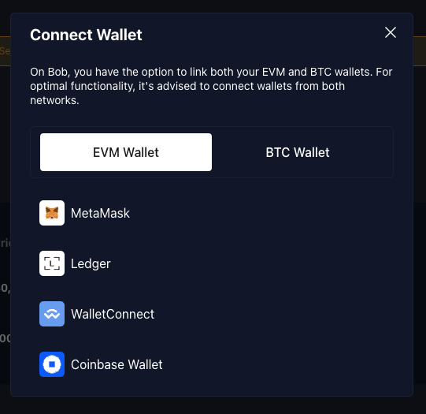

### Connecting BTC Wallet

- Install one of the supported BTC wallets (XVerse, Unisat, Leather - coming soon).
- Go to [demo.gobob.xyz](https://demo.gobob.xyz)
- Click 'Connect Wallet' button at the top right of the UI.
- Within the 'BTC Wallet' tab, select one of the available wallets.

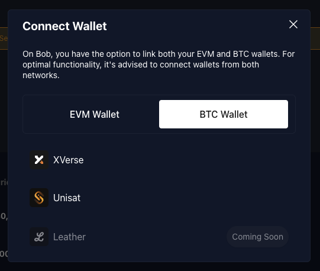

## Creating and Funding Test Accounts

### Funding EVM Wallet

You will need two accounts for this demo, so you can try the whole flow of creating and fulfilling orders. For each account:

- Click the 'Get Gas' button to fund your account with ETH. This will be needed for transaction fees.
- After the ETH tokens have arrived in your wallet, click on the 'Get Tokens' button to fund your account with ERC20 tokens to used when adding an order.
- Import the ERC20 tokens from the following contract addresses:
  - WBTC: `0x2868d708e442A6a940670d26100036d426F1e16b`
  - USDC: `0x27c3321E40f039d10D5FF831F528C9CEAE601B1d`

:::note

The faucet is configured to mint 30,000 tokens for each currency. If you want to create orders for more than this amount, the faucet can be called multiple times.

:::

#### Known Issues

- If you have connected your wallet to an earlier version of the application, you may see an error (`No chain was provided to the request`). If this happen you should disconnect and then reconnect your wallet.
- ETH tokens need to be minted first, as ETH is required to pay the transaction fees for minting ERC20s.

### Funding BTC Wallet

#### Testnet BTC

For orders where BTC is being swapped, you will need first to fund you wallet and you can do so by using [Bitcoin testnet faucet](https://bitcoinfaucet.uo1.net/).

#### Testnet Ordinals

If you want to try swapping ordinals, you will need to inscribe them first. There are many ways to do so, such as:

- [Metamask Ordinals Demo](https://ordinals.gobob.xyz/): in-house developed demo which uses metamask snap to inscribe ordinals.
- [Testnet Unisat](https://testnet.unisat.io/inscribe): to use this dapp you will need unisat wallet.

:::note

You will need to fund your account first before inscribing.

:::

## Token Order

These are the different kinds of token swaps that a user can do:

- ERC20 → ERC20: sell ERC20 for ERC20 (swapping ERC20)
- ERC20 → BTC: sell ERC20 for BTC (buying BTC)
- BTC → ERC20: sell BTC for ERC20 (selling BTC)

The peer-to-peer swap is divided into three steps:

- Creating order
- Filling order
- Completing order (excluded on ERC20 → ERC20 order)

Let's now go through each step for each different swap type.

### ERC20 → ERC20 (swaping ERC20)

#### Creating Order

These are the steps to create ERC20 → ERC20 order:

- On the top right of the main page, click on the 'Add an order' button.
- A modal with a 'New Order' title should be visible. Within this modal, you should be on the 'Token' tab.
- This tab contains two inputs: 'Offer' and 'You will receive'. Please select the ERC20 tokens that you wish to pay with and receive, along with the respective amounts.
- Once you fill in the previous fields, you should now be able to submit:
  - if you never approved a spending cap for your "Offer" ERC20 token, when clicking the 'Approve & Place Order' button, a transaction will be prompted for you to do so and one last to approve the creation of the order.
  - if have already approved the spending cap, when clicking 'Place Order' button, a transaction for the create order approval will be prompted.
- Once everything is approved, by going to the 'Sell' tab on the main page, you should be able to see your newly created ERC20 → ERC20 order.

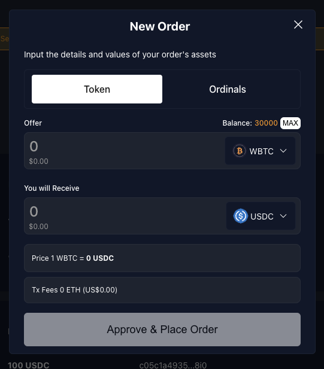

:::note

Orders are shown with a price per unit even though BTC orders cannot be partially filled. That means that if you offer 1 BTC in exchange for 25,000 USDC, you will see a price per unit of 0.00004 in 'Sell' table

:::

#### Filling Order

These are the steps to fill ERC20 → ERC20 order:

- Switch to the account you created for fulfilling orders.
- In the 'Buy' table find the order you created previously.
- Click on the 'Fill Order' button, and enter the amount you wish to fill (total or partial).
- You will be prompted to sign the transaction in your wallet.
- Once the transaction is successful, the order will disappear because it was completed successfully. You will notice that the involved accounts balances were affected.

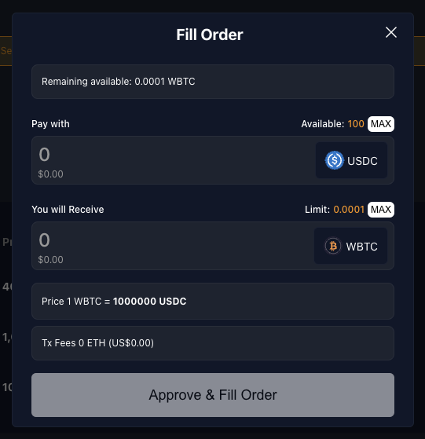

### ERC20 → BTC (buying BTC)

#### Creating Order

These are the steps to create ERC20 → BTC order:

- On the top right of the main page, click on the 'Add an order' button.
- A modal with a 'New Order' title should be visible. Within this modal, you should be on the 'Token' tab.
- This tab contains two inputs: 'Offer' and 'You will receive'. Please select the ERC20 tokens that you wish to pay with and BTC as a token to be received, along with the respective amounts.
- Lastly, you may also fill the "Bitcoin Address" field with a Testnet Bitcoin Wallet address, in which you desire to receive the BTC.
- Once you fill in the previous fields, you should now be able to submit:
  - if you never approved a spending cap for your "Offer" ERC20 token, when clicking the 'Approve & Place Order' button, a transaction will be prompted for you to do so and one last to approve the creation of the order.
  - if have already approved the spending cap, when clicking 'Place Order' button, a transaction for the create order approval will be prompted.
- Once everything is approved, by going to the 'Sell' tab on the main page, you should be able to see your newly created ERC20 → BTC order.

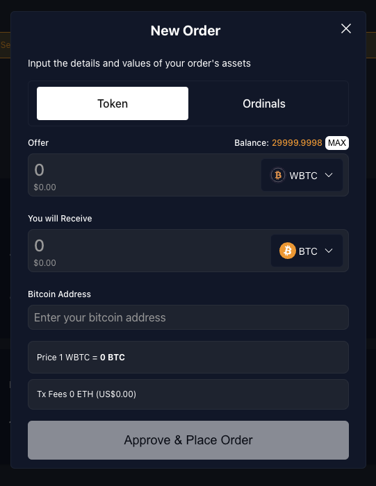

#### Filling Order

These are the steps to fill ERC20 → BTC order:

- Switch to the account you created for fulfilling orders.
- In the 'Buy' table find the order you created previously.
- Click on the 'Fill Order' button. This will open a modal with the title 'Fill Order'.
- Orders that involve BTC, are not allowed to be partially filled like ERC20 orders. So you should be able to submit by clicking 'Fill Order'.
- You will be prompted to sign the transaction in your wallet.
- Once the transaction is successful, you will be able to see the accepted order under 'Accepted BTC Orders' table.
  - In this table, there is a column with a countdown, which shows you how long the other party has to send you the ordered BTC amount. Once the timer reaches 0, you will be able to cancel the order. This does not happen automatically: the other party will still be able to send the BTC unless you cancel the order. Let's now look at how the order is completed.

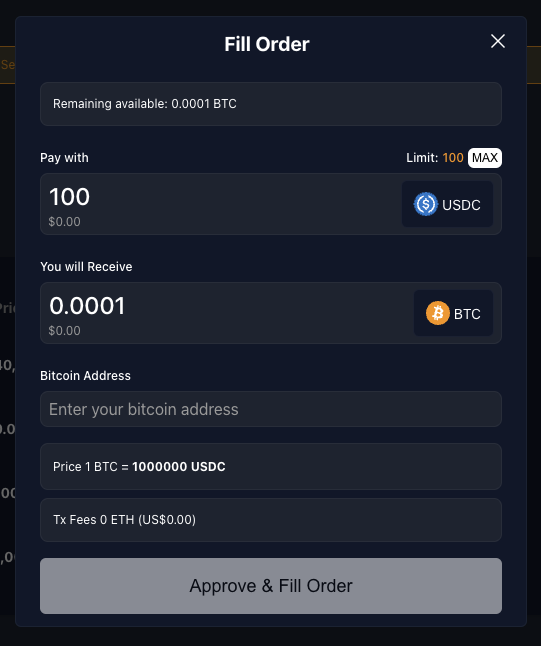

:::note

Partial fulfillment of orders is only available for swaps involving two ERC20 tokens. Swaps involving BTC can only be fulfilled in full.

:::

In the next section, we will look at completing this order.

#### Completing Order

These are the steps to complete ERC20 → BTC order:

- Still in the account used to fill the order, find your order under "Accepted BTC Orders" table.
- Once you find the order, click on the 'Complete Order' button. This will open a modal with the title 'Complete Order'.
- Using a BTC wallet connected to the BTC testnet, send the BTC amount to the address shown. You can scan the QR code to use a mobile wallet.
- You will be able to complete the order as soon as one confirmation has been received.
- When completing the order, a transaction will be prompted, which is used to submit the proof the BTC was sent successfully.
- Once completed, in your current account you should be able to see the ERC20 that you received for your BTC. You should eventually receive the BTC at the address that you specified.

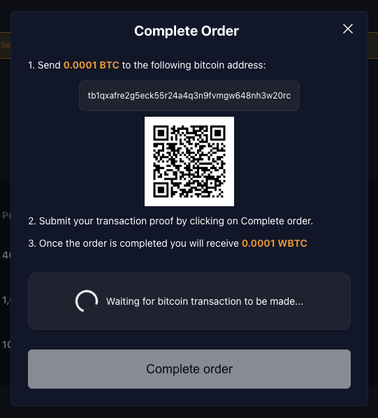

### BTC → ERC20 (selling BTC)

#### Creating Order

These are the steps to create BTC → ERC20 order:

- On the top right of the main page, click on the 'Add an order' button.
- A modal with a 'New Order' title should be visible. Within this modal, you should be on the 'Token' tab.
- This tab contains two inputs: 'Offer' and 'You will receive'. Please select BTC as 'Offer' token and the ERC20 that you wish to receive, along with the respective amounts.
- Once you fill in the previous fields, you should now be able to submit them by clicking 'Place Order' button. This will prompt a transaction that will create the order.
- Once everything is approved, by going to the 'Sell' tab in the main page, you should be able to see your newly created BTC → ERC20 order.

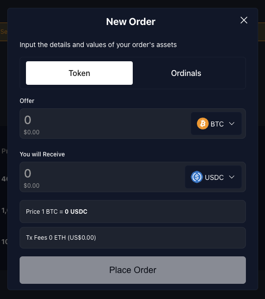

#### Filling Order

These are the steps to fill BTC → ERC20 order:

- Switch to the account you created for fulfilling orders.
- In the 'Buy' table find the order you created previously.
- Click on the 'Fill Order' button. This will open a modal with the title 'Fill Order'.
- Orders that involve BTC, are not allowed to be partially filled like ERC20 orders, so you only need to fill "Bitcoin Address" field with a Testnet Bitcoin Wallet address, in which you desire to receive the BTC.
- Once you fill in the previous field, you should now be able to submit:
  - if you never approved a spending cap for your "Pay with" ERC20 token, when clicking the 'Approve & Fill Order' button, a transaction will be prompted for you to do so and one last to approve the creation of the order.
  - if have already approved the spending cap, when clicking 'Fill Order' button, a transaction for the fill order approval will be prompted.
- Once the transaction is successful, you will be able to see the accepted order under "Accepted BTC Orders" table.
  - In this table, there is a column with a countdown, which shows you how long the other party has to send you the ordered BTC amount. Once the timer reaches 0, you will be able to cancel the order. This does not happen automatically: the other party will still be able to send the BTC unless you cancel the order. Let's now look at how the order is completed.

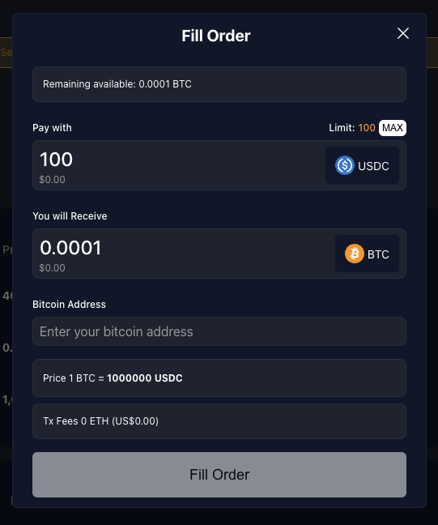

In the next section, we will look at completing this order.

#### Completing Order

These are the steps to complete ERC20 → BTC order:

- Switch back to the account in which you created the order.
- Go to the 'Sell' tab on the main page and find your order under "Accepted BTC Orders" table.
- Once you find the order, click on the 'Complete Order' button. This will open a modal with the title 'Complete Order'.
- Using a BTC wallet connected to the BTC testnet, send the BTC amount to the address shown. You can scan the QR code to use a mobile wallet.
- You will be able to complete the order as soon as one confirmation has been received.
- When completing the order, a transaction will be prompted, which is used to submit the proof the BTC was sent successfully.
- Once completed, in your current account you should be able to see the ERC20 that you received for your BTC. You should eventually receive the BTC at the address that you specified.

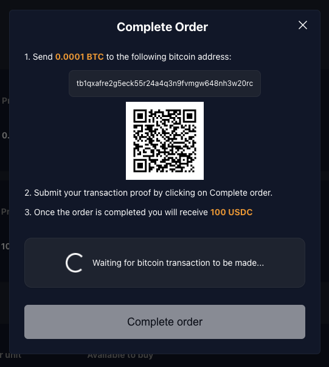

## Ordinal Order

The peer-to-peer swap of ordinals is divided into three steps:

- Creating order
- Filling order
- Completing order (excluded on ERC20 → ERC20 order)

Let's now go through each step.

:::note

At the moment, ordinals can only be sold for ERC20 tokens.

:::

:::note

Make sure you use a BTC Wallet that is able to send and receive ordinals.

:::

:::tip

[Connecting a BTC wallet](#connecting-btc-wallet) will drastically improve your user experience. We will be looking at the different flows for this kind of order.

:::

### Ordinal → ERC20 (selling Ordinal)

#### Creating Order

These are the steps to create Ordinal → ERC20 order:

- On the top right of the main page, click on the 'Add an order' button.
- A modal with a 'New Order' title should be visible. Within this modal, you should be on the 'Ordinal' tab.
- This tab contains two paths:
  - if you have a BTC Wallet connected, you should be able to see an 'Inscription ID' Select. If you click it, a modal you will be shown with your connected wallet inscriptions listed.
  - if you do not have a BTC Wallet connected, you should be able to see an "Inscription ID" field that should be filled with an inscription ID.
- Once the inscription field is filled, if valid, your inscription will be displayed. Lastly, you may also fill in the amount you desire for your ordinal.
- Once you fill in the previous fields, you should now be able to submit them by clicking 'Place Order' button. This will prompt a transaction that will create the order.
- Once everything is approved, by going to the 'Sell' tab on the main page, you should be able to see your newly created Ordinal → ERC20 order.

<Tabs>
  <TabItem value="connected" label="Connected BTC Wallet" default>
    
  </TabItem>
  <TabItem value="disconnected" label="Disconnected BTC Wallet">
    
  </TabItem>
</Tabs>

#### Filling Order

These are the steps to fill Ordinal → ERC20 order:

- Switch to the account you created for fulfilling orders.
- In the 'Buy' table find the order you created previously.
- Click on the 'Fill Order' button. This will open a modal with the title 'Fill Order'.
  - if you do not have a BTC wallet connected, you will need to fill "Bitcoin Address" field with a Testnet Bitcoin Wallet address, in which you desire to receive the BTC.
- You should now be able to submit:
  - if you never approved a spending cap for your "Pay with" ERC20 token, when clicking the 'Approve & Fill Order' button, a transaction will be prompted for you to do so and one last to approve the creation of the order.
  - if have already approved the spending cap, when clicking 'Fill Order' button, a transaction for the fill order approval will be prompted.
- Once the transaction is successful, you will be able to see the accepted order under "Accepted Ordinals Orders" table.
  - In this table, there is a column with a countdown, which shows you how long the other party has to send the ordinal. Once the timer reaches 0, you will be able to cancel the order. This does not happen automatically: the other party will still be able to send the ordinal unless you cancel the order. Let's now look at how the order is completed.

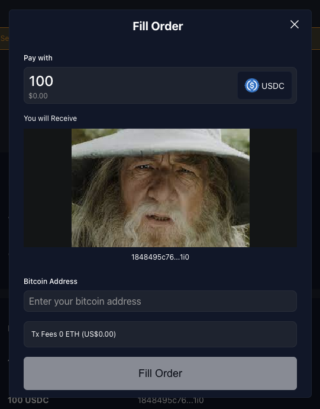

In the next section we will look at completing this order.

#### Completing Order

These are the steps to complete Ordinal → BTC order:

- Switch back to the account in which you created the order.
- Go to the 'Sell' tab on the main page and find your order under "Accepted Ordinal Orders" table.
- Once you find the order, click on the 'Complete Order' button. This will open a modal with the title 'Complete Order'.
- Using a BTC wallet connected to the BTC testnet, send the ordinal to the address shown. You can scan the QR code to use a mobile wallet.
- You will be able to complete the order as soon as one confirmation has been received.
- When completing the order, a transaction will be prompted, which is used to submit the proof the ordinal was sent successfully.
- Once completed, in your current account you should be able to see the ERC20 that you received for your ordinal. You should eventually receive the ordinal in the address that you specified.

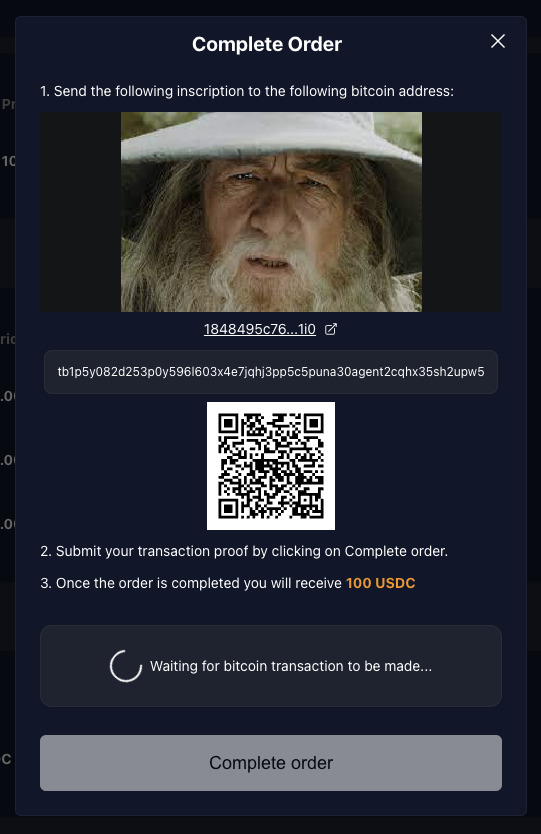

## Demo Code

### The Contract

The contract that this example uses can be found in `src/swap/Btc_Marketplace.sol`. Example usage can be seen in its tests in `test/swap/Btc_Marketplace.t.sol`. The contract is a work in progress, with some Bitcoin-related parts being mocked. Its usage is as follows:

#### Buying BTC

- Alice calls `placeBtcBuyOrder` and specifies amounts and a Bitcoin address.
- Bob calls `acceptBtcBuyOrder`
- Bob makes the Bitcoin transfer
- Bob calls `proofBtcBuyOrder`, or Alice can call `cancelAcceptedBtcBuyOrder` after a timeout.

#### Selling BTC

- Alice calls `placeBtcSellOrder` specifying the amounts
- Bob calls `acceptBtcSellOrder` and specifies a Bitcoin address
- Alice calls `proofBtcSellOrder`, or Bob can call `cancelAcceptedBtcSellOrder`

For both buying and selling orders, if the order has not yet been accepted, Alice can withdraw the request using `withdrawBtcSellOrder`/`withdrawBtcBuyOrder`.

### Set up a Local Environment

1. Clone [https://github.com/bob-collective/bob](https://github.com/bob-collective/bob)
2. Install [Docker](https://www.docker.com)
3. Run `docker-compose up`
4. Verify that Regtest and Electrum are running by checking for the latest blocks at [http://localhost:3002/blocks](http://localhost:3002/blocks)
5. Add BOB L2 testnet to your EVM wallet and fund it with ETH using [Conduit](https://app.conduit.xyz/published/view/fluffy-bob-7mjgi9pmtg)

An example application can be found at [https://github.com/bob-collective/bob-ui-poc](https://github.com/bob-collective/bob-ui-poc). This has been built using [Viem](https://viem.sh/), [Wagmi](https://wagmi.sh/), React and Typescript, but you can interact with the smart contract using your preferred tools and frameworks.

### Funding Your Wallet with ERC20 Tokens

This can be done using the faucet buttons as described in the [Creating and Funding Test Accounts](#creating-and-funding-test-accounts) above.

#### Getting the Smart Contract ABIs in the UI

This is done using a React hook which extends Viem's `getContract` method. This allows contract member types to be inferred, rather than respecified in the application.

```ts
import { getContract } from "viem";
import { usePublicClient, useWalletClient } from "wagmi";
import { contracts, ContractType } from "../constants";
import { useMemo } from "react";

// Wrapper around ethers Contract to automatically get contract types
// with read and write objects automatically constructed from provider and signer.
const useContract = (contractType: ContractType) => {
  const publicClient = usePublicClient();
  const { data: walletClient } = useWalletClient();

  return useMemo(() => {
    const { address, abi } = contracts[contractType];

    return getContract({
      address,
      abi,
      publicClient,
      walletClient: walletClient ?? undefined,
    });
  }, [walletClient, publicClient, contractType]);
};

export { useContract };
```

This can then be called in the application:

```ts
// contracts/config.ts
const contracts = {
  [ContractType.BTC_MARKETPLACE]: {
    address: "0xd6cd079ee8bc26b5000a5e1ea8d434c840e3434b",
    abi: BtcMarketplaceAbi,
  },
} as const;

// App.tsx
const { read: readBtcMarketplace, write: writeBtcMarketplace } = useContract(
  ContractType.BTC_MARKETPLACE
);
```
