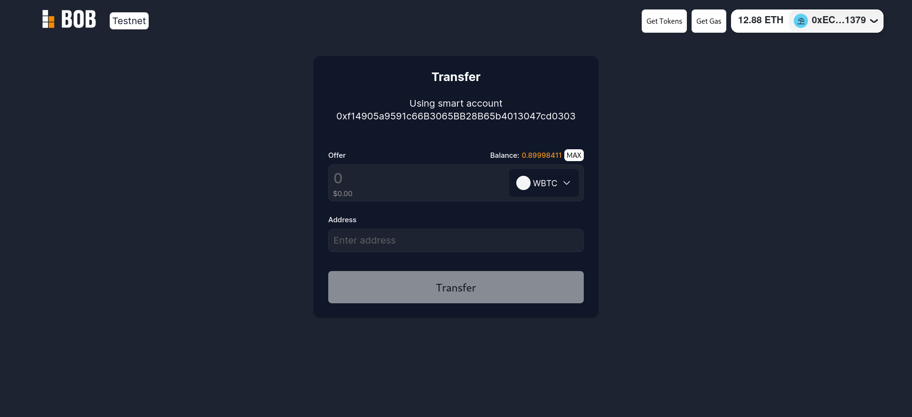

# Gas fee payment in WBTC using ERC-4337

In this example, we will show how WBTC can be used for gas fee payment using the [ERC-4337 account abstraction standard](https://eips.ethereum.org/EIPS/eip-4337) on the BOB testnet. This enables users to use smart contract wallets and transact without the need to own ether.

:::info Example Code

The source code for this demo can be found in [this repository](https://github.com/bob-collective/demo-account-abstraction-transfer/).

:::



## Local development

### Contract addresses and links
WBTC contract address: `0x28A13b11551f91651e8Da8Cd997886aA0B46CD16`

Entry point contract address: `0x7A660708DB3D56BB0dC3694344777c805716Fca7`

WBTC paymaster address:
`0xD8Ae58534d5488571E248DdC0A3aD42aD5dBaD26`

Bundler (eth-infinitism):
`https://bundler-fluffy-bob.gobob.xyz/rpc`

### Installing the project

1. Install [pnpm](https://pnpm.io/installation)
2. Run `pnpm install`


### Starting the project

1. Run `pnpm run dev`
2. Open `localhost:5173` in browser.


## Using the dApp

This application uses the ERC-4337 standard and showcases how a smart contract wallet can be integrated. It contains an implementation of a custom account abstraction client that simplifies the integration of this standard into the UI. 


The application consists of a simple form that allows you to send WBTC from the smart contract account with the gas fee paid in WBTC. To use it enter the WBTC amount and the recipient's EVM address. Then the injected wallet will ask for a user operation signature. After that, a signed user operation will be sent to the bundler which will broadcast it to the network.

:::note
Before the first user operation can be made, the paymaster smart contract has to be approved to spend your WBTC. That is why the first wallet prompt will be the WBTC approval transaction request.
:::


## Using account abstraction client

To allow easy integration of ERC-4337 into dApps, a simple account abstraction client is included in this repository. This client handles smart account creation and bundler connection, manages user operations and allows paymaster usage. This repository also includes a React hook and context provider which enable straightforward usage of the client in the React application.

To use `AaClient` in your app wrap it in the `AccountAbstractionProvider`:
```typescript
<AccountAbstractionProvider>
  <App />
</AccountAbstractionProvider>
```

Now you can use the `useAccountAbstraction` hook anywhere within the app to get the client and utilize its functionality:
```typescript
const { client } = useAccountAbstraction();  
...
const userOp = await client.createUserOp({
address: contract.address,
callData,
value: 0,
nonce: approvalUserOpNonce
});

const transferResult = await client.signAndSendUserOp(userOp);
  

```

To view the example of a full account abstraction flow please navigate to the `src/App.tsx` component.