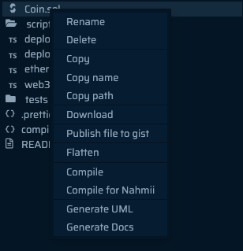

import Tabs from "@theme/Tabs";
import TabItem from "@theme/TabItem";

# Hello World

This guide provides step-by-step instructions on how to deploy smart contracts on BOB.

We will provide instructions for using Remix and Foundry.

- [Remix](https://remix.ethereum.org/) is a web-based IDE for writing smart contracts. This is a great option if you do not want to install any software on your computer.
- [Foundry](https://book.getfoundry.sh/) is a Rust-based development environment for writing smart contracts. This is a great option if you want to use a local development environment.

## Coin Contract

### Objectives

- **Set up a development environment**: Learn how to set up a development environment for your BOB smart contract development.
- **Create a Smart Contract for BOB**: We will use the a [simple example contract to create a token](https://docs.soliditylang.org/en/v0.8.21/introduction-to-smart-contracts.html#subcurrency-example) smart contract.
- **Compile a Smart Contract for BOB**: Compile your token smart contract using the development environment.
- **Deploy a Smart Contract to BOB**: Deploy your compiled token smart contract to the BOB platform.
- **Interact with a Smart Contract Deployed on BOB**: Learn how to interact with the smart contract you've deployed on the BOB platform.

### Prerequisites

Before you can deploy smart contracts on BOB, ensure you have the following prerequisites:

- An EVM wallet with funds from the [testnet faucet](https://faucetlink.to/sepolia).
- Setup either Remix or Foundry as your development environment.

<Tabs groupId="dev-env">
  <TabItem value="remix" label="Remix">

Open the [Remix IDE](https://remix.ethereum.org/) in your browser.

  </TabItem>
  <TabItem value="foundry" label="Foundry">

Follow the steps from the [foundry book](https://book.getfoundry.sh/getting-started/installation) to install the Foundry toolsuite, which contains the `forge`, `cast`, `anvil` and `chisel` tools.

  </TabItem>
</Tabs>

### Creating the Coin Contract

<Tabs groupId="dev-env">
  <TabItem value="remix" label="Remix">

Create a new project with Remix. Under `contracts` folder create a new file `Coin.sol`.

  </TabItem>
  <TabItem value="foundry" label="Foundry">

Start a new project with Foundry.

```shell
forge init coin
```

Create a new `Coin.sol` file in src directory.

```shell
cd coin
touch Coin.sol
```

  </TabItem>
</Tabs>

Enter the below code in `Coin.sol` file. To learn more about the contract [checkout the Solidity tutorial guide](https://docs.soliditylang.org/en/v0.8.21/introduction-to-smart-contracts.html#subcurrency-example).

```solidity

// SPDX-License-Identifier: GPL-3.0
pragma solidity ^0.8.4;

contract Coin {
    // The keyword "public" makes variables
    // accessible from other contracts
    address public minter;
    mapping(address => uint) public balances;

    // Events allow clients to react to specific
    // contract changes you declare
    event Sent(address from, address to, uint amount);

    // Constructor code is only run when the contract
    // is created
    constructor() {
        minter = msg.sender;
    }

    // Sends an amount of newly created coins to an address
    // Can only be called by the contract creator
    function mint(address receiver, uint amount) public {
        require(msg.sender == minter);
        balances[receiver] += amount;
    }

    // Errors allow you to provide information about
    // why an operation failed. They are returned
    // to the caller of the function.
    error InsufficientBalance(uint requested, uint available);

    // Sends an amount of existing coins
    // from any caller to an address
    function send(address receiver, uint amount) public {
        if (amount > balances[msg.sender])
            revert InsufficientBalance({
                requested: amount,
                available: balances[msg.sender]
            });

        balances[msg.sender] -= amount;
        balances[receiver] += amount;
        emit Sent(msg.sender, receiver, amount);
    }
}
```

### Compile the Coin Contract

<Tabs groupId="dev-env">
  <TabItem value="remix" label="Remix">

To compile contract go to `Solidity Compiler` section of the IDE, select and compile the `Coin` smart contract.

You can also directly compile the `Coin` smart contract by right-clicking on the `Coin.sol` file and select compile.

  </TabItem>
  <TabItem value="foundry" label="Foundry">

To compile the contract run the followling command:

```shell
forge build
```

  </TabItem>
</Tabs>

### Deploy the Coin Contract

<Tabs groupId="dev-env">
  <TabItem value="remix" label="Remix">

To deploy the compiled coin smart contract first open the MetaMask extension and make sure the wallet is connected to the BOB network.

Choose the Remix `ENVIRONMENT` and `Injected Provider - MetaMask`. Remix will deploy contract to connected network, i.e., BOB.

Select contract as `Coin` click `Deploy` and sign the transaction pop up message on .


The contract details will be displayed in the Remix terminal.


  </TabItem>
  <TabItem value="foundry" label="Foundry">

To deploy the contract via the terminal, you'll need your private key. If you're using MetaMask, be cautious when exporting your private key as it can be risky. Checkout [this article](https://support.metamask.io/hc/en-us/articles/360015289632-How-to-export-an-account-s-private-key) to get your private key from MetaMask.

Deploy the compiled smart contract using the following command:

```shell
forge create --rpc-url <enter_bob_rpc_url> --private-key <enter_private_key> src/<enter_contract_name>.sol:<enter_contract_name>
```

For Coin smart contract using the Fluffy BOB testnet:

```shell
forge create --rpc-url wss://l2-fluffy-bob-7mjgi9pmtg.t.conduit.xyz --private-key <enter_private_key> src/Coin.sol:Coin
```

The output in the terminal should look similar to this:

```shell
Deployer: 0xd8a0bb324b46D89C105BA98C402dF0972b9164Af
Deployed to: 0xbd56c1FFF2d2073F84825D582808885dbB2085C6
Transaction hash: 0x263ead5ea07e6122d4d1fe6544158502d278b23e86b2a5b143770b82eead1588
```

  </TabItem>
</Tabs>

### Interact with the Coin Contract

Checkout the [testnet explorer](https://explorerl2-fluffy-bob-7mjgi9pmtg.t.conduit.xyz) to get contract details using the transaction hash from the previous step.


<Tabs groupId="dev-env">
  <TabItem value="remix" label="Remix">

Get the [ABI](https://docs.soliditylang.org/en/latest/abi-spec.html) of Coin contract from remix IDE under `Solidity Compiler` section:

  </TabItem>
  <TabItem value="foundry" label="Foundry">

Get the [ABI](https://docs.soliditylang.org/en/latest/abi-spec.html) of Coin contract:

```shell
forge build --silent && jq '.abi' ./out/Coin.sol/Coin.json > coin_contract_abi.json
```

  </TabItem>
</Tabs>

### Finished

:::tip Congratulations!

Congratulations! You have successfully deployed your first smart contract on BOB.

:::

### Extra: Publish and verify the Coin Contract

At this point, your smart contract is ready to be used, but we can go a step further to verify and publish the smart contract in the explorer. By doing this you will be able to interact with any existing read or write calls in the contract right on the explorer. To do so follow these steps:

1. Go to the Remix IDE. Check if the contract imports other contracts. If it does, check step 2. If it doesn't, simply copy the contract code into your clipboard and jump to step 3.

2. In case your contract imports other contract, you need to flatten your contract. To do that you just need right click your contract file in Remix IDE file explorer and copy the flattened code into your clipboard.



3. Head over to the [testnet explorer](https://explorerl2-fluffy-bob-7mjgi9pmtg.t.conduit.xyz) and search for your published contract page.

4. Click on the "Code" tab and click on "Verify & Publish" button.


5. Click on the "Code" tab and click on "Verify & Publish" button.

6. Now you should be presented we a set of possilities for verifying you published contract, but we will proceed with "Via flattened source code".

7. Fill the form with the specific information about the contract and how it was deployed. Make sure every field is correctly populated before submitting. Any incorrect field will lead to a failed verification. After submitting, the verification might take a couple of minutes.


8. Once submitted correctly, the contract source code should be visible in the "Code" tab, alongside with new "Read Contract" and "Write Contract". You are now ready to interact with the contract right on the explorer.


## Next Steps

BOB is built to make it easy to interact with Bitcoin.

### Verifying Bitcoin Transactions

You might be interested in verifying Bitcoin transactions on BOB. Check out the [Bitcoin Light Client](/docs/build/how-to/relay) guide to learn more.

### Examples

Check out examples of how to work with a BTC light client, ordinals, and unifying assets: [Example list](/docs/build/getting-started/#examples).

### Join the Discord

Join the [Discord](https://discordapp.com/invite/interlay) to connect with the community and ask questions.

## Notes

Please note the following:

- Links provided in this guide can change over time. Make sure to check for the most up-to-date resources and documentation.

- Testnet environments, like the one mentioned in this guide, may be restarted or reset periodically. Be prepared for changes and interruptions in testnet activities.

Feel free to revisit this guide and check for updates or changes in the links and testnet status as needed.

## References

- [Coin contract code](https://github.com/ethereum/solidity/blob/develop/docs/introduction-to-smart-contracts.rst)
- [Remix](https://remix.ethereum.org/)
- [Foundry](https://book.getfoundry.sh/)
- [BOB testnet](networks)
