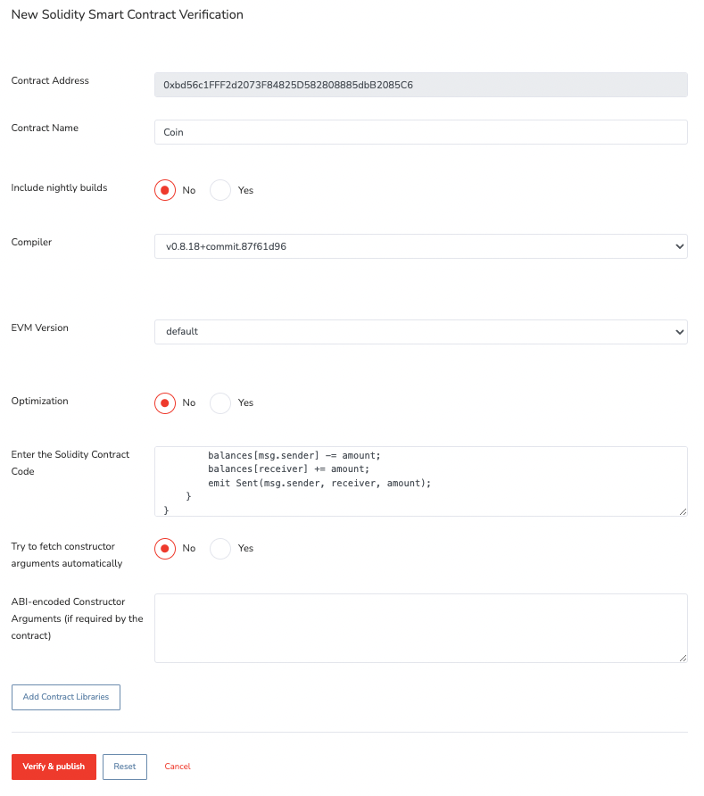

import Tabs from "@theme/Tabs";
import TabItem from "@theme/TabItem";

# Hello Bitcoin

This guide provides step-by-step instructions on how to deploy a smart contract on BOB that interacts with Bitcoin.

BOB is EVM-based and we recommend using the [Solidity](https://docs.soliditylang.org/en/v0.8.24/) language to write your smart contracts. The base currency on BOB is ETH. Since BOB is a rollup on Ethereum, you can bridge over ETH from Ethereum to pay for transactions.

:::tip

If you are new to Solidity, we recommend checking out the [Solidity getting started guide](https://docs.soliditylang.org/en/v0.8.24/introduction-to-smart-contracts.html#subcurrency-example) to get a better understanding of the language.

:::

Developing Solidity contracts is made a lot easier using a development toolchain. Two of the most popular ones are [Remix](https://remix.ethereum.org/) and [Foundry](https://book.getfoundry.sh/). We will use these tools to develop and deploy our smart contract.
We will provide instructions for using Remix and Foundry.

- [Remix](https://remix.ethereum.org/) is a web-based IDE for writing smart contracts. This is a great option if you do not want to install any software on your computer.
- [Foundry](https://book.getfoundry.sh/) is a Rust-based development environment for writing smart contracts. This is a great option if you want to use a local development environment.

Solidity and a toolchain are sufficient to get you started deploying contracts on BOB. However, since BOB's purpose is to make it easy to interact with Bitcoin, we will also add parts of the BOB SDK as part of the starter kit.

- [BOB Starter Kit](https://github.com/bob-collective/bob-starter-kit): The kit serves as a quick start way to develop on BOB using the BOB SDK. Note: you can deploy any EVM contract on BOB without having to use the BOB SDK contracts. They are primarily a helper when you want to interact with Bitcoin from your smart contracts.

## HelloBitcoin Contract

### Overview of the contract

- The contract allows swapping between BTC->USDT and Ordinal->USDT using the BTC relay on testnet without requiring the BTC or ordinals to be bridged to BOB.
- The contract integrates the [BTC relay](/docs/contracts/src/src/relay/LightRelay.sol/contract.LightRelay) to enable trustless communication between the Bitcoin blockchain and BOB Sepolia (Testnet).

### Objectives

- **Set up a development environment**: Learn how to set up a development environment for your BOB smart contract development.
- **Create a Smart Contract for BOB**: We will use [HelloBitcoin smart contract](https://github.com/bob-collective/StarterKit/blob/main/src/HelloBitcoin.sol) present in the developer kit.
- **Compile a Smart Contract for BOB**: Compile your HelloBitcoin smart contract using the development environment.
- **Deploy a Smart Contract to BOB**: Deploy your compiled smart contract to BOB Sepolia (Testnet).
- **Interact with a Smart Contract Deployed on BOB**: Learn how to interact with the smart contract you've deployed on BOB Sepolia (Testnet).

### Prerequisites

We start with installing the prerequisites for the development environment.

- Get Sepolia ETH and bridge them to BOB. Use the links on the [Connect to BOB](/docs/build/getting-started/networks) page.
- Setup either Remix or Foundry as your development environment. If you want to get started without having to install software, use Remix. If you are planning to develop more complex contracts, use Foundry.

<Tabs groupId="dev-env">
  <TabItem value="foundry" label="Foundry">

Follow the steps from the [foundry book](https://book.getfoundry.sh/getting-started/installation) to install the Foundry toolsuite, which contains the `forge`, `cast`, `anvil` and `chisel` tools.

  </TabItem>

  <TabItem value="remix" label="Remix">

Open the [Remix IDE](https://remix.ethereum.org/) in your browser.

  </TabItem>

</Tabs>

### Creating the HelloBitcoin Contract

<Tabs groupId="dev-env">

  <TabItem value="foundry" label="Foundry">

Clone the starter toolkit provided.

```shell
git clone https://github.com/bob-collective/bob-starter-kit.git
cd bob-starter-kit
```

The `HelloBitcoin` contract should already be present inside the src directory.

Checkout the contract by opening it in your favorite editor or IDE.

:::tip

If you are using [VSCode](https://code.visualstudio.com/), use the [Solidity plugin](https://marketplace.visualstudio.com/items?itemName=NomicFoundation.hardhat-solidity) to get syntax highlighting and other features.

:::

:::tip

It's not required to create a new contract, but if you want to create a new contract, you can do so by creating a new file in the `src` directory.

```shell
touch src/<Contract_Name>.sol
```

:::

  </TabItem>

  <TabItem value="remix" label="Remix">
  Create a new project with Remix. Under `contracts` folder create a new file `HelloBitcoin.sol`.

Add the following remappings in `compiler_config.json` under `settings`

```json
{
  "language": "Solidity",
  "settings": {
    "optimizer": {
      "enabled": true,
      "runs": 200
    },
    "outputSelection": {
      "*": {
        "": ["ast"],
        "*": [
          "abi",
          "metadata",
          "devdoc",
          "userdoc",
          "storageLayout",
          "evm.legacyAssembly",
          "evm.bytecode",
          "evm.deployedBytecode",
          "evm.methodIdentifiers",
          "evm.gasEstimates",
          "evm.assembly"
        ]
      }
    },
    "remappings": [
      "@openzeppelin/contracts/=https://github.com/OpenZeppelin/openzeppelin-contracts/blob/v4.5.0/contracts/",
      "@bob-collective/bitcoin-spv/=https://github.com/bob-collective/bitcoin-spv/blob/master/src/",
      "@bob-collective/bob/=https://github.com/bob-collective/bob/blob/master/src/"
    ]
  }
}
```

Enter the below code in `HelloBitcoin.sol` file.

To learn more about the Solidity contracts in general [checkout the Solidity tutorial guide](https://docs.soliditylang.org/en/v0.8.21/introduction-to-smart-contracts.html#subcurrency-example).

```solidity
// SPDX-License-Identifier: UNLICENSED
pragma solidity ^0.8.13;

import "@openzeppelin/contracts/token/ERC20/IERC20.sol";
import "@openzeppelin/contracts/token/ERC20/utils/SafeERC20.sol";
import {BTCUtils} from "@bob-collective/bitcoin-spv/BTCUtils.sol";
import {BitcoinTx} from "@bob-collective/bob/utils/BitcoinTx.sol";
import {IRelay} from "@bob-collective/bob/relay/IRelay.sol";
import {TestLightRelay} from "@bob-collective/bob/relay/TestLightRelay.sol";

using SafeERC20 for IERC20;

contract HelloBitcoin {

    /**
     * @dev Mapping to store BTC to USDT (or other ERC20) swap orders based on their unique identifiers.
     * Each order is associated with a unique ID, and the order details are stored in the BtcSellOrder struct.
     */
    mapping(uint256 => BtcSellOrder) public btcSellOrders;

    /**
     * @dev Mapping to store ordinal sell orders for swapping BTC to USDT (or other ERC20) based on their unique identifiers.
     * Each ordinal sell order is associated with a unique ID, and the order details are stored in the OrdinalSellOrder struct.
     */
    mapping(uint256 => OrdinalSellOrder) public ordinalSellOrders;

    /**
     * @dev The address of the ERC-20 contract. You can use this variable for any ERC-20 token,
     * not just USDT (Tether). Make sure to set this to the appropriate ERC-20 contract address.
     */
    IERC20 public usdtContractAddress;

    /**
     * @dev Counter for generating unique identifiers for BTC to USDT swap orders.
     * The `nextBtcOrderId` is incremented each time a new BTC to USDT swap order is created,
     * ensuring that each order has a unique identifier.
     */
    uint256 nextBtcOrderId;

    /**
     * @dev Counter for generating unique identifiers for ordinal sell orders.
     * The `nextOrdinalOrderId` is incremented each time a new ordinal sell order is created,
     * ensuring that each ordinal order has a unique identifier.
     */
    uint256 nextOrdinalOrderId;

    /**
     * @dev Struct representing a BTC to USDT swap order.
     */
    struct BtcSellOrder {
        uint256 sellAmountBtc; // Amount of BTC to be sold in the order.
        uint256 buyAmount; // Amount of USDT (or other ERC20) to be bought in the order.
        address btcSeller; // Address of the seller initiating the order.
        BitcoinAddress btcBuyer; // Bitcoin address of the buyer (initialized with an empty scriptPubKey).
        bool isOrderAccepted; // Flag indicating whether the order has been accepted.
    }

    /**
     * @dev Struct representing an ordinal sell order for swapping Ordinal to USDT.
     */
    struct OrdinalSellOrder {
        OrdinalId ordinalID; // Unique identifier for the ordinal sell order.
        uint256 buyAmount; // Amount of USDT (or other ERC20) to be bought in the order.
        BitcoinTx.UTXO utxo; // UTXO associated with the BTC to USDT swap order.
        address ordinalSeller; // Address of the seller initiating the ordinal order.
        BitcoinAddress ordinalBuyer; // Bitcoin address of the buyer (initialized with an empty scriptPubKey).
        bool isOrderAccepted; // Flag indicating whether the ordinal order has been accepted.
    }

    /**
     * @dev Struct representing a unique identifier for an ordinal sell order.
     */
    struct OrdinalId {
        bytes32 txId; // Transaction ID associated with the ordinal order.
        uint32 index; // Index associated with the ordinal order.
    }

    /**
     * @dev Struct representing a Bitcoin address with a scriptPubKey.
     */
    struct BitcoinAddress {
        bytes scriptPubKey; // Script public key associated with the Bitcoin address.
    }

    event btcSellOrderSuccessfullyPlaced(uint256 indexed orderId, uint256 sellAmountBtc, uint256 buyAmount);
    event btcSellOrderBtcSellOrderAccepted(uint256 indexed id, BitcoinAddress bitcoinAddress);
    event btcSuccessfullySendtoDestination(uint256 id);

    event ordinalSellOrderSuccessfullyPlaced(uint256 indexed id, OrdinalId ordinalID, uint256 buyAmount);
    event ordinalSellOrderBtcSellOrderAccepted(uint256 indexed id, BitcoinAddress bitcoinAddress);
    event ordinalSuccessfullySendtoDestination(uint256 id);

    IRelay internal relay;
    TestLightRelay internal testLightRelay;

    /**
     * @dev Constructor to initialize the contract with the relay and ERC20 token address.
     * @param _relay The relay contract implementing the IRelay interface.
     * @param _usdtContractAddress The address of the USDT contract.
     *
     * Additional functionalities of the relay can be found in the documentation available at:
     * https://docs.gobob.xyz/docs/contracts/src/src/relay/LightRelay.sol/contract.LightRelay
     */
    constructor(IRelay _relay, address _usdtContractAddress) {
        relay = _relay;
        testLightRelay = TestLightRelay(address(relay));
        usdtContractAddress = IERC20(_usdtContractAddress);
    }

    /**
     * @dev Set the relay contract for the bridge.
     * @param _relay The relay contract implementing the IRelay interface.
     */
    function setRelay(IRelay _relay) internal {
        relay = _relay;
    }

    /**
     * @notice Places a BTC sell order in the contract.
     * @dev Emits a `btcSellOrderSuccessfullyPlaced` event upon successful placement.
     * @param sellAmountBtc The amount of BTC to sell.
     * @param buyAmount The corresponding amount to be received in exchange for the BTC.
     * @dev Requirements:
     *   - `sellAmountBtc` must be greater than 0.
     *   - `buyAmount` must be greater than 0.
     */
    function placeBtcSellOrder(uint256 sellAmountBtc, uint256 buyAmount) public {
        require(sellAmountBtc > 0, "Sell amount must be greater than 0");
        require(buyAmount > 0, "Buy amount must be greater than 0");

        uint256 id = nextBtcOrderId++;
        btcSellOrders[id] = BtcSellOrder({
            sellAmountBtc: sellAmountBtc,
            buyAmount: buyAmount,
            btcSeller: msg.sender,
            btcBuyer: BitcoinAddress({scriptPubKey: new bytes(0)}),
            isOrderAccepted: false
        });

        emit btcSellOrderSuccessfullyPlaced(id, sellAmountBtc, buyAmount);
    }

    /**
     * @notice Accepts a BTC sell order, providing the Bitcoin address for the buyer.
     * @dev Transfers the corresponding currency from the buyer to the contract and updates the order details.
     * @param id The unique identifier of the BTC sell order.
     * @param bitcoinAddress The Bitcoin address of the buyer to receive the BTC.
     * @dev Requirements:
     *   - The specified order must not have been accepted previously.
     *   - The buyer must transfer the required currency amount to the contract.
     * @dev Emits a `btcSellOrderBtcSellOrderAccepted` event upon successful acceptance.
     */
    function acceptBtcSellOrder(uint256 id, BitcoinAddress calldata bitcoinAddress) public {
        BtcSellOrder storage placedOrder = btcSellOrders[id];

        require(placedOrder.isOrderAccepted == false, "Order has already been accepted");

        // "lock" selling token by transferring to contract
        IERC20(usdtContractAddress).safeTransferFrom(msg.sender, address(this), placedOrder.buyAmount);

        placedOrder.btcBuyer = bitcoinAddress;
        placedOrder.isOrderAccepted = true;

        emit btcSellOrderBtcSellOrderAccepted(id, bitcoinAddress);
    }

    /**
     * @notice Completes a BTC sell order by validating and processing the provided Bitcoin transaction proof.
     * @dev This function is intended to be called by the original seller.
     * @param id The unique identifier of the BTC sell order.
     * @param transaction Information about the Bitcoin transaction.
     * @param proof Proof associated with the Bitcoin transaction.
     * @dev Requirements:
     *   - The specified order must have been previously accepted.
     *   - The caller must be the original seller of the BTC.
     *   - The Bitcoin transaction proof must be valid.
     *   - The BTC transaction output must match the expected amount and recipient.
     * @dev Effects:
     *   - Sets the relay difficulty based on the Bitcoin headers in the proof.
     *   - Transfers the locked USDT amount to the original seller.
     *   - Removes the order from the mapping after successful processing.
     * @dev Emits a `btcSuccessfullySendtoDestination` event upon successful completion.
     */
    function completeBtcSellOrder(uint256 id, BitcoinTx.Info calldata transaction, BitcoinTx.Proof calldata proof)
        public
    {
        // Retrieve the accepted order based on the provided ID
        BtcSellOrder storage acceptedOrder = btcSellOrders[id];

        // Ensure that the order has been accepted and the caller is the original seller
        require(acceptedOrder.isOrderAccepted == true, "Order must be accepted");
        require(acceptedOrder.btcSeller == msg.sender, "Only the original seller can provide proof");

        // Set the difficulty of the relay based on the Bitcoin headers in the proof
        testLightRelay.setDifficultyFromHeaders(proof.bitcoinHeaders);

        // Validate the BTC transaction proof using the relay, in production a higher than 1 block confirmation should be used
        BitcoinTx.validateProof(relay, 1, transaction, proof);

        // Check if the BTC transaction output matches the expected amount and recipient
        _checkBitcoinTxOutput(acceptedOrder.sellAmountBtc, acceptedOrder.btcBuyer, transaction);

        // Transfer the locked USDT to the original seller
        IERC20(usdtContractAddress).safeTransfer(acceptedOrder.btcSeller, acceptedOrder.buyAmount);

        // Remove the order from the mapping since it has been successfully processed
        delete btcSellOrders[id];

        // Emit an event indicating the successful completion of the BTC to USDT swap
        emit btcSuccessfullySendtoDestination(id);
    }

    /**
     * @notice Places an ordinal sell order in the contract.
     * @dev Emits an `ordinalSellOrderSuccessfullyPlaced` event upon successful placement.
     * @param ordinalID The unique identifier for the ordinal.
     * @param utxo Information about the Bitcoin UTXO associated with the ordinal.
     * @param buyAmount The amount to be received in exchange for the ordinal.
     * @dev Requirements:
     *   - `buyAmount` must be greater than 0.
     * @dev Effects:
     *   - Creates a new ordinal sell order with the provided details.
     */
    function placeOrdinalSellOrder(OrdinalId calldata ordinalID, BitcoinTx.UTXO calldata utxo, uint256 buyAmount)
        public
    {
        require(buyAmount > 0, "Buying amount should be greater than 0");

        uint256 id = nextOrdinalOrderId++;

        ordinalSellOrders[id] = OrdinalSellOrder({
            ordinalID: ordinalID,
            buyAmount: buyAmount,
            utxo: utxo,
            ordinalSeller: msg.sender,
            isOrderAccepted: false,
            ordinalBuyer: BitcoinAddress({scriptPubKey: new bytes(0)})
        });

        emit ordinalSellOrderSuccessfullyPlaced(id, ordinalID, buyAmount);
    }

    /**
     * @notice Accepts an ordinal sell order, providing the Bitcoin address for the buyer.
     * @dev Transfers the corresponding currency from the buyer to the contract and updates the order details.
     * @param id The unique identifier of the ordinal sell order.
     * @param bitcoinAddress The Bitcoin address of the buyer to receive the ordinal.
     * @dev Requirements:
     *   - The specified order must not have been accepted previously.
     *   - The buyer must transfer the required currency amount to this contract.
     * @dev Effects:
     *   - "Locks" the selling token by transferring it to the contract.
     *   - Updates the ordinal sell order with the buyer's Bitcoin address and marks the order as accepted.
     * @dev Emits an `ordinalSellOrderBtcSellOrderAccepted` event upon successful acceptance.
     */
    function acceptOrdinalSellOrder(uint256 id, BitcoinAddress calldata bitcoinAddress) public {
        OrdinalSellOrder storage placedOrder = ordinalSellOrders[id];
        require(placedOrder.isOrderAccepted == false, "Order already accepted");

        // "lock" sell token by transferring to contract
        IERC20(usdtContractAddress).safeTransferFrom(msg.sender, address(this), placedOrder.buyAmount);

        placedOrder.ordinalBuyer = bitcoinAddress;
        placedOrder.isOrderAccepted = true;

        emit ordinalSellOrderBtcSellOrderAccepted(id, bitcoinAddress);
    }

    /**
     * @notice Completes an ordinal sell order by validating and processing the provided Bitcoin transaction proof.
     * @dev This function is intended to be called by the original seller.
     * @param id The unique identifier of the ordinal sell order.
     * @param transaction Information about the Bitcoin transaction.
     * @param proof Proof associated with the Bitcoin transaction.
     * @dev Requirements:
     *   - The specified order must have been previously accepted.
     *   - The caller must be the original seller of the ordinal.
     *   - The Bitcoin transaction proof must be valid.
     *   - The BTC transaction input must spend the specified UTXO associated with the ordinal sell order.
     *   - The BTC transaction output must be to the buyer's address.
     * @dev Effects:
     *   - Sets the relay difficulty based on the Bitcoin headers in the proof.
     *   - Validates the BTC transaction proof using the relay.
     *   - Ensures that the BTC transaction input spends the specified UTXO.
     *   - Checks the BTC transaction output to the buyer's address.
     *   - Transfers the locked USDT amount to the original seller.
     *   - Removes the ordinal sell order from storage after successful processing.
     * @dev Emits an `ordinalSuccessfullySendtoDestination` event upon successful completion.
     */
    function completeOrdinalSellOrder(uint256 id, BitcoinTx.Info calldata transaction, BitcoinTx.Proof calldata proof)
        public
    {
        OrdinalSellOrder storage acceptedOrder = ordinalSellOrders[id];

        // Ensure that the order has been accepted and the caller is the original seller
        require(acceptedOrder.isOrderAccepted == true, "Order must be accepted");
        require(acceptedOrder.ordinalSeller == msg.sender, "Only the original seller can provide proof");

        // Set the relay difficulty based on the Bitcoin headers in the proof
        testLightRelay.setDifficultyFromHeaders(proof.bitcoinHeaders);

        // Validate the BTC transaction proof using the relay, in production a higher than 1 block confirmation should be used
        BitcoinTx.validateProof(relay, 1, transaction, proof);

        // Ensure that the BTC transaction input spends the specified UTXO associated with the ordinal sell order
        BitcoinTx.ensureTxInputSpendsUtxo(transaction.inputVector, acceptedOrder.utxo);

        // Check if the BTC transaction output is to the buyer's address
        _checkBitcoinTxOutput(0, acceptedOrder.ordinalBuyer, transaction);

        // ToDo: Check that the correct satoshis are being spent to the buyer's address if needed

        // Transfer the locked USDT to the original seller
        IERC20(usdtContractAddress).safeTransfer(acceptedOrder.ordinalSeller, acceptedOrder.buyAmount);

        // Remove the ordinal sell order from storage as it has been successfully processed
        delete ordinalSellOrders[id];

        // Emit an event to indicate the successful completion of the ordinal sell order
        emit ordinalSuccessfullySendtoDestination(id);
    }

    /**
     * Checks output script pubkey (recipient address) and amount.
     * Reverts if transaction amount is lower or bitcoin address is not found.
     *
     * @param expectedBtcAmount BTC amount requested in order.
     * @param bitcoinAddress Recipient's bitcoin address.
     * @param transaction Transaction fulfilling the order.
     */
    //ToDo: Should we move this into the library.
    function _checkBitcoinTxOutput(
        uint256 expectedBtcAmount,
        BitcoinAddress storage bitcoinAddress,
        BitcoinTx.Info calldata transaction
    ) private view {
        // Prefixes scriptpubkey with its size to match script output data.
        bytes32 scriptPubKeyHash =
            keccak256(abi.encodePacked(uint8(bitcoinAddress.scriptPubKey.length), bitcoinAddress.scriptPubKey));

        uint256 txOutputValue = BitcoinTx
            .processTxOutputs(transaction.outputVector, scriptPubKeyHash)
            .value;

        require(txOutputValue >= expectedBtcAmount, "Bitcoin transaction amount is lower than in accepted order.");
    }
}

```

Also create a `TestLightRelay.sol` file for deploying your own bitcoin relay.

```solidity
pragma solidity 0.8.17;

import {BTCUtils} from "@bob-collective/bitcoin-spv/BTCUtils.sol";
import "@bob-collective/bob/relay/LightRelay.sol";

/**
* @title HelloBitcoin
* @dev contract allows swapping between BTC->USDT and Ordinal->USDT using the BTC relay on testnet.
* @custom:dev-run-script ./scripts/deploy_relay.ts
*/
contract TestLightRelay is LightRelay {
    using BTCUtils for bytes;
    using BTCUtils for uint256;

      /// @notice Sets the current and previous difficulty based on the difficulty
      ///         inferred from the provided Bitcoin headers.
    function setDifficultyFromHeaders(bytes memory bitcoinHeaders) external {
        uint256 firstHeaderDiff = bitcoinHeaders.extractTarget().calculateDifficulty();

        currentEpochDifficulty = firstHeaderDiff;
        prevEpochDifficulty = firstHeaderDiff;
    }
}

```

  </TabItem>
</Tabs>

### Compile the Contract

<Tabs groupId="dev-env">
  <TabItem value="foundry" label="Foundry">

To compile the contract run the followling command:

```shell
forge build
```

  </TabItem>
  <TabItem value="remix" label="Remix">

In `Advanced Configurations` section of Solidity Compiler switch from `Compiler configuration` to `Use configuration file`.


To compile the contract, go to the `Solidity Compiler` section of the IDE, select and compile the `HelloBitcoin` smart contract.
You can also directly compile the `HelloBitcoin` smart contract by right-clicking on the `HelloBitcoin.sol` file and select compile.
In the same way `TestLightRelay.sol` contract should also be compiled.

  </TabItem>
</Tabs>

### Deploy the HelloBitcoin Contract

<Tabs groupId="dev-env">
  <TabItem value="foundry" label="Foundry">

To deploy the contract via the terminal, you'll need your private key. We recommend generating a separate key for development purposes.

:::tip

If you are using MetaMask, use this [guide](https://support.metamask.io/hc/en-us/articles/360015289632-How-to-export-an-account-s-private-key) to export your private key.

:::

To deploy the compiled smart contract on testnet we will use the `HelloBitcoin` script present under `scripts/HelloBitcoin.sol`:

```shell
export PRIVATE_KEY=0x<your-private-key>
export USDT_ADDRESS=0xF58de5056b7057D74f957e75bFfe865F571c3fB6
export RPC_URL=https://testnet.rpc.gobob.xyz
export VERIFIER_URL=https://testnet-explorer.gobob.xyz/api?

forge script script/HelloBitcoin.sol --rpc-url=$RPC_URL --broadcast \
--verify --verifier blockscout --verifier-url=$VERIFIER_URL \
--priority-gas-price 1
```

The output in the terminal should look similar to this:

```shell
Script ran successfully.
...
✅  [Success]Hash: 0x7a1653e0a0673bd363c28ebd610eb643b29408087f29bf1565df81ded78d2f8b
Contract Address: 0x14F932d0184d4595A3d152ec13F64A36393701B7
Block: 4325242
Paid: 0.00551169309186155 ETH (1837231 gas * 3.00000005 gwei)

✅  [Success]Hash: 0x1d8edfa2be54524804a69507cc967adbdc34716404c43b0d27b9b2375aaf221c
Contract Address: 0x141eE0F02Df17bE850032D578CC4b3BF7d1c7f4F
Block: 4325242
Paid: 0.0082765501379425 ETH (2758850 gas * 3.00000005 gwei)
```

  </TabItem>
  <TabItem value="remix" label="Remix">

To deploy the compiled HelloBitcoin smart contract first open the MetaMask extension and make sure the wallet is connected to the BOB network.

Choose the Remix `ENVIRONMENT` and `Injected Provider - MetaMask`. Remix will deploy contract to connected network, i.e., BOB.

Select contract as `TestLightRelay`. Click `Deploy` and sign the transaction pop up message.


Copy the `TestLightRelay` contract address from the terminal this will be used as a constructor argument for `HelloBitcoin` contract.

Select contract as `HelloBitcoin`.

Add the `_RELAY` ie `TestLightRelay` address copied above.

Add the `_USDTCONTRACTADDRESS` address as `0xF58de5056b7057D74f957e75bFfe865F571c3fB6`.

:::tip
If you want, you can also modify the contract at a later stage and use [other ERC20 contracts already deployed on BOB Sepolia (Testnet)](/docs/build/contracts/).
:::

Click `Deploy` and sign the transaction pop up message.


The contract details will be displayed in the Remix terminal.


  </TabItem>
</Tabs>

### Interact with the HelloBitcoin Contract

Checkout the [testnet explorer](https://testnet-explorer.gobob.xyz/) to get contract details using the transaction hash from the previous step.


<Tabs groupId="dev-env">
  <TabItem value="foundry" label="Foundry">

Get the [ABI](https://docs.soliditylang.org/en/latest/abi-spec.html) of HelloBitcoin contract:

```shell
forge build --silent && jq '.abi' ./out/HelloBitcoin.sol/HelloBitcoin.json > hello_bitcoin_contract_abi.json
```

  </TabItem>
  <TabItem value="remix" label="Remix">

Get the [ABI](https://docs.soliditylang.org/en/latest/abi-spec.html) of Coin contract from remix IDE under `Solidity Compiler` section:

  </TabItem>
</Tabs>

### Congratulations! You are done!

Congratulations! You have successfully deployed your first smart contract on BOB.

### Extra: Publish and verify the HelloBitcoin Contract

<Tabs groupId="dev-env">
  <TabItem value="foundry" label="Foundry">

The deployment script provided above already handles contract verification.

You can find the contract source code in the "Code" tab, along with new "Read Contract" and "Write Contract" sub-tabs. You are now ready to interact with the contract directly on the explorer.


  </TabItem>
  <TabItem value="remix" label="Remix">

At this point, your smart contract is ready to be used, but we can go a step further to verify and publish the smart contract in the explorer. By doing this you will be able to interact with any existing read or write calls in the contract right on the explorer. To do so follow these steps:

1. Go to the Remix IDE. Check if the contract imports other contracts. If it does, check step 2. If it doesn't, simply copy the contract code into your clipboard and jump to step 3.

2. In case your contract imports other contract, you need to flatten your contract. To do that you just need right click your contract file in Remix IDE file explorer and copy the flattened code into your clipboard.


3. Head over to the [testnet explorer](https://testnet-explorer.gobob.xyz/) and search for your published contract page.

4. Click on the "Contract" tab and click on "Verify & Publish" button.


5. Click on the "Code" tab and click on "Verify & Publish" button.

6. Now you should be presented we a set of possilities for verifying you published contract, but we will proceed with "Via flattened source code".

7. Fill the form with the specific information about the contract and how it was deployed. Make sure every field is correctly populated before submitting. Any incorrect field will lead to a failed verification. After submitting, the verification might take a couple of minutes.



8. Once submitted correctly, the contract source code should be visible in the "Code" tab, alongside with new "Read Contract" and "Write Contract". You are now ready to interact with the contract right on the explorer.


  </TabItem>
</Tabs>

## Next Steps

BOB is built to make it easy to interact with Bitcoin.

### Join the Community

Join the [Telegram](https://t.me/+CyIcLW2nfaFlNDc1) to connect with the community and ask questions.

### Check out Examples

Check out examples of how to work with a BTC light client, ordinals, and unifying assets: [Example list](/docs/build/getting-started/#examples).

We recommend taking a look at our [Trustless P2P Swap](https://docs.gobob.xyz/docs/build/examples/btc-swap/) example first.

## References

- [HelloBitcoin contract code](https://github.com/bob-collective/StarterKit/blob/main/src/HelloBitcoin.sol)
- [Remix](https://remix.ethereum.org/)
- [Foundry](https://book.getfoundry.sh/)
- [BOB Sepolia (Testnet)](networks)
