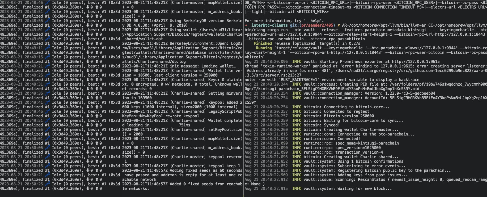
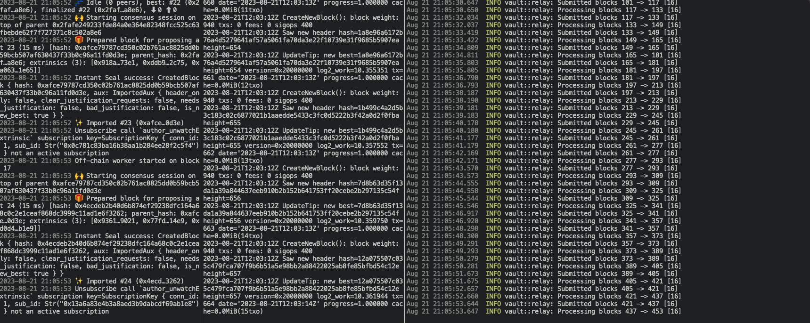

# Local Development Environment

## Start a Local Network

:::info

The following steps require developers to manually compile the blockchain node and the client submitting the BTC headers. This is a temporary solution until we have released binaries. Compile times will take significantly longer than the previous steps.

:::

We are going to set up three components to have a complete environment:

1. A Bitcoin regtest node
2. An Interlay blockchain node
3. A BTC-Relay client submitting BTC headers

The Bitcoin regtest node will be installed into your OS. For the other two components, we recommend setting up a folder structure like this:

```bash
mkdir bob
cd bob
```

We will then clone the repositories into this folder so that it looks like this:

```bash
bob
├── interbtc # the blockchain node
└── interbtc-clients # the BTC-Relay client
```

### Setup Bitcoin core

Download and install Bitcoin core from the [Bitcoin core website](https://bitcoincore.org/en/download/).

:::tip

Make sure to install at least Bitcoin core 24 for inscriptions to work.

:::

Start the Bitcoin regtest node from a terminal:

```bash
bitcoind -regtest -txindex -fallbackfee=0.0001 -rpcuser=bitcoin -rpcpassword=bitcoin
```

### Setup an Interlay node

Clone the repository and checkout the `btc-hack` branch:

```bash
git clone git@github.com:interlay/interbtc.git
cd interbtc
git checkout btc-hack
```

Run the node in a new terminal window:

```bash
cargo run --bin interbtc-parachain -- --dev --instant-seal --rpc-methods=unsafe
```

:::tip

There can be issues with compiling on Apple Silicon and Linux with the latest C/LLVM toolchain. Check out [this issue for help](https://github.com/interlay/interbtc/issues/1087).

:::

### Setup the BTC-Relay client

Clone the repository and checkout the `bitcoin-25-support` branch:

```bash
git clone git@github.com:sander2/polkabtc-clients.git interbtc-clients
cd interbtc-clients
git checkout bitcoin-25-support
```

Run the client in a new terminal window:

```bash
cargo run --bin vault --release --features parachain-metadata-kintsugi -- --keyring=charlie --btc-parachain-url=ws://127.0.0.1:9944 --bitcoin-relay-start-height=1 --bitcoin-rpc-url=http://127.0.0.1:18443 --bitcoin-rpc-user=bitcoin --bitcoin-rpc-pass=bitcoin
```

## Successful Node Setup

By the end of the above steps, you should have three terminal windows running:

1. The Interlay node
2. The Bitcoin regtest node
3. The BTC-Relay client



### Mine Bitcoin Blocks

Test if the setup works by mining a few blocks on the Bitcoin regtest node:

```bash
 bitcoin-cli -regtest -rpcuser=bitcoin -rpcpassword=bitcoin -rpcwallet=Charlie-shared -generate 100
```

### Trigger Interlay block production

Produce one block on the Interlay node to kick off the block relaying:

```bash
curl -H "Content-Type: application/json" -d '{"id":"1", "jsonrpc":"2.0", "method": "engine_createBlock", "params": [true, true]}' http://localhost:9933
```

### Block Relaying

You should now see that the client is submitting BTC headers to the Interlay node:


