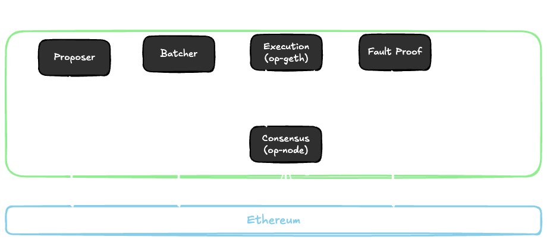
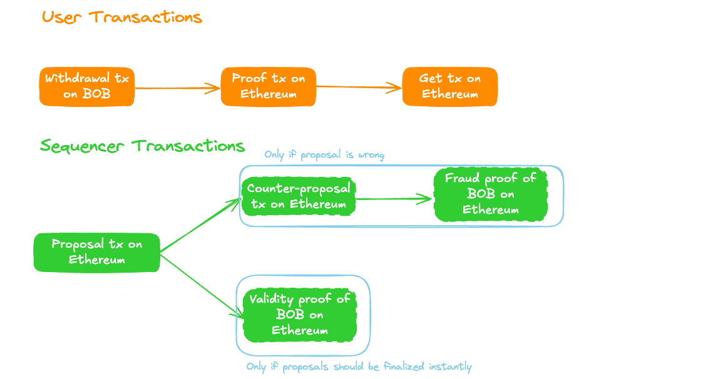
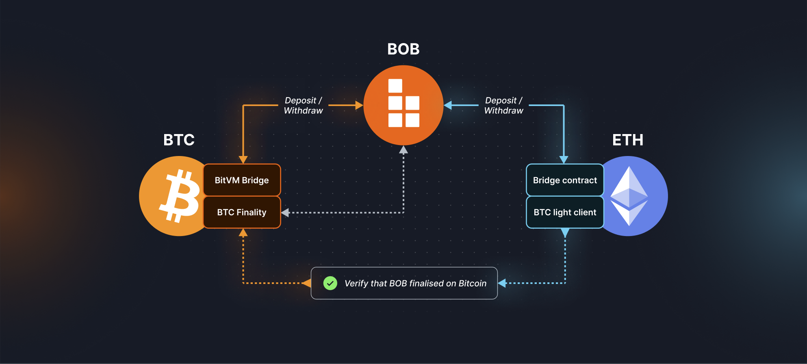

# Hybrid Chain

BOB is a _Hybrid Chain_, a new kind of Hybrid ZK Rollup that inherits Bitcoin finality while providing trust-minimized bridges directly to Ethereum and Bitcoin. Through its unique multi-layered architecture, BOB combines Bitcoin's security with Ethereum's innovation, ultimately bringing BTC to any app on any chain.

## Native Bridges

BOB's hybrid architecture is built on two native bridges that provide secure asset transfers to both Bitcoin and Ethereum.

### BitVM Bridge: BTC on BOB

:::info R&D
BOB has released its BitVM testnet bridge. Mainnet is planned for Q4 2025. For details, see the dedicated [BitVM Bridge](/docs/bitvm) page.
:::

BOB has [released its BitVM testnet bridge](https://blog.gobob.xyz/posts/bob-bitvm-testnet-launch) a two-way light-client BTC bridge powered by [BitVM](/docs/bitvm) in partnership with [bitvm/acc](https://bitvm-acc.org/) members. The BitVM bridge represents the most secure BTC bridge design to date, operating under a superior 1-of-n security model where BTC deposits cannot be stolen as long as there is a single honest and online node in the network.

Withdrawals of bridged BTC from BOB to Bitcoin through this BitVM bridge are verified by a ZK SNARK fraud-proof mechanism that relies on a 1-of-N trust assumption for operation. Unlike traditional bridges that rely on trusted multisigs or honest majorities, the BitVM bridge uses optimistic computation secured by Bitcoin's own consensus, allowing anyone to challenge fraudulent withdrawals and prevent theft through on-chain fraud proofs. A bridged version of BTC secured by BitVM is a massive improvement in BTC safety because it unlocks unilateral exit back to Bitcoin.

### Ethereum Bridge: ETH, ERC20s, and NFTs on BOB

BOB utilizes the [OP Stack's native bridge contracts](https://docs.optimism.io/app-developers/bridging/standard-bridge) for secure and free asset transfers between Ethereum and BOB. This allows users to deposit and withdraw assets directly through L1 smart contracts, inheriting Ethereum's security guarantees and censorship-resistance. The bridge supports 1-click onboarding of ERC-20 tokens, stablecoins, and ETH, with over $250M in TVL secured by Ethereum's validator network.

Users can already force withdraw their assets from BOB to Ethereum, even if BOB's sequencer goes offline. An Ethereum transaction can directly call the [Native Ethereum Bridge](/docs/reference/contracts#ethereum-l1) that BOB has as an OP Stack rollup. For technical details, see the OP Stack [deposit flow](https://docs.optimism.io/stack/transactions/deposit-flow) and [withdrawal flow](https://docs.optimism.io/stack/transactions/withdrawal-flow) documentation.

## Consensus: Hybrid ZK Rollup

### Hybrid ZK Rollup

BOB operates as a hybrid ZK rollup powered by [Kailua](https://github.com/boundless-xyz/kailua), combining the efficiency of optimistic rollups with the security of ZK proofs. Under normal operation, the BOB proposer posts state updates that can be challenged like other optimistic rollups, but disputes are resolved through single ZK proofs rather than expensive multi-round verification games. This approach reduces withdrawal times to 4 days (with plans to reduce to hours as the system matures) and makes fault proofs accessible with just 0.5 ETH collateral, ~$3 proof generation cost, and 250k gas for SNARK verification.

On demand, the hybrid model allows proposers to submit validity proofs directly with their proposals for instant finality, enabling users to choose between cost-optimized (optimistic) and speed-optimized (validity proof) modes based on their needs. The Kailua integration provides:

- **Mathematical Certainty:** ZK proofs guarantee the correctness of all BOB state transitions during disputes
- **Flexible Finality:** Users can choose between cost-optimized (optimistic) or speed-optimized (validity proof) modes based on their needs
- **Progressive Enhancement:** Seamless upgrade path from optimistic to full validity rollup without disruption

This upgrade positions BOB to achieve Stage 0 status on [L2Beat](https://l2beat.com/scaling/projects/bob).

### Under the Hood: OP Stack

BOB uses the [OP Stack](https://docs.optimism.io/stack/getting-started) as its foundation. In the OP Stack, the "Sequencer" actually consists of multiple services that are run together. The main services are:

- **Proposer:** The proposer is responsible for submitting the latest proposals of BOB to Ethereum.
- **Batcher:** The batcher is responsible for submitting all data from BOB to Ethereum blobs to ensure that the BOB state can be entirely reconstructed just from data on Ethereum without any dependency on the BOB sequencer.
- **Execution (op-geth):** The execution client is responsible for processing transactions and BOB blocks.
- **Consensus (op-node):** The consensus client is responsible for ordering of transactions and BOB blocks from both Ethereum blobs and the L2 data. Full nodes use the consensus client to verify the BOB blocks and transactions purely from Ethereum data.
- **Fraud Proof:** The fraud proof client usually consists of a verifier and a challenger. The verifier checks if BOB blocks are valid and triggers the challenger to submit a counter-proposal in case the proposer submitted an invalid proposal.

### Under the Hood: Kailua

Traditionally, rollups have followed two separate models: optimistic rollups, which assume transactions are valid but require a 7-day challenge window, and validity rollups, which verify transactions instantly via ZK proofs but are expensive to operate. Kailua introduces a third Hybrid ZK option by applying ZK proofs to the fraud resolution process in optimistic rollups.

**Sequencing**

In Kailua, proposer need to stake 0.5 ETH to be the proposer. The proposer submits ["mini proposals"](https://boundless-xyz.github.io/kailua/design.html#sequencing) frequently. In the case of BOB, every 6 BOB blocks a mini proposal is created. Every 12 hours, the proposer submits a full proposal to BOB's Ethereum contracts that reference all the mini proposals. The mini proposals are stored in Ethereum blobs.

**On Demand Validity Proofs**

The proposer can optionally submit a validity proof with their proposal. If a correct validity proof is submitted, the proposal is finalized instantly. If no validity proof is submitted, the proposal is finalized after 4 days unless successfully disputed.

:::info Validity Proof on BOB Mainnet

See here for an example of a validity proof for BOB on mainnet: https://etherscan.io/tx/0xe3d5ed2b47c9b19fa777e8a3d5103b72d05abfa5d5c79c7289389acb9eafda0f

:::

**Dispute Resolution**

Once a full proposal is submitted by a proposer, it can be challenged by anyone. The challenger needs to submit a full proposal (including their own mini proposals) that is different from the proposer's proposal. The challenger also needs to stake 0.5 ETH as collateral. Then either the proposer or the challenger submit a fault proof. The fault proof proves the correctness of one of the mini-proposals and thereby invalidates one of the proposals. This allows cheap proving cost: instead of having to prove all 21,600 blocks in a 12 hour period, the challenger only needs to prove 6 blocks. If a proposal is not disproven for 4 days, it is considered finalized.

**Vanguard Mode**

BOB is currently in [vanguard mode](https://boundless-xyz.github.io/kailua/parameters.html?highlight=vanguard#vanguard-advantage). This means that the BOB proposer has priority to submit proposals. If no proposal is made by the proposer within 30 days, then any user can submit their own proposal.

**Finality**

Once a proposal is finalized on Ethereum, it is considered final and cannot be disputed. At this point, pending withdrawals from BOB to Ethereum can be executed.

### Bitcoin Finality

:::info R&D
The Bitcoin finality gadget is currently in R&D.
:::

BOB will introduce BTC-staked Finality Providers (FPs) through [Babylon](https://babylonlabs.io/)'s Bitcoin Staking Network. These FPs will sign BOB state proposals and receive sequencer fees in exchange for providing economic security through their staked BTC. If FPs sign competing chains, their staked BTC will be slashed, creating strong economic incentives against chain forks.

The consensus process will combine three key building blocks:

- **Kailua Validity Proofs:** ZK proofs that cryptographically guarantee the correctness of all BOB state transitions, with on-demand generation for fast withdrawals
- **BTC-staked FPs:** Finality Providers that sign state proposals, with ⅔ stake required for finalization  
- **Hybrid Architecture:** Default optimistic mode with optional validity proofs for enhanced security and flexibility

BOB blocks will be fast-finalized by Bitcoin stakers within seconds, providing economic security without waiting for Ethereum inclusion, then checkpointed to Bitcoin for reorganization-resistance through Bitcoin's proof-of-work security.

## Hybrid Data Availability: Ethereum Blobs with Bitcoin Fallback

:::info R&D
BOB is currently using Ethereum blobs as DA. The Bitcoin DA is currently in R&D.
:::

BOB implements a hybrid data availability architecture that combines Ethereum's cost efficiency with Bitcoin's censorship resistance. BOB uses EIP-4844 blobs as the primary data availability layer, following the standard OP Stack derivation pipeline while processing transactions in a specific order: Bitcoin forced withdrawals first, followed by Ethereum deposits and transaction batches.

BOB is researching modifications to the `op-node` to add a check for forced withdrawal transactions on Bitcoin as part of the derivation pipeline. Bitcoin serves as a highly censorship-resistant fallback mechanism, enabling users to force withdrawals using only BTC without requiring ETH. This is implemented through a two-phase commit/reveal scheme on Bitcoin using Taproot outputs to store transaction data, requiring both a commit transaction and a reveal transaction to complete the forced withdrawal process.

This hybrid DA model offers:

- **Censorship Resistance:** Leverages Bitcoin's battle-tested security as fallback storage
- **Forced Transaction Inclusion:** Enables forced withdrawals back to Bitcoin through the [BitVM bridge](/docs/bitvm#bitvm-bridge-summary), even if BOB's Sequencer is offline

This unique approach defaults to Ethereum for data availability while allowing users to force include transactions on BOB via special Bitcoin transactions, providing enhanced censorship resistance and ensuring users can always exit their funds even if BOB's sequencer goes offline. Learn more about the technical implementation in our [hybrid data availability research](https://blog.gobob.xyz/posts/hybrid-data-availability-enforcing-bitvm-withdrawals-on-bob).

## Development Phases

### ✅ Phase 1: Bootstrapping as an Ethereum L2

BOB launched as an Ethereum L2 built with the [OP stack](https://docs.optimism.io/) and has now upgraded to a hybrid ZK rollup with [Kailua](https://github.com/risc0/kailua). The network operates with native Ethereum bridge contracts and supports multiple third-party Bitcoin bridges, providing familiar UX, wallets, tokens, and dapps as other EVM chains like Ethereum, Arbitrum, and Base.

BOB tracks Bitcoin's state with an onchain BTC light client, verifying block headers and accepting transaction inclusion proofs. **This enables smart contracts on BOB to trustlessly use Bitcoin state in real time**, powering applications like [BOB Gateway](/docs/user-hub/onboard-to-bob/bob-gateway) for cross-chain Bitcoin DeFi.

### ⌛ Phase 2: Bitcoin "Soft" Finality

_In Phase 2, BOB will add Bitcoin finality to the Ethereum L2 setup._

Once per epoch (one or more BOB blocks), the Sequencer will request sign-off by participants of the Bitcoin finality protocol, who fully validate the BOB chain state. Using BitVM, BOB can then construct a trust-minimized Bitcoin bridge secured by this Bitcoin "soft" finality protocol. To attack the Bitcoin bridge, one would need to corrupt the majority of Bitcoin finality protocol participants ([hash rate](https://gobob.xyz/optimine) or [BTC stake](/docs/reference/research#bitvm2-bridging-bitcoin-to-second-layers)). The Ethereum bridge will remain secured by Ethereum.

**This Bitcoin "soft" finality can be used to accelerate withdrawals of the Ethereum bridge, reducing the delay from 7 days to a few minutes or hours.**

### Phase 3: Full Bitcoin Security

_The final step is inheriting Bitcoin security by posting BOB's state transition proofs on Bitcoin._

In the absence of a Bitcoin fork enabling on-chain zk-verifiers, BOB will leverage optimistic verification via BitVM. Achieving optimistic rollups on Bitcoin without additional trust assumptions requires using the Bitcoin mainchain as a data availability layer. The associated costs are onerous and pose a challenge in terms of economics. As a result, to complete the transition to Phase 3, BOB must reach sufficient scale in terms of active users such that incurring additional data availability fees does not increase transaction fees beyond that of competing Ethereum L2s. Alternative data availability layers can be considered as a trade-off between cost and security, as they introduce additional trust assumptions beyond that of Bitcoin.

## Further Reading

To learn more about the background, motivations, and technical details of the BOB Hybrid Chain, read the [BOB Hybrid Chain Vision Paper](https://docs.gobob.xyz/whitepaper.pdf).
