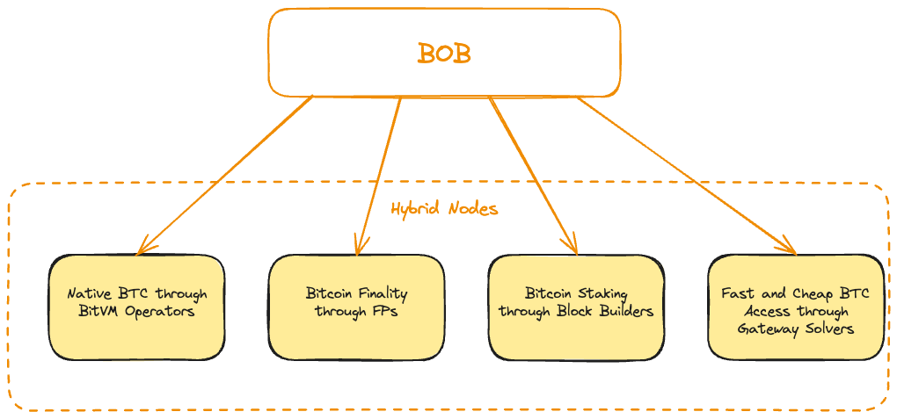

# Hybrid Nodes

Hybrid Nodes are technical infrastructure providers that operate core BOB services. All node operators on BOB are called "Hybrid Nodes" and serve critical roles in enabling Bitcoin DeFi functionality through BitVM operations, Bitcoin finality, and cross-chain infrastructure.

## Node Types and Ranking

### Delegation as a Ranking Mechanism

BOB requires a decentralized way to select and rank infrastructure providers. Since BOB cannot support arbitrarily many operators due to technical constraints (e.g., BitVM operators introduce off-chain data requirements that scale with each new operator), delegations serve as a ranking instrument. Operators most trusted by the community, as demonstrated by delegations they receive, serve as the infrastructure providers for BOB.

This creates an alignment mechanism where:
- Operators are selected based on their service performance and delegations received
- Delegators seek to support reliable operators that expand liquidity and pioneer new products
- The system naturally limits operator numbers while ensuring quality through community selection

### Current Infrastructure Roles

:::info R&D
BitVM operators and Bitcoin finality providers are currently in development, planned for Phase 2.
:::

**Native BTC through BitVM Operators**

BitVM achieves 1-of-n security, meaning if there's one honest provider, native BTC on BOB is secure. BitVM operators serve as safekeepers of all BitVM for BOB. The trust model allows users to verify their own BTC deposits while relying on ranked operators to trigger fault-proof processes if anyone attempts to cheat. Operators are selected and prioritized according to their reliability and delegations received.

**Bitcoin Finality through Finality Providers (FPs)**

FPs attest to BOB's finality on Bitcoin, enabling BitVM verification that BOB has finalized on Bitcoin. This can be achieved through [Babylon's BSN architecture](https://docs.babylonlabs.io/guides/overview/bitcoin_secured_networks/) or BOB's [OptiMine](https://gobob.xyz/optimine) optimistic merged mining protocol. BOB maintains hybrid ZK proof security on Ethereum while adding Bitcoin "soft" finality. FPs are selected based on their ecosystem contribution and delegations received.

### Future Infrastructure Roles

**Bitcoin Staking through Block Builders**

BOB's approach to BTC staking leverages tight control over block production to eliminate harmful MEV while enabling "good" MEV like DEX rebalancing and liquidation execution. Users stake BTC assets on BOB, builders use these assets for ecosystem health activities, creating transparent yield from DeFi activity. Builders require delegations to participate in fast block building.

**Fast BTC Access through Gateway Solvers**

Gateway solvers provide liquidity for quick BTC swaps between Bitcoin and BOB, and integrate with bridges for optimal cross-chain routing. Delegations ensure only reliable solvers offering fast transfers are selected, with the system limiting solver numbers to reduce coordination overhead.

## Rollout Phases

### Phase 1: Pre-staking
- Users delegate to Hybrid Nodes
- Nodes establish themselves without active infrastructure

### Phase 2: Infrastructure Launch
- Bitcoin finality providers and BitVM operators go live
- FPs prioritized based on delegations and ecosystem contributions
- BitVM operators selected based on bridging capability and reliability

### Phase 3: Role Extension
- Gateway solvers extended to facilitate BTC swaps between chains
- Block builders enable MEV searching and DeFi optimization
- Additional node types based on ecosystem needs

## Technical Architecture

### Security Model
- **BitVM**: 1-of-n trust assumption with fraud proofs on Bitcoin
- **Finality**: Economic security through staked BTC with slashing
- **Delegation**: Non-custodial smart contracts where nodes cannot access delegated assets
- **Transparency**: On-chain monitoring and verification of all operations