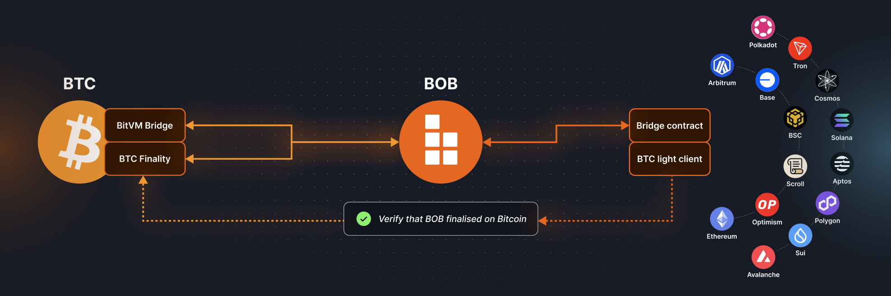

# Hybrid Chain Roadmap

BOB is a _Hybrid Chain_, a new kind of rollup that inherits Bitcoin security while providing trust-minimized bridges directly to multiple L1s.

Today, BOB has completed [Phase 1](#-phase-1-bootstrapping-as-an-ethereum-l2) of its roadmap. The network is live as an optimistic rollup on Ethereum with [a growing TVL](https://dune.com/bob_collective/build-on-bitcoin-bob-overview) of Bitcoin liquid staking tokens (LSTs) in [our DeFi ecosystem](https://app.gobob.xyz/en/apps). Our onchain [BTC light client](/docs/bob-chain/relay) powers trust-minimized cross-chain BTC intents with [BOB Gateway](/docs/user-hub/onboard-to-bob/bob-gateway).

Next, our Hybrid Chain will inherit security from Bitcoin, then leverage this security to create trust-minimized bridges to Bitcoin, Ethereum, and other L1s. Thus, we won't need to rely on third-party bridges for interoperability between these networks, solving the problem of fragmented BTC multi-chain liquidity.

Our vision paper, "[BOB: The Hybrid Chain](https://docs.gobob.xyz/whitepaper.pdf)", provides a more technical description of this roadmap.

## ✅ Phase 1: Bootstrapping as an Ethereum L2

BOB first launched as an Ethereum L2 built with the [OP stack](https://docs.optimism.io/), operating a native Ethereum bridge, and supporting multiple 3rd-party Bitcoin bridges. Our EVM-compatible network has the familiar UX, wallets, tokens, and dapps as EVM chains like Ethereum, Arbitrum, and Base. This allows dApps on BOB to build on top of best-in-class developer tooling and new developments like sub-second transaction speeds and [fee token abstraction](/docs/deprecated/bridged-btc-gas-fee).

BOB tracks the state of Bitcoin with a BTC light client, verifying block headers and accepting transaction inclusion proofs. **This enables smart contracts on BOB to trustlessly use Bitcoin state in real time**, such as [BOB Gateway](/docs/user-hub/onboard-to-bob/ethereum-bridge).

## ⌛ Phase 2: Bitcoin "Soft" Finality

_In Phase 2, BOB will add Bitcoin finality to the Ethereum L2 setup._

Once per epoch (one or more BOB blocks), the Sequencer requests a sign-off by participants of the Bitcoin finality protocol, who fully validate the BOB chain state. Using BitVM, we can then construct a trust-minimized Bitcoin bridge secured by this Bitcoin "soft" finality protocol. In other words, to attack the Bitcoin bridge one would need to corrupt the majority of Bitcoin finality protocol participants ([hash rate](https://gobob.xyz/optimine) or [BTC stake](/docs/reference/research#bitvm2-bridging-bitcoin-to-second-layers)). The Ethereum bridge will remain secured by Ethereum.

**This Bitcoin "soft" finality can be used to accelerate withdrawals of the Ethereum bridge, reducing the delay from 7 days to a few minutes or hours.**

## Phase 3: Full Bitcoin Security

_The final step is inheriting Bitcoin security by posting BOB's state transition proofs on Bitcoin._

In the absence of a Bitcoin fork enabling on-chain zk-verifiers, BOB will have to leverage optimistic verification via BitVM. Achieving optimistic rollups on Bitcoin without additional trust assumptions requires using the Bitcoin mainchain as a data availability layer. The associated costs are onerous and pose a challenge in terms of economics. As a result, to complete the transition to Phase 3, BOB must reach sufficient scale in terms of active users such that incurring additional data availability fees does not increase transaction fees beyond that of competing Ethereum L2s. Alternative data availability layers can be considered as a trade-off between cost and security, as they introduce additional trust assumptions beyond that of Bitcoin.

## Further Reading

To learn more about the background, motivations, and technical details of the BOB Hybrid Chain, read the [BOB Hybrid Chain Vision Paper](https://docs.gobob.xyz/whitepaper.pdf).
