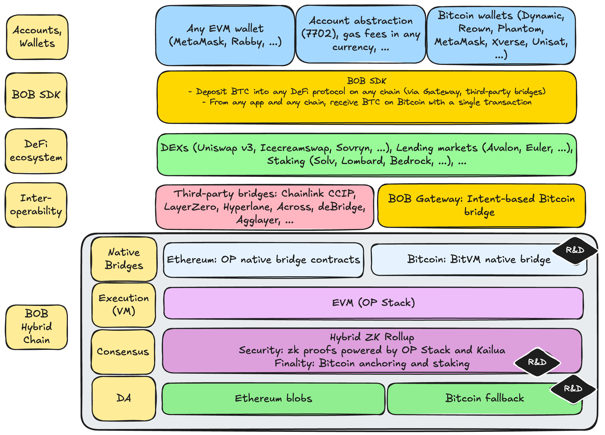

# Hybrid Stack

The BOB ecosystem is built as a layered stack that enables seamless interaction between Bitcoin and Ethereum ecosystems, providing users with cryptographic security via ZK proofs, Ethereum's innovation, and Bitcoin-secured finality.

## Accounts and Wallets

Users interact with BOB through familiar EVM wallets like MetaMask and Rabby, as well as native Bitcoin wallets including Xverse, Unisat, and Phantom. Account abstraction is supported via ERC-4337 smart accounts and [EIP-7702](https://eips.ethereum.org/EIPS/eip-7702) (which provides [superior UX](https://blog.thirdweb.com/eip-7702/)) for gasless transactions and enhanced user experience. Bitcoin wallet integration allows users to control EVM funds directly from their Bitcoin wallets through providers. Or users can skip wallets altogether and use social logins with providers like [Dynamic](https://dynamic.xyz/), [Reown](https://reown.com/), and others.

## BOB SDK

The [BOB SDK](https://docs.gobob.xyz/gateway) abstracts Bitcoin cross-chain complexity for developers, enabling single-transaction BTC deposits and withdrawals from and into any DeFi protocol on any chain. Developers can build and extend their existing applications to accept native BTC deposits that are converted to wBTC or other BTC-wrappers. They can also offer their users to receive native BTC. The SDK provides familiar web3 APIs and comprehensive tooling for seamless Bitcoin DeFi integration powered by [BOB Gateway](https://docs.gobob.xyz/gateway).

## DeFi Ecosystem

BOB hosts a [growing ecosystem](https://app.gobob.xyz/en/apps) of leading DeFi applications including Uniswap v3, Avalon, Euler, Solv, Lombard, Bedrock, and more. The ecosystem leverages BOB's Bitcoin position to offer BTC-yields, BTC trading, and BTC lending use cases.

## Interoperability

BOB's interoperability layer consists of [BOB Gateway](https://docs.gobob.xyz/gateway), an intent-based Bitcoin bridge optimized for speed and programmability. BOB is specialized in optimizing the Bitcoin to BOB route. For multichain connection to Base, Arbitrum, Solana, Binance Smart Chain, and many more, BOB relies on multiple third-party bridges including [Chainlink CCIP](https://chain.link/cross-chain), [LayerZero](https://layerzero.network/), [Hyperlane](https://hyperlane.xyz/), [deBridge](https://debridge.finance/), and many more.

## BOB Hybrid Chain

BOB's foundation consists of native bridges to both Ethereum (via the OP stack) and Bitcoin (developed by BOB via [BitVM](/docs/bitvm)). Just like "ETH" is "ETH" on Arbitrum, BTC on BOB will just be "BTC". In addition, EVM smart contracts for full programmability, and a hybrid ZK rollup consensus powered by OP stack and Kailua complete the rollup. Data availability uses Ethereum blobs as primary storage with Bitcoin as a censorship-resistant fallback. This infrastructure enables unilateral exit to both Bitcoin and Ethereum while providing cryptographic security guarantees through validity proofs.
