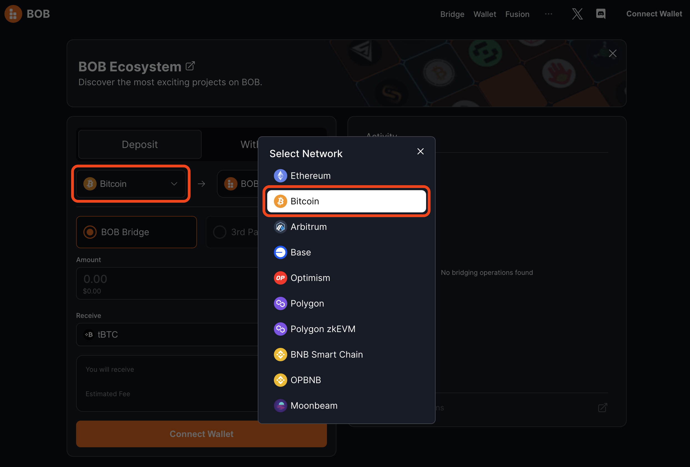
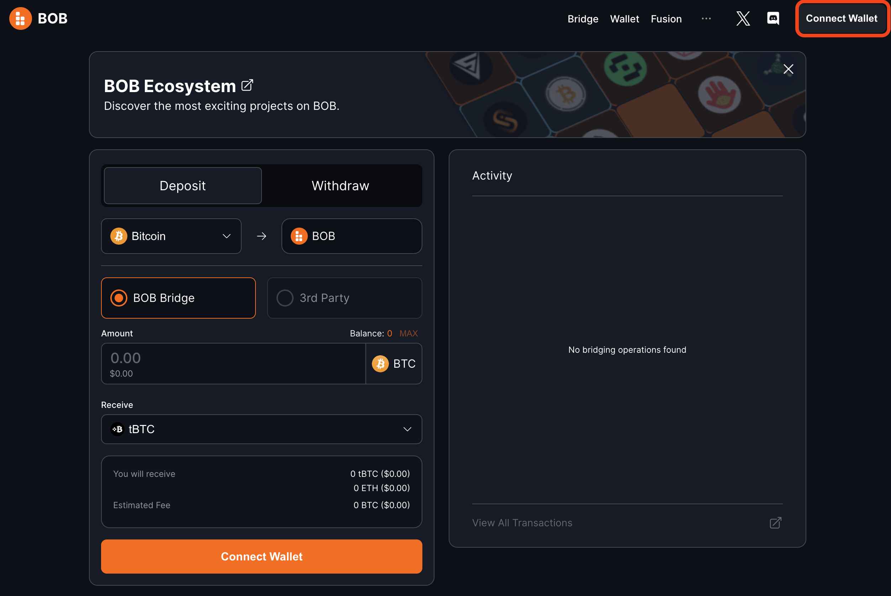
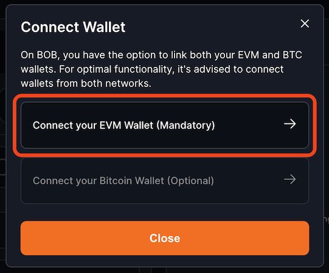
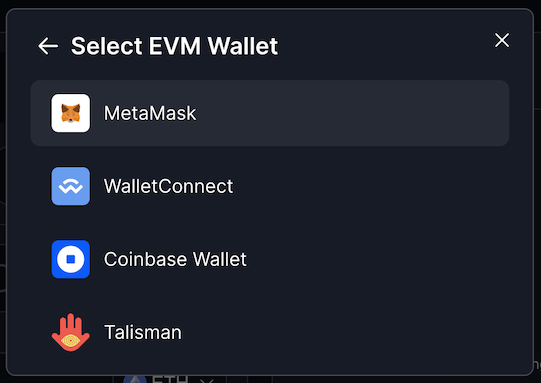
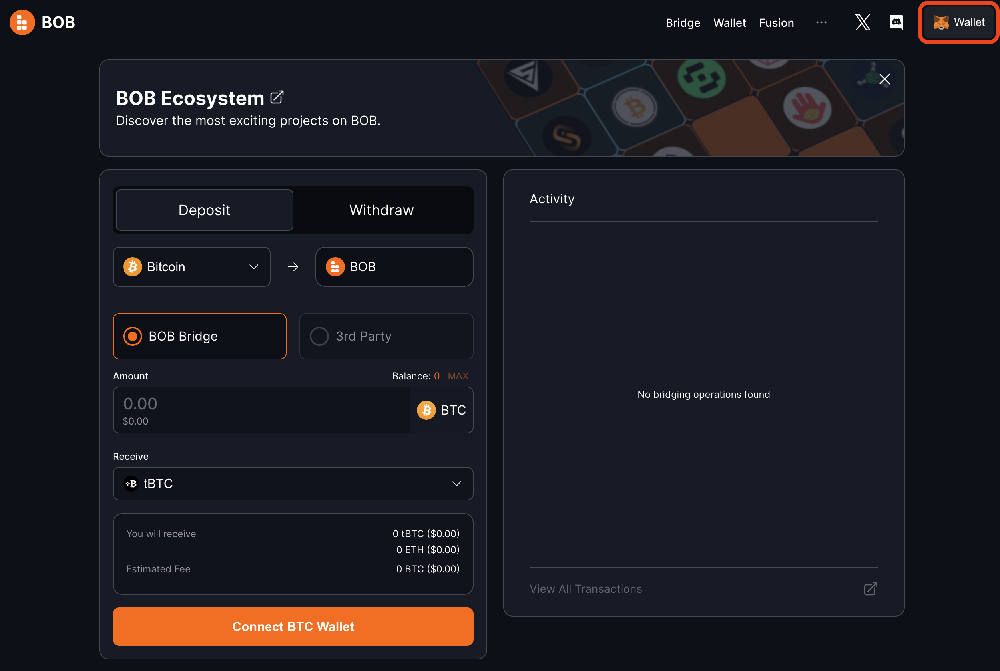
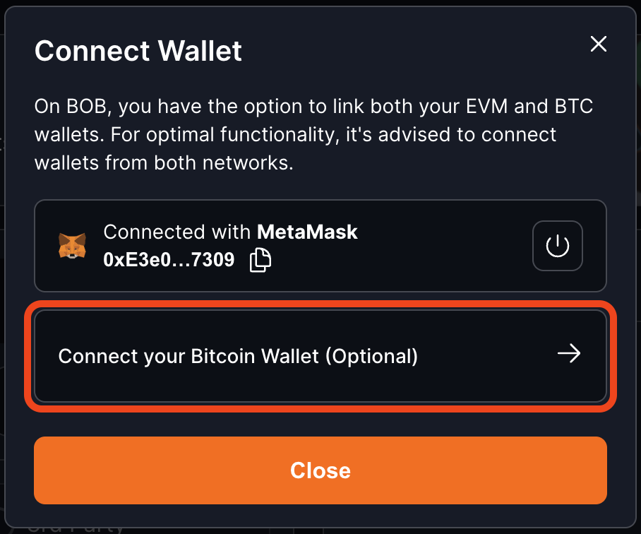
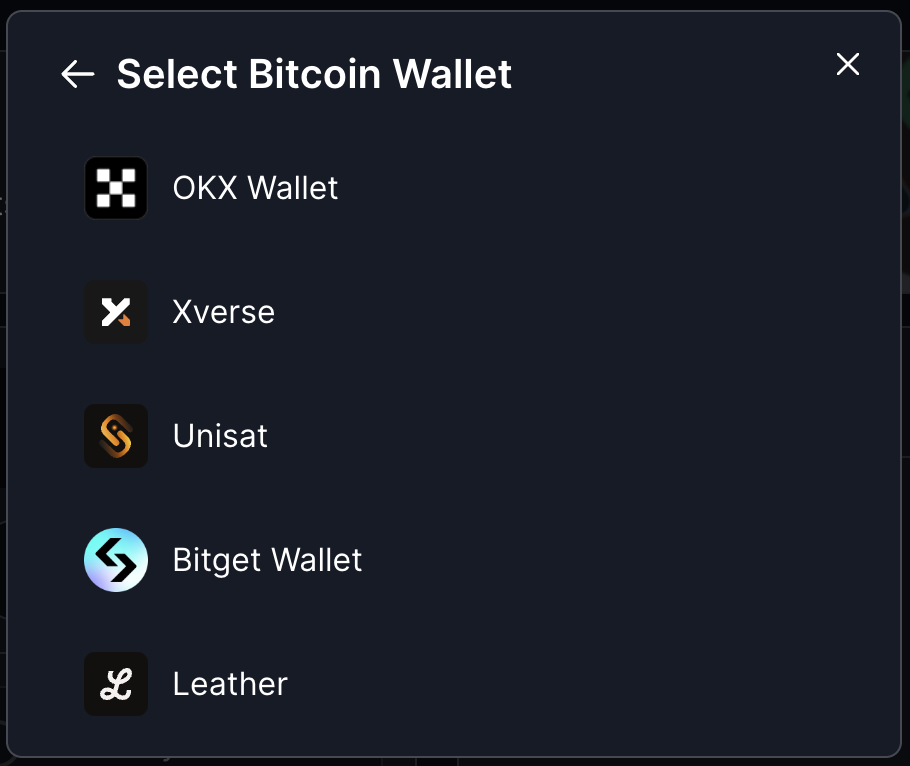
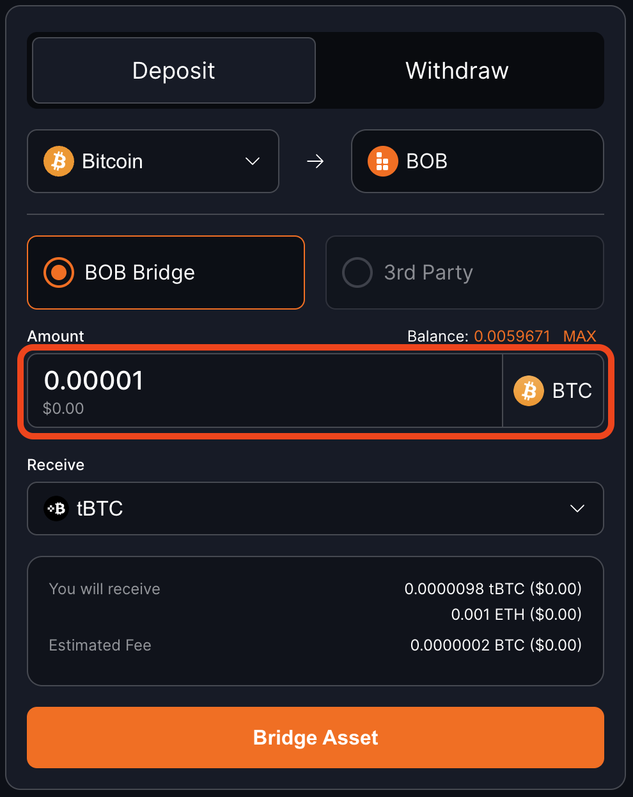
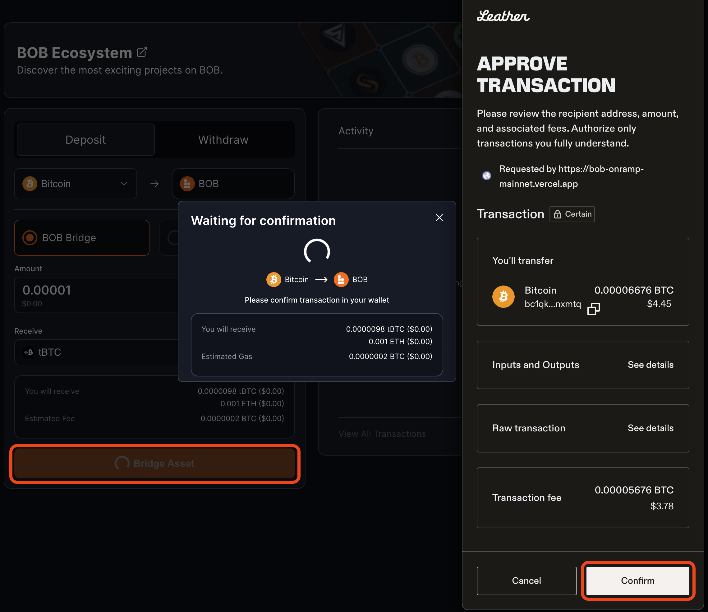
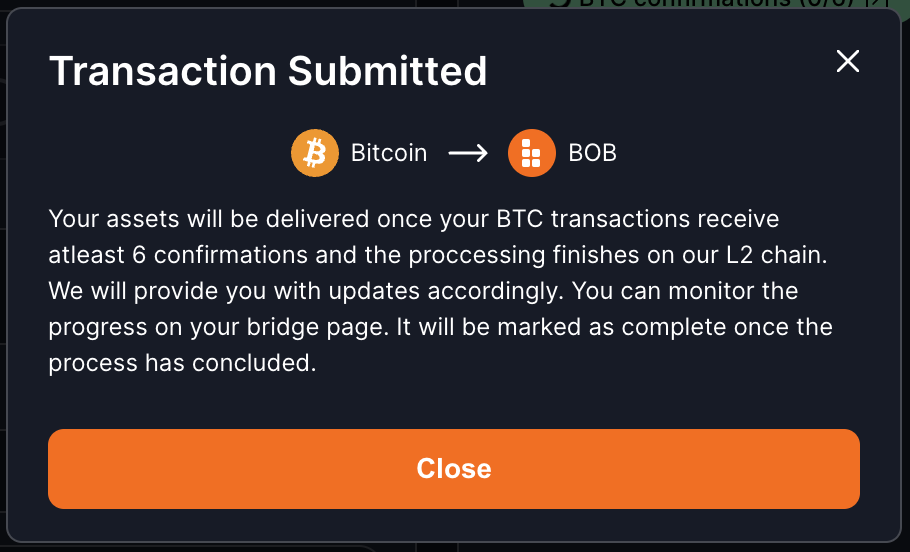

# Bridge from Bitcoin to BOB

[BOB Gateway](https://docs.gobob.xyz/gateway) lets you stake, swap, or lend your bitcoin from a single, unified interface so you can put your bitcoin to work earning yield faster than ever before.

It's built on a trustless, RFQ-based cross-chain swap protocol that connects professional LPs with users through a seamless swapping experience. Essentially, LPs handle the complexities of bridging and staking on behalf of users in exchange for a fee.

:::tip Interested in providing liquidity?
If you are interested in being an LP for the BOB Gateway bridge, please send us an email at `gateway@gobob.xyz`.
:::

All you need is a Bitcoin wallet with some BTC to send and an EVM-compatible wallet to receive your Bitcoin LST/LRT or wrapped Bitcoin on BOB. We'll even send you some ETH to cover the fees of your first few transactions on BOB.

:::tip Want to add BOB Gateway to your dapp?

Check out our guide to see how you can [integrate BOB Gateway into your dapp](https://docs.gobob.xyz/gateway).

:::

## Video Tutorial

<iframe width="560" height="315" src="https://www.youtube.com/embed/xExdId-s4xA?playlist=xExdId-s4xA" frameborder="0" allow="accelerometer; autoplay; clipboard-write; encrypted-media; gyroscope; picture-in-picture" allowfullscreen></iframe>

## Step-by-Step Guide

1. Open the [BOB Gateway website](https://bob-fusion-git-feat-external-bridges-interlay.vercel.app/bridge?type=deposit).

2. Select the Bitcoin network by clicking "Ethereum" and then selecting "Bitcoin" from the list.

3. Click `Connect Wallet` in the top-right corner.

3. Click `Connect your EVM Wallet (Mandatory)`.

4. Choose your EVM wallet provider. In this example we'll use MetaMask.

:::tip Choosing your EVM address
You will receive your wrapped Bitcoin at the EVM address you connect at this step.
:::

5. Click `Wallet` in the top-right corner again to connect your Bitcoin wallet.

6. Click `Connect your Bitcoin Wallet (Optional)`.

7. Select your Bitcoin wallet provider. In this example we'll use Leather.

8. Type the amount of BTC that you would like to bridge from Bitcoin to BOB.

9. Click "Bridge Asset," then Confirm the transaction in your wallet.

10. That's it! After a few Bitcoin blocks your BTC will be finalized on BOB. You can verify the bridging is complete with the Activity section on the right of the page or by opening your EVM wallet and seeing that your balance of wrapped BTC on BOB has increased.

If you have any questions, please reach out to us on [Discord](https://discord.gg/gobob) or [Telegram](https://t.me/+CyIcLW2nfaFlNDc1). Welcome to the Bitcoin Renaissance on BOB!
