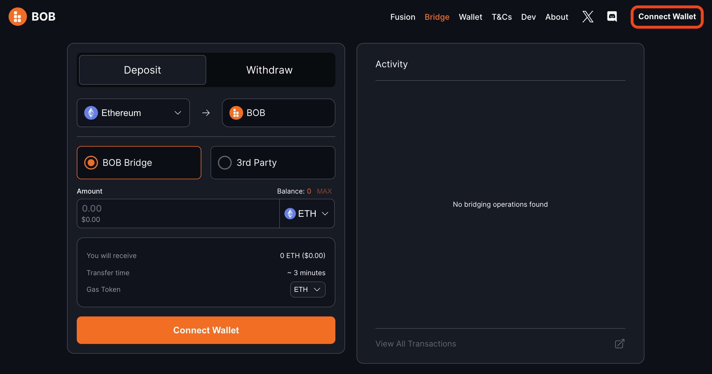
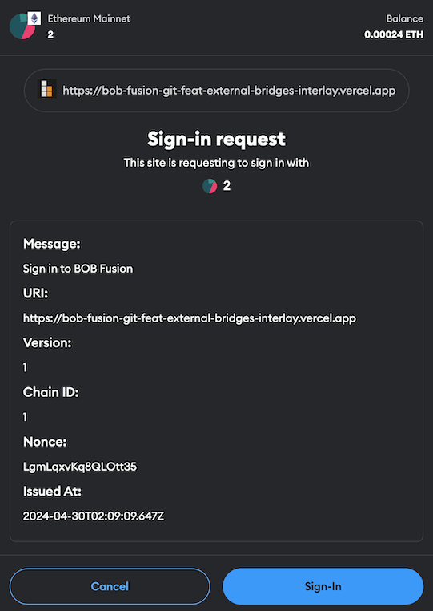
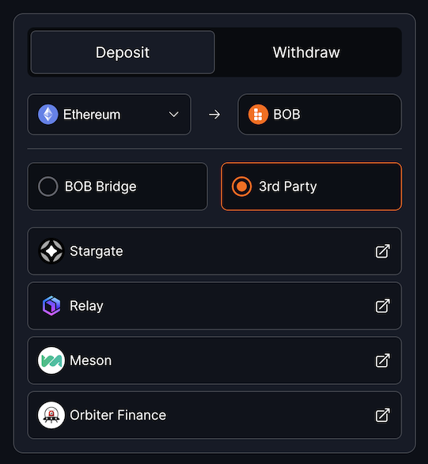
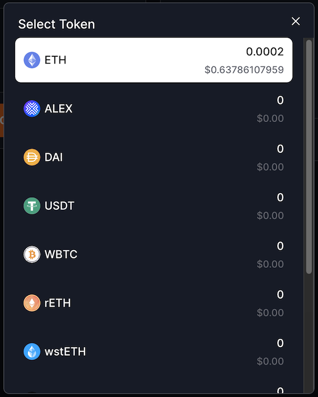
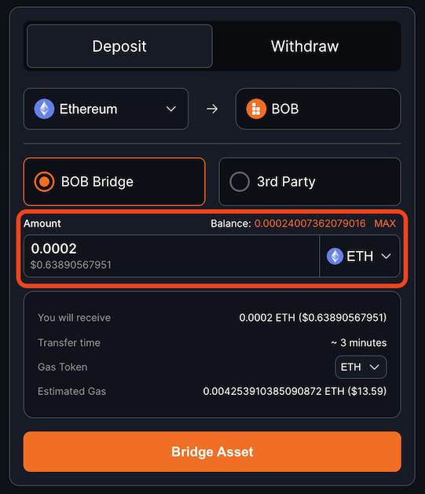
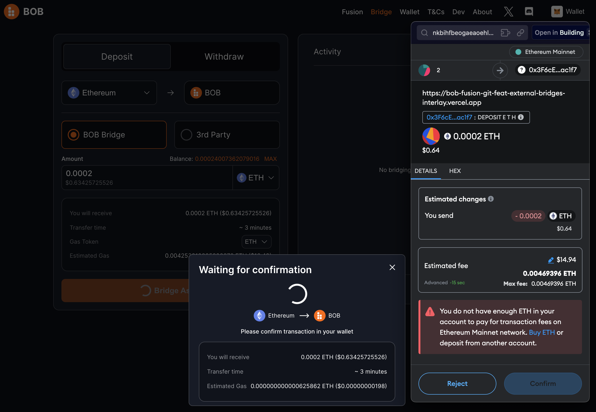
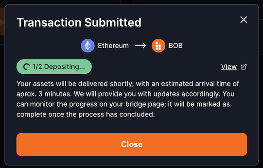

# Bridge from Ethereum to BOB

The [BOB Bridge](https://app.gobob.xyz/bridge) allows you to move ETH between Ethereum and BOB.

## Step-by-step Guide

1. Open the [BOB Bridge website](https://app.gobob.xyz/bridge).

2. Click `Connect Wallet` in the top-right corner.

3. Click `Connect your EVM Wallet (Mandatory)`.

4. Choose your EVM wallet. In this example we’ll use MetaMask.

5. You will receive a few pop-up messages to connect your wallet, including this message to “Sign-In.” Your wallet may look different. The URI displayed for you will be `https://app.gobob.xyz`.

6. Make sure you are on the “Deposit” tab and have “Ethereum” selected.

:::tip
You may choose to use a “3rd Party” bridge. Each of these buttons will direct you to that bridge’s website. For the rest of this guide we’ll use the “BOB Bridge.”
:::

7. You may choose between bridging ETH (“Ether”) or a variety of ERC-20 tokens such as WBTC, DAI, wstETH, and others.

8. Type the amount of that token that you would like to bridge from Ethereum to BOB.

9. Click “Bridge Asset,” then Confirm the transaction in your wallet. Make sure you have enough ETH to pay the gas fee for the transaction. 🥲

10. That’s it! After ~3 minutes your tokens will be bridged to BOB. You can verify the bridging is complete with the Activity section on the right or by clicking “Withdraw” and seeing that your token balance on BOB has increased.

If you have any questions, please reach out to us on [Discord](https://discord.gg/gobob) or [Telegram](https://t.me/+CyIcLW2nfaFlNDc1). Welcome to BOB!
