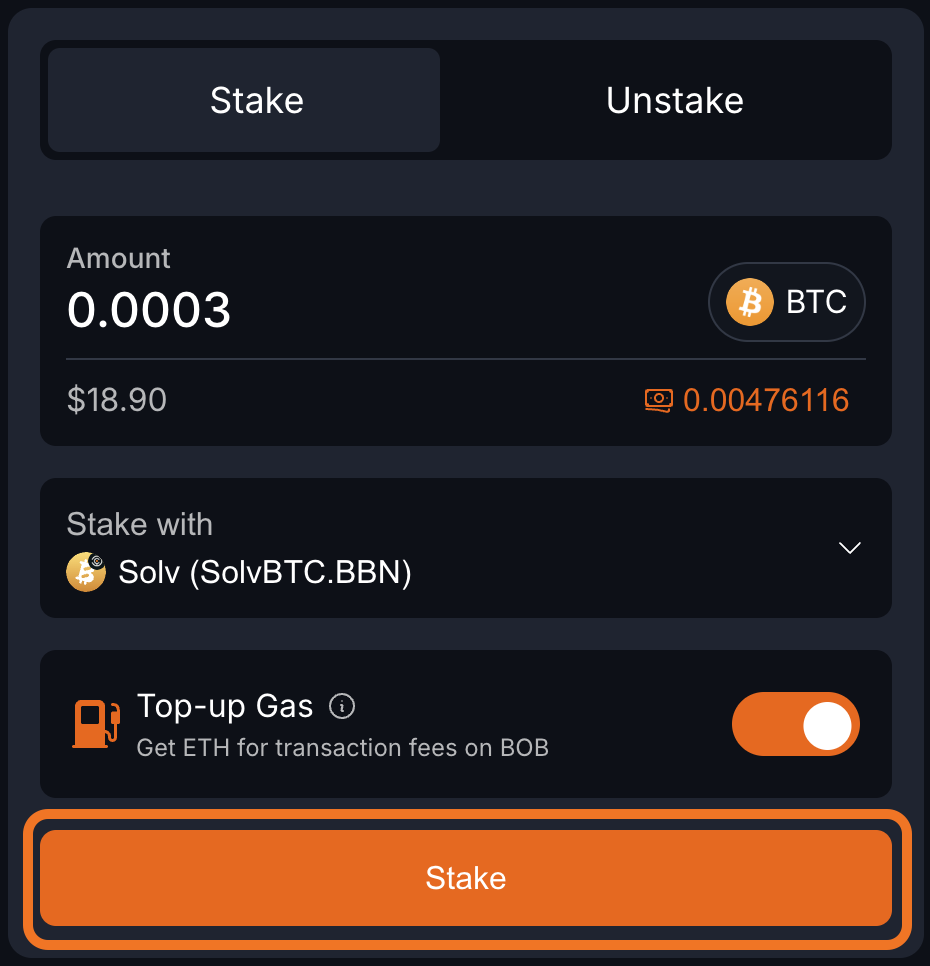

# Guide: Stake BTC

## One-Click BTC Staking

[BOB Earn](https://app.gobob.xyz/stake?type=stake&stakeWith=solv-solvbtcbbn) is a new 1-click Bitcoin staking portal and [BOB Gateway](/docs/gateway/) for Bitcoin liquid staking. Harvest BOB Spice points in the final season of BOB Fusion by using BOB Earn and exploring the growing Bitcoin staking ecosystem on BOB.

It's built on a trustless, RFQ-based cross-chain swap protocol that connects professional LPs with users through a seamless swapping experience. LPs handle the complexities of bridging and staking on behalf of users in exchange for a fee.

All you need is a Bitcoin wallet with some BTC to send and an EVM-compatible wallet to receive your Bitcoin LST on BOB. We'll even send you some ETH to cover the fees of your first few transactions on BOB.

## Choose Your Wallet Setup

### Standard Setup
If you're using a regular Bitcoin wallet and EVM wallet, follow the [Standard Guide](#standard-guide) below.

### Ledger Hardware Wallet Setup
If you're using a Ledger hardware wallet, follow the [Ledger Guide](#ledger-guide) below.

## Standard Guide

1. Open the [BOB Earn website](https://app.gobob.xyz/stake?type=stake&stakeWith=solv-solvbtcbbn).

1. Click `Connect Wallet` in the top-right corner.

2. Click `Connect your EVM Wallet (Mandatory)`.

3. Choose your EVM wallet provider.

:::tip Choosing your EVM address
You will receive your assets at the EVM address you connect at this step.
:::

4. Click `Wallet` in the top-right corner again to connect your Bitcoin wallet.

5. Click `Connect your Bitcoin Wallet (Optional)`.

6. Select your Bitcoin wallet provider.

7. Type the amount of BTC that you would like to stake.

8. Click the "Stake with" box to open a menu of staking options.

9. Choose a BTC yield source.

10. Toggle on "Top-up Gas" to convert a small amount of your BTC to ETH for transaction fees on BOB. You must do this if your EVM wallet has no ETH to make sure you can transact on BOB. If you already have ETH on BOB, this is optional.

11. Click "Stake", then Confirm the transaction in your wallet.

12. Click "Close".

:::tip You're done!
The next steps are optional and show how to monitor the progress of your transaction.
:::

13. Click "Bridge".

14. Look in the "Activity" box to see the status of your transaction. After a few Bitcoin blocks your BTC will be finalized on BOB. You can also verify the bridging is complete by opening your EVM wallet and seeing that your balance of wrapped BTC on BOB has increased.

## Ledger Guide

### Prerequisites

To complete this task you will need:
- A Ledger Hardware wallet with BTC on the Bitcoin network

That's it! You do not need any tokens on any EVM chain, including BOB. If you don't have an Ethereum or EVM address yet, this guide will show you how to create one in Ledger Live.

### Part One: Set Up Accounts

1. [Download the XVerse wallet](https://www.xverse.app/ledger-hardware-wallet-support). This will allow you to connect your Ledger's BTC account to the BOB Stake app.
2. [Connect your Ledger device to the XVerse wallet](https://support.xverse.app/hc/en-us/articles/17819233917965-How-to-Connect-Your-Ledger-Device-to-Xverse).
3. Create an EVM account for your Ledger device. This is sometimes also called an Ethereum address. We recommend these options:
   - Ledger Live: [Create an EVM account in Ledger Live](https://support.ledger.com/article/360009576554-zd)
   - MetaMask: [Connect your Ledger to MetaMask](https://support.ledger.com/article/4404366864657-zd)
   - Rabby: [Set up and use Rabby wallet to access your Ledger Ethereum (ETH) account](https://support.ledger.com/article/4409801559569-zd)

### Part Two: Stake

1. [Open the BOB Earn page](https://app.gobob.xyz/en/stake).

2. Click `Connect Wallet` in the top-right corner of the page.
3. Select BTC, then select XVerse.

4. Select your Ledger account and click `Connect` in the XVerse window that pops open.

5. Click your Bitcoin address in the top-right corner of the page.

6. Click `Connect EVM Wallet` in the sidebar that opens.

7. Choose your EVM account to connect. It will depend on the wallet software you chose in [Part One](#part-one-set-up-accounts). The next few steps will show how to connect to Ledger Live's Ethereum account with WalletConnect.

8. Click `Ledger Live`.

9. Click the EVM address you would like to use, then click `Connect`.

10. Back on the BOB Stake page, click the icon of two arrows to close the wallet drawer.

11. Follow steps 7-14 from the [Standard Guide](#standard-guide) to complete your staking.

## Contact Us

If you have any questions, please reach out to us on [Discord](https://discord.gg/gobob) or [Telegram](https://t.me/+CyIcLW2nfaFlNDc1). Welcome to the Bitcoin Renaissance on BOB! 