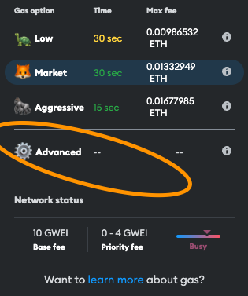
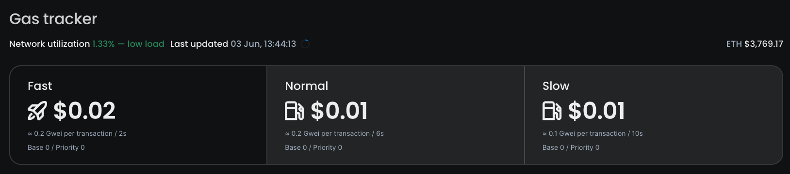
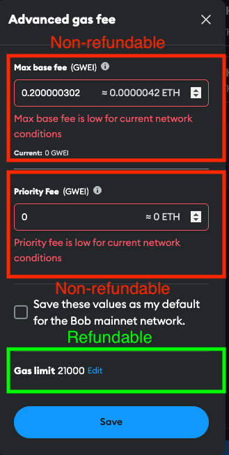
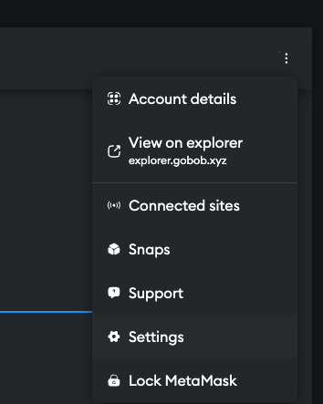
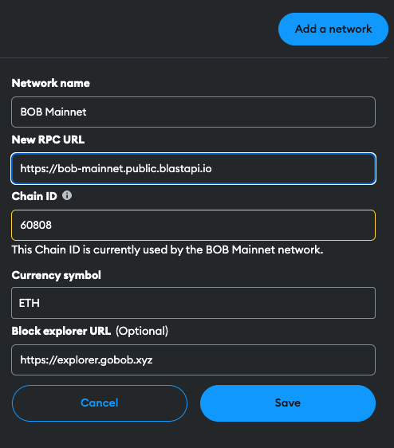

# FAQ & Troubleshooting

## Do I need a new wallet for BOB?

- **No!** Your existing Ethereum wallet (MetaMask, Rabby, Safe, or Ledger address) works on BOB.
- The only exception is Safe - you need to create a new Safe on the BOB network: https://safe.gobob.xyz/

## What if my wallet's RPC isn't working?

- Try the **Tenderly public RPC**:
  - https://bob-sepolia.explorer.gobob.xyz/

## Can I use a custodian like Fireblocks or Anchorage?

- Yes! BOB supports institutional-grade custody solutions.

## What's the best wallet for beginners?

- **MetaMask** is the most popular and user-friendly option
- **Rabby** offers enhanced security features while maintaining ease of use

## What's the most secure wallet option?

- **Hardware wallets** (Ledger or Trezor) provide the highest security
- **Multi-signature wallets** (Safe) are ideal for teams and large holdings

## Can I use multiple wallets with BOB?

- Yes! You can use multiple wallets simultaneously
- Each wallet will have its own address and balance
- You can switch between wallets in the BOB interface

## How do I recover my wallet if I lose access?

- Use your recovery phrase (also called seed phrase)
- Never share your recovery phrase with anyone
- Store it securely offline
- Consider using a hardware wallet for better security

## MetaMask fees are too high. How can I reduce them?

Sometimes MetaMask can have issues with estimating the correct gas fees. Gas fee settings in MetaMask consist of three parts:

- **Max Base Fee**: The base fee amount you will pay for the transaction. This will not be refunded if set too high. If it is set too low, the sequencer might take a long time to include transaction.
- **Max Priority Fee**: The amount of gas you are willing to pay per unit of gas as a priority to get the transaction included before others. This will not be refunded if set too high. If it is set too low, the sequencer might take a long time to include the transaction.
- **Gas Limit**: The maximum amount of gas you are willing to spend on a transaction. If this is set too high, it will be refunded. The transaction will fail if it is set too low, and the fees paid are lost.

You can reduce the gas fees by following [the steps from the MetaMask documentation](https://support.metamask.io/transactions-and-gas/gas-fees/how-to-customize-gas-settings/):

1. When making a transaction using MetaMask, click the "Pen" icon next to the estimated fee to edit the gas usage.

2. In the "Advanced Gas Controls" window, you can adjust the "Gas Limit" and "Max Priority Fee" to reduce the gas fees. You can either set one of the suggested gas options like "Low", "Market", or "Aggressive". If these options still seem expensive, or you can manually set the gas limit and max priority fee via the "Advanced" tab.

3. In the "Advanced" tab, you can manually set the "Max base fee", "Priority Fee", and "Gas limit" to reduce the gas fees.

- For "Max base fee" and "Priority fee", check the current gas prices on the [BOB explorer](https://explorer.gobob.xyz/gas-tracker). In this example, the base fee is 0.2 Gwei, and the priority fee is 0 Gwei.

- Set the "Max base fee" and "Priority fee" to the desired values. In this example, the base fee is 0.2 Gwei, and the priority fee is 0 Gwei.
- Ideally, don't adjust the "Gas limit" unless you are sure about the amount of gas required for the transaction. The only reason to adjust the gas limit is if MetaMask underestimates the gas required to send a transaction, which might happen if you interact with an unverified smart contract. **If you set the gas limit too low, the transaction will fail with an out-of-gas error, and you will lose the fees paid.**

:::tip
Gas fees change based on the BOB network utilization. If you consistently face issues with MetaMask, you might want to consider switching to other wallets such as Rainbow or Rabby.
:::

## I can't connect to the BOB network. How can I change the RPC node?

If you are unable to connect to the BOB network, you can try changing the RPC node in your wallet. Here is an example how to change the RPC node in MetaMask:

1. Open the wallet settings.

2. Go to the "Networks" tab and select the BOB Network to change RPC nodes.

We recommend using the following network settings:

- **Network Name**: BOB Mainnet
- **New RPC URL**: https://bob-mainnet.public.blastapi.io
- **Chain ID**: 60808
- **Symbol**: ETH
- **Block Explorer URL**: https://explorer.gobob.xyz

