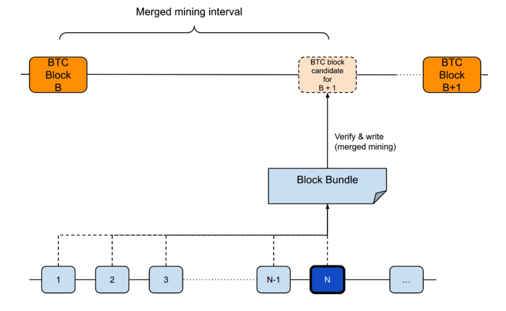

# Optimistic Merged Mining

BOB uses the [OptiMine](https://gobob.xyz/optimine) optimistic merged mining protocol.
OptiMine extends [traditional merged mining](https://bitcoin.stackexchange.com/questions/273/how-does-merged-mining-work) to separate block production from Proof-of-Work (PoW) finalization, following the hybrid consensus model. In a nutshell, blocks are produced optimistically while PoW eventually finalizes batches of blocks. BOB inherits security from Bitcoin miners, offsets the reliance on centralized sequencers, and retains fast block times.

## Benefits

Optimistic Merged Mining has the following benefits:

- EVM rollups with Bitcoin miner security: BOB inherits security from Bitcoin miners.
- Removing trust in (centralized) sequencers: Bitcoin miners run full nodes of BOB and thereby verify that the sequencer(s) are producing valid blocks. This offsets trust in the sequencer(s) and thereby provides Bitcoin security through mining to a rollup.
- No extra PoW: Merged mining reuses work of the Bitcoin network, i.e., no extra PoW is required for BOB. No extra electricity spend is required.
- Fast block times: With optimistic merged mining, BOB can retain its 2-second block times. Other merged mining approaches require a lower bound of roughly 15-second block times due to high uncle rates.
- No Bitcoin modifications needed: Optimistic merged mining works on Bitcoin today. While we are working on BitVM, we can implement optimistic merged mining today.
- Block fee stability: Since multiple blocks are merged mined at once, the fees are averaged over multiple blocks such that fee variance across blocks is reduced for Bitcoin miners.
- Prevention of Bitcoin miner attacks: Since blocks are produced by the sequencer and miners only verify, they can at worst halt block production but not create forks or invalid blocks.

## Merged Mining

An existing technique to receive Bitcoin security is through merged mining. In “vanilla” merged mining, Miners submit PoW to two or more chains simultaneously. Thereby, an auxiliary chain inherits (some of) the security of the parent chain (e.g., Bitcoin).

In [Namecoin](https://www.namecoin.org/), Bitcoin Miners submit Bitcoin blocks and block candidates with sufficient PoW to the Namecoin chain, where the coinbase transaction includes a reference to the to-be-mined Namecoin block hash. On receiving a valid auxiliary PoW, block production in Namecoin continues.
[RSK (Rootstock)](https://rootstock.io/) is currently the most widely adopted merged mined chain. Each block in RSK receives PoW and block production depends on the previous merged mined block.

A limitation of merged mining is the slow block production rate compared to Proof-of-Stake networks and L2 solutions. For example, RSK achieves a 30-second block time on average, while Optimism produces a block every two seconds. This limitation is due to the non-deterministic nature of PoW, as well as the increased chance of forks due to network propagation delays when two or more blocks are found for the same high within a short period of time.

## Optimistic Merged Mining in a Nutshell

The [BOB sequencer](https://docs.optimism.io/stack/components#sequencing) creates signed blocks optimistically by collecting transactions from the BOB L2 and Ethereum L1 which are then assembled into blocks. Block finalization is achieved by Bitcoin Miners running a BOB L2 full node to verify the correctness of the signed blocks. Miners periodically submit PoW solutions according to the BOB PoW difficulty. Miners and the sequencer(s) finalize multiple signed blocks at once by including the signed blocks’ combined hashes into the PoW solutions produced by mining, i.e., so-called “mined blocks”. The mined blocks are verified and signed by the sequencer to prevent attacks by miners.

If no valid PoW mined blocks are generated for a pre-defined timeout period, the rollup/BOB L2 considers this a consensus failure and block production is halted - until a mined block is found.

## Optimistic Merged Mining in Detail

### Preliminaries

**Actors**

- *Sequencer:* a block producer subject to the rollup rules. The sequencer is responsible for creating and signing blocks.
- *Miners:* Bitcoin miners that participate in merged mining the BOB L2. Miners are assumed to run a BOB full node.

**Notation**

- *Signed blocks*: Blocks proposed and signed by the sequencer.
- *Mined blocks*: Blocks created by miners (have PoW) that commit to a set of existing signed blocks.
- *Block bundle*: A block bundle refers to a set `N` of signed blocks that are not yet merged mined. For data efficiency, the block bundle is a single hash derived from a vector of `N` signed block hashes that are not yet merged mined. Note that we use a vector instead of a Merkle tree or similar since the BOB rollup full nodes operated both by the miners and the sequencer(s) need to validate that all signed block hashes are correctly included in the block bundle.

Figure 1: Optimistic Merged Mining

### Sequenced Block Production

The sequencer produces and validates blocks based on two inputs:

1. Transactions submitted to the BOB L2.
2. Transactions submitted to the BOB rollup contracts on Ethereum.

BOB is operating with a single sequencer as are other OP stack chains.
You can learn more details about the block production and the working of the optimistic rollup part in the [Optimism Docs](https://docs.optimism.io/stack/protocol/overview#block-production)

In comparison to other OP stack rollups, Bitcoin miners need to finalize BOB L2 blocks. This means that settlement on Ethereum is not sufficient to consider blocks finalized.

### Sequenced Merged Mining Block Finalization

Every `N` BOB L2 blocks, the state of the rollup will be subject to a merged mining "block bundle", akin to a finality gadget in hybrid consensus protocols.

### Protocol

**Rollup block production.** The BOB sequencer collects transactions (from Ethereum and BOB L2) and creates blocks as described above.

**Prepare merged mining block bundle.** Merged miners query their BOB L2 full node for the latest block bundle. The BOB L2 full node will provide a block bundle that includes a reference to all `N` blocks that have not yet been finalized. The block bundle is a hash of the `N` BOB L2 block hashes.

**Merge mining.**

- The miner fetches the block bundle and other merged mining information from the BOB L2 node(s) and verifies the signatures of the block bundle.
- The miner includes the block bundle in the coinbase transaction of the next Bitcoin block template.
- The miner performs AuxPoW over this block template until an AuxPoW solution matches the required BOB L2 difficulty.
- The miner sends the AuxPoW solution (Bitcoin block) to the Federation BOB L2 node.

**BOB L2 finalizes N signed blocks.**

- The BOB L2 sequencer verifies the AuxPoW solution. Verification includes verifying the coinbase transaction of the Bitcoin block, the sequencer signature, and the BOB L2 AuxPoW.
- The BOB L2 sequencer distributes the fee share of the miners since the last block bundle to the miners as part of the EVM block that includes the AuxPoW. Other full nodes verify the inclusion of the fee as part of consensus.

**Block intervals**

The merged mining interval will be determined by the BOB L2 AuxPoW difficulty target, i.e., miners continuously mine and submit a mined block whenever a valid AuxPoW solution is found. The initial target merged mining interval shall be 1 minute.

### BOB L2 consensus rules

Follow the longest chain of sequencer signed blocks. If no merged mined block bundles are created for a predefined number of blocks ("mining timeout period"), e.g., 10,000 blocks, the sequencer will stop producing new signed blocks. This is considered a critical failure.

- If merged mining block bundles are submitted again, the chain will resume producing blocks.
- If merged mining block bundles are never submitted or not for a very long time mitigation out of band is required.

### Architecture

The figure below describes in a simplified way how merged mining will be implemented in BOB.

Figure 2: Overview of the BOB Architecture

### Communication between BOB and Bitcoin

In black, we show the interaction between the BOB sequencer and the miner (mining pool):

- The sequencer is responsible for block production and verification of L2 blocks and the AuxPoW.
- The sequencer runs the rollup clients and the execution client (geth).
  - The execution client is responsible for transaction gossiping, executing transactions and smart contracts. BOB does not modify op-geth and therefore, other execution clients such as [reth](https://github.com/paradigmxyz/reth) with the `op` flag can also be used.
  - The consensus client is responsible for block gossiping, block production, and finalization. We are currently researching how to integrate the merged mining part with the least changes possible into the OP stack components (the smart contracts, op-node, op-batcher, and op-proposer).
  - The consensus and execution client communicate via the via the `getPayload` and `newPayload` RPCs.
- The mining pool connects to their own BOB L2 full node, i.e., it does not directly use the sequencer RPC (as shown in a simplified way in the diagram).
  - The `createAuxBlock` RPC is used to create a Bitcoin block template that includes the block bundle.
  - The `submitAuxBlock` RPC is used to submit the mined block to the BOB L2 node.

### Inclusion of Block Bundle in Bitcoin Block

In orange, we show the inclusion of the block bundle in the Bitcoin block:

- The miner receives the block template that includes the latest block bundle from the BOB L2 node `createAuxBlock` RPC.
- The miner mines Bitcoin blocks and includes the block bundle hash in the output of the coinbase transaction.
- When the miner has found a Bitcoin block that meets the BOB L2 difficulty, it submits the block to the BOB L2 node using the `submitAuxBlock` RPC.

### BOB L2 Block States

In green and red, we show how each BOB L2 node keeps its view of the finalized and non-finalized blocks:

- The green blocks `n-3` and `n-2` are finalized blocks.
- The red blocks `n-1`, `n`, `n+1` are non-finalized blocks.
- The red blocks `n-1` and `n` are signed blocks, i.e., they are signed by the sequencer.
- The red block `n+1` is the head of the BOB L2. It is not yet signed by the sequencer and currently being prepared for inclusion.
- Finalization of blocks consists of the successful submission of the AuxPoW (via the `submitAuxBlock` RPC) and the sequencer including and signing the AuxPoW confirmation as part of a BOB L2 block.
  - On block `n`, the sequencer producing block `n` added an extra data to the BOB L2 block:
    - The sequencer received a Bitcoin block with a coinbase output that included the block bundle `sha256(sha256(x), sha256(y))`.
    - The sequencer verified that the Bitcoin block meets the BOB L2 difficulty.
    - The sequencer then added the data to the BOB L2 block:
      - `start`: The start height of the block bundle `n-3`.
      - `end`: The end height of the block bundle `n-2`.
      - `bits`: The difficulty of the block bundle `n-3` to `n-2`.
      - `coinbase_txn`: The coinbase transaction of the Bitcoin block and includes the block bundle hash.
      - `merkle branches`: The Merkle proof of the coinbase transaction to the Bitcoin block Merkle root.
      - `parent block`: The parent block header of the Bitcoin block.
  - The sequencer sent block `n` including the merged mining data to Ethereum to settle.

## References

- [EVM Overview](https://takenobu-hs.github.io/downloads/ethereum_evm_illustrated.pdf)
- [Ethereum Block Architecture](https://ethereum.stackexchange.com/a/6413/5370)