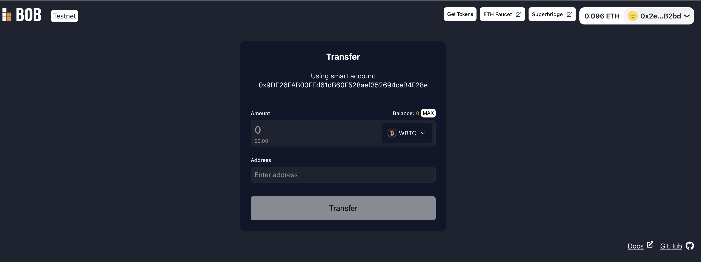

# Account Abstraction (ERC-4337)

In this example, we will show how wBTC can be used for gas fee payment using the [ERC-4337 account abstraction standard](https://eips.ethereum.org/EIPS/eip-4337) on BOB Sepolia (Testnet). This enables users to use smart contract wallets and transact without the need to own ETH.

:::tip Live Demo

Check out the live demo at [demo-account-abstraction.gobob.xyz](https://demo-account-abstraction.gobob.xyz/).

:::

:::info Example Code

Check out the code of the demo in [this repository](https://github.com/bob-collective/demo-account-abstraction-transfer/).

:::

## Smart Contract wallets

This demo showcases wBTC transfer from the smart contract wallet. Smart contract wallets utilize smart contracts rather than single private keys found in Externally Owned Address (EOA) wallets. The programmable nature of smart contract wallets allows for diverse use cases. Unlike EOAs, smart contract wallets can contain logic but rely on EOAs to sign the user operations. Therefore, integration of the smart contract wallet into UI adds an additional complexity - users need to distinguish between the signer (EAO) and the account that holds assets (smart contract wallet).



## Using the dApp

This application uses the ERC-4337 standard and showcases how a smart contract wallet can be integrated. It contains an implementation of a custom account abstraction client that simplifies the integration of this standard into the UI.

The application consists of a simple form that allows you to send wBTC from the smart contract account with the gas fee paid in wBTC. To use it enter the wBTC amount and the recipient's EVM address. Then the injected wallet will ask for a user operation signature. After that, a signed user operation will be sent to the bundler which will broadcast it to the network.

:::note
Before the first user operation can be made, the paymaster smart contract has to be approved to spend your wBTC. That is why the first wallet prompt will be the wBTC approval transaction request.
:::

### Try it out

#### Connecting MetaMask and funding your account

1. Go to [demo-acccount-abstraction.gobob.xyz](https://demo-account-abstraction.gobob.xyz/)
2. Fund your account with Sepolia ETH from the [Sepolia testnet faucet](https://faucetlink.to/sepolia).
3. Transfer Sepolia ETH to BOB Sepolia (Testnet) using [our Bridge](https://app.gobob.xyz/).
4. Connect with your MetaMask account and get wBTC by clicking on the 'Get Tokens' button in the application header. (You will receive 30,000 wBTC that you can spend.)
5. Add wBTC to your MetaMask, wBTC address is `0x2868d708e442A6a940670d26100036d426F1e16b`
6. Transfer wBTC to the smart contract account via MetaMask (displayed above the amount field in the form).

#### Making a transfer

1. Input the amount you wish to send and the recipient's address into the form fields.
2. Click on 'Transfer'. This will require three interactions with MetaMask: first one will deposit small amount of ETH to the entry point contract so that you can sign the user operation that allows the paymaster contract to spend your wBTC. Then you will sign the approval user operation. Finally, you will sign the transfer user operation.
3. Wait for the transfer user operation to be executed.

## Limitations

Given that ERC-4337 is still relatively new, there is not a lot of support for this standard available yet on "traditional" crypto wallets like MetaMask, Ledger, and others.

## Opportunities

There are interesting use cases that account abstraction enables being pushed by several team. Some places to look for inspiration:

- [Privy](https://docs.privy.io/): Privy allows users to choose from traditional crypto wallets and social logins to create accounts.
- [Safe](https://docs.safe.global/getting-started/readme): Safe allows complex multi-sig setups, simple authentication, and onramping.
- [Pimlico](https://pimlico.notion.site/Product-Directory-5d92fe60243b4c5aac6650de390e7cb3): Pimlico tracks several products around account abstraction and it is worthwhile checking out the rapid and new developments in this space.

## Local development

### Contract addresses and links

- wBTC contract address: `0x2868d708e442A6a940670d26100036d426F1e16b`
- Entry point contract address: `0x8b57d6ec08e09078Db50F265729440713E024C6a`
- wBTC paymaster address: `0x777FA19ea9e771018678161ABf2f1E2879D3cA6C`
- Bundler (eth-infinitism): `https://bundler-sepolia.gobob.xyz/rpc`

### Installing the project

1. Install [pnpm](https://pnpm.io/installation)
2. Run `pnpm install`

### Starting the project

1. Run `pnpm run dev`
2. Open `localhost:5173` in browser.

## Using account abstraction client

To allow easy integration of ERC-4337 into dApps, a simple account abstraction client is included in this repository. This client handles smart account creation and bundler connection, manages user operations and allows paymaster usage. This repository also includes a React hook and context provider which enable straightforward usage of the client in the React application.

To use `AaClient` in your app wrap it in the `AccountAbstractionProvider`:

```typescript
<AccountAbstractionProvider>
  <App />
</AccountAbstractionProvider>
```

Now you can use the `useAccountAbstraction` hook anywhere within the app to get the client and utilize its functionality:

```typescript
const { client } = useAccountAbstraction();
...
const userOp = await client.createUserOp({
address: contract.address,
callData,
value: 0,
nonce: approvalUserOpNonce
});

const transferResult = await client.signAndSendUserOp(userOp);
```

To view the example of a full account abstraction flow please navigate to the `src/App.tsx` component.
