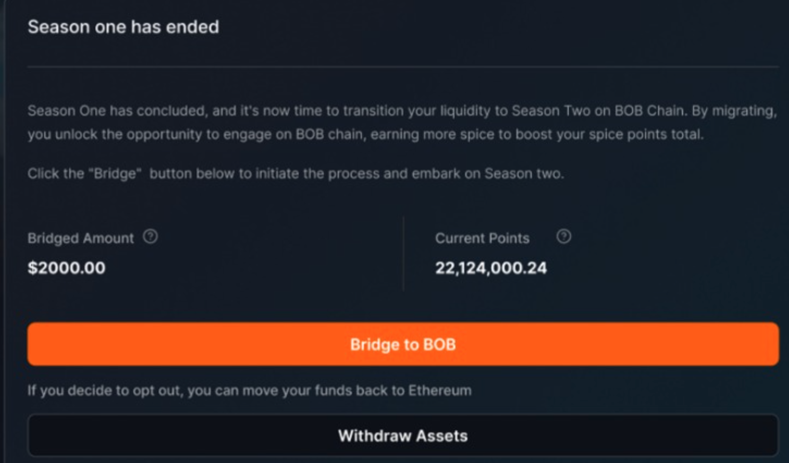

# BOB Fusion

## What is BOB Fusion?

BOB Fusion is the official points program of BOB, where users can harvest BOB Spice (points) based on their on-chain activity on the BOB mainnet. BOB Spice (points) represent your contribution to the BOB ecosystem - today and in the future.

:::tip Add your project to Fusion

Building on BOB? [Contact us](https://forms.gle/EKYmrAhPsyiQ3ua57) to join the Fusion campaign after you deploy on BOB.

:::

## Season 1

Season 1 started on 27/03/2024 and ended with the BOB mainnet launch on 1st May 2024.
During Season 1, users harvested Spice by locking in whitelisted assets with different multipliers. The on-chain TVL for Season 1 reached a whopping 300 Million USD in just 4 weeks.

## Season 2

Season 2 started on 1st May 2024 with more ways to harvest Spice based on-chain activity. Here are the 5 different ways in which you can harvest Spice during Season 2.

1. **Bridging assets to BOB**
   Holding whitelisted assets to the BOB network will accrue Spice based on the asset value and asset multipliers. Here’s a [list of all whitelisted assets](https://app.gobob.xyz/fusion?tab=info) that will be eligible for Spice and will be updated from time to time.

Hint - BTC assets (wBTC and tBTC) will get the highest multiplier of Spice. Bridge more BTC assets to harvest more Spice.

`Spice harvest meter: Low (Depends on how many assets user bridges)`

2. **Supplying TVL**
   After bridging to the BOB mainnet, when users deploy TVL into whitelisted assets dApps, the dApps will start receiving Spice points (based on TVL).

The dApps then distribute the Spice they receive to their users (there is a special process and API for this). Please note that the dApps may have their own rules and eligibility criteria for Spice harvested in this manner. You can track all the information about how much Spice each dApp has received and distributed to users, as well as your personal Spice harvest on the [BOB Fusion dashboard](https://app.gobob.xyz/fusion).

`Spice harvest meter: Medium to High (Depends on dApp distributions)`

3. **Actively using BOB dApps**
   When you use and interact with certain whitelisted dApps, you harvest Spice. This Spice is distributed to you directly and will be reflected on your BOB Fusion Dashboard. More hints and tips to harvest Spice will be shared by the participating dApps on their BOB Fusion Dashboards, on Discord, or project-specific social channels.

`Spice harvest meter:  Medium to High (Depends on user activity)`

4. **Referring power users**
   Users will get +15% on top of any Spice their invites get, and +7% on top of any Spice their invite’s invites get. The more users you invite and the more your invites bridge, the more you get!

5. **Being an active community member**
   Users can get more Spice by participating in community events and solving quests on BOB’s official [GALXE dashboard](https://app.galxe.com/quest/bob), where new quests are added regularly.

## FAQs

1. **How to participate in BOB Fusion?**
   BOB Fusion is an invite-only program. If you are an existing member of the program, just log in via the same wallet you used for Season 1 to continue for Season 2.

If you’re new to BOB Fusion then follow the steps below,

- Step 1: Get an invite code from our [official discord server](https://discord.gg/gobob) and sign up at http://fusion.gobob.xyz
- Step 2: Bridge [whitelisted assets](https://docs.google.com/spreadsheets/d/12wTFxjjqAsmRKHNFeVHCOcZmesyJlrtCjUgIpZ229jc/edit#gid=0) to the BOB network via https://app.gobob.xyz/bridge and generate your own invite code to share with others and get bonus Spice.
- Step 3: Check out the different dApp campaigns on the [BOB Fusion dashboard](http://fusion.gobob.xyz) and harvest Spice.

2. **Will my Season 1 assets automatically bridge to the BOB mainnet for Season 2?**

No, you will need to bridge the assets to the BOB mainnet. We have made an easy 1 click feature that allows direct bridging to the BOB mainnet. You can do so by visiting your BOB Fusion Dashboard and choosing “Bridge all locked assets to BOB” as shown in the image below. Sign the transaction & your assets will be bridged to the BOB mainnet.

### Special case: USDT

If you locked USDT during Season 1, then the above 1-click transfer will not work for your locked USDT & you will need to sign 2 transactions:

- Once to directly move all your assets except USDT to the BOB mainnet
- And another to withdraw USDT to the Ethereum mainnet.

You can then bridge your USDT to the BOB mainnet via the BOB bridge. Here’s a guide on how you can do it in simple steps.

3. **What happens to my Season 1 points?**

Your Season 2 points will accrue on top of Season 1 points. For eg. If you harvested 100,000 Spice for Season 1, your Season 2 Spice tally will begin from 100,000 and accrue on top of it. Even if you do not participate in Season 2, you will keep your Season 1 Spice points.

4. **Who are the participating dApps for Season 2?**

All information about the eligible transactions on participating dApps will be shared on the BOB Fusion dashboard. https://app.gobob.xyz/fusion

5. **How can I maximize my Spice harvest for Season 2?**

We believe in complete transparency and therefore all Spice distribution from BOB to dApps and from dApp to users will be reflected on the BOB Fusion dashboard. Users are expected to do their own research from the dashboard information and figure out a strategy that works best for them.

Some tips for Spice harvest: (Not Financial Advice, Always DYOR)

(i) Bitcoin assets on the BOB mainnet have the highest multiplier of Spice.
(ii) On-chain activity and putting your assets to work in dApps will lead to higher Spice harvest
(iii) Make sure to check the BOB Fusion dashboard regularly for new dApp campaigns.

6. **I participated in Galxe quests during Season 1, what about those points?**

To be able to redeem your Galxe points to Spice in 1:1 ratio,

(i) You will need to make sure you’ve registered and logged in for BOB Fusion
(ii) Bridged whitelisted assets to the BOB mainnet. Make sure to use the same wallet address for both Galxe and BOB Fusion. If you fail to do these steps, your Galxe points will be invalid.

If you follow the above steps correctly then your Spice from Galxe quests will be reflected in the coming months once we make the UI update.

7. **My assets are on an exchange. How can I contribute?**

Withdraw your assets as well as sufficient ETH for gas fees from a centralized exchange to the Ethereum network or any supported L2 like Arbitrum, Optimism, Base, etc.

If you’re a Coinbase user, withdrawing to the base network is free & then you can bridge your assets to BOB for low gas fees.

Use the BOB bridge or any other listed bridge providers to bridge your assets to the BOB network. https://app.gobob.xyz/bridge

8. **What happens to the referrals I made in Season 1?**

Your referral bonus will continue into Season 2 if your Season 1 invites (& their invites) also participate & harvest spice into Season 2. Your invite code will remain the same in Season 2 so you can invite more people as well for bonus spice.

9. **What is the gas token on BOB**

ETH. BOB fees are low, similar to OP chain fees (see here https://l2fees.info/)
