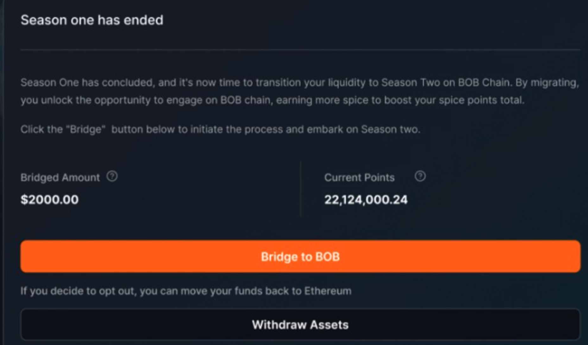
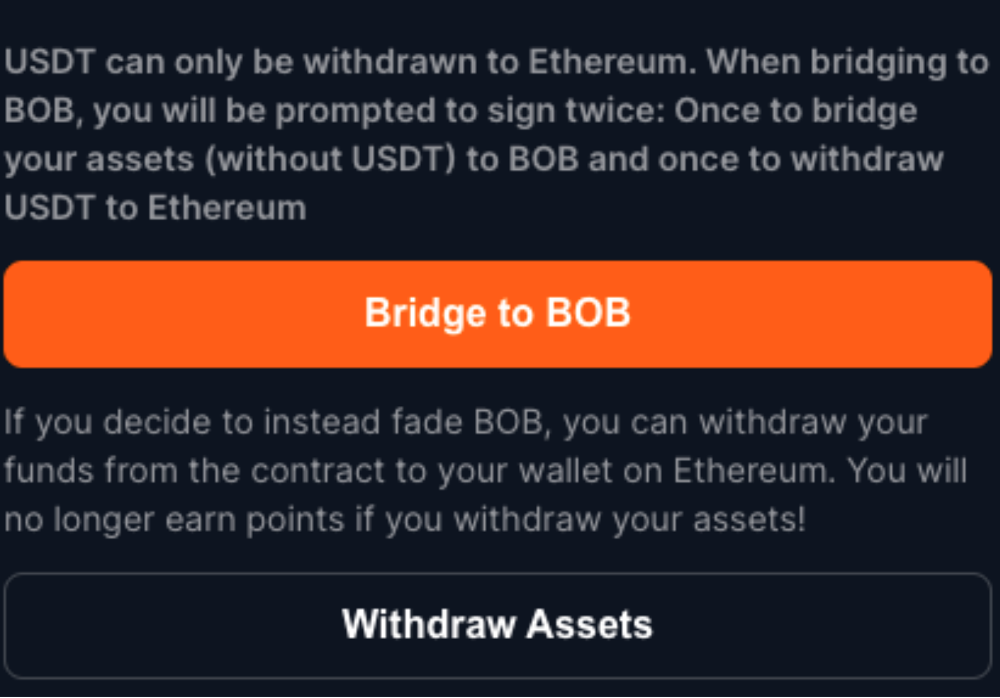

import styles from './bob-fusion.module.css';

# BOB Fusion

## What is BOB Fusion?

BOB Fusion is the official points program of BOB, where users can harvest BOB Spice (points) based on their on-chain activity on the BOB mainnet. BOB Spice (points) represent your contribution to the BOB ecosystem - today and in the future.

:::tip Add your project to Fusion
Building on BOB? [Contact us](https://forms.gle/EKYmrAhPsyiQ3ua57) to join the Fusion campaign after you deploy on BOB.
:::

## Season 2 (Live)

Season 2 started on 1st May 2024 with more ways to harvest Spice based on-chain activity.

Users can harvest Spice (points) based on:

- TVL (Medium/High)
- Using dApps (Low/Medium)
- Referrals (Low/Medium/High)
- Quests and special events (Low/Medium)

DApps can use the BOB Fusion system to bootstrap their launch on BOB.

:::info BOB Fusion Page
Checkout the information on the official [BOB Fusion page](https://app.gobob.xyz/fusion?tab=info) for more details.
:::

:::tip Running a Project on BOB? 
Reach out to the team on [Telegram](https://t.me/gobobxyz) to learn more about the opportunities for builders to grow their projects with our BOB Fusion campaign or read our [project checklist](https://build-on-bitcoin.notion.site/BOB-Launch-Partner-Checklist-12b6da11f607438c82494be34c0f0c58) that includes information about how to whitelist your dApp or add custom assets to the BOB Fusion campaign.
:::

## Season 1 (Ended)

Season 1 started on 27/03/2024 and ended with the BOB mainnet launch on 1st May 2024.
During Season 1, users harvested Spice by locking in whitelisted assets with different multipliers. The on-chain TVL for Season 1 reached a whopping USD 300 million in just four weeks.

## FAQs

### Does spending gas fees result in higher spice harvest than deploying capital?

TVL suppliers are eligible to get spice in more than one way (via TVL spice distribution by dApps, gas fees spice distribution by dApps), increasing their chances of receiving more spice. However, this hasn't been clear to users because many dApps haven't distributed their spice yet.

Thus users who get spice via gas fees are essentially paying for that spice, while TVL suppliers get it for free.

### I have deployed capital into some dApps but they’re not distributing Spice very regularly

Please note some dApps plan to distribute spice retroactively at some point in the future, so if you have used the dApp during that snapshot time, you will get your spice, albeit the distribution timelines depend on the dApps.

If you are unhappy about a dApp’s Spice distribution, your best options are to either voice your concerns to that dApp or look for other opportunities in the BOB Fusion campaign. 

### Inflation of Spice from Season 1 to Season 2

Season 2 inherently requires more effort, research, smart contract interactions, and gas fees than Season 1. (IL risk, protocol risk, smart contract risk, capital deployments, minting, trading, lending, etc.)
By actively engaging with the ecosystem in Season 2, you climb the ranks against users who just deployed capital in Season 1 and did not contribute to Season 2. 
We believe this is a fair outcome as the main mission behind BOB Fusion is to track active participation across the BOB ecosystem.

### What’s the maximum amount of Spice for the Fusion campaign?

There is no limit. The more TVL and activity, the more Spice distribution. Stay active in the ecosystem, to defend and grow your position.

### Is there a distinction between how much Spice I can earn with different dApps as an LP?

Yes! More risk and effort = more spice.

Example: DEXes harvest more than lending.
There will be regular calls to action for specific assets or pools that can get bonuses.

### How to participate in BOB Fusion?

BOB Fusion is an invite-only program. If you are an existing member of the program, just log in via the same wallet you used for Season 1 to continue for Season 2.

If you’re new to BOB Fusion then follow the steps below,

- Step 1: Get an invite code from our [official discord server](https://discord.gg/gobob) and sign up at http://fusion.gobob.xyz
- Step 2: Bridge [whitelisted assets](https://docs.google.com/spreadsheets/d/12wTFxjjqAsmRKHNFeVHCOcZmesyJlrtCjUgIpZ229jc/edit#gid=0) to the BOB network via https://app.gobob.xyz/bridge and generate your own invite code to share with others and get bonus Spice.
- Step 3: Check out the different dApp campaigns on the [BOB Fusion dashboard](http://fusion.gobob.xyz) and harvest Spice.

### Will my Season 1 assets automatically bridge to the BOB mainnet for Season 2?

No, you will need to bridge the assets to the BOB mainnet. We have made an easy 1-click feature that allows direct bridging to the BOB mainnet. You can do so by visiting your BOB Fusion Dashboard and choosing "Bridge all locked assets to BOB" as shown in the image below. Sign the transaction & your assets will be bridged to the BOB mainnet.

#### Special case: USDT

If you locked USDT during Season 1, then the above 1-click transfer will not work for your locked USDT, and you will need to sign two transactions:

- One to directly move all your assets except USDT to the BOB mainnet
- Another to withdraw USDT to the Ethereum mainnet.

You can then bridge your USDT to the BOB mainnet via the BOB bridge. Here’s a guide on how you can do it in simple steps.

### What happens to my Season 1 points?

Your Season 2 points will accrue on top of Season 1 points. For example, if you harvested 100,000 Spice for Season 1, your Season 2 Spice tally will begin from 100,000 and accrue on top of it. Even if you do not participate in Season 2, you will keep your Season 1 Spice points.

### Who are the participating dApps for Season 2?

All information about the eligible transactions on participating dApps will be shared on the BOB Fusion dashboard. https://app.gobob.xyz/fusion

### I participated in Galxe quests during Season 1, what about those points?

To be able to redeem your Galxe points to Spice in 1:1 ratio,

(i) You will need to make sure you’ve registered and logged in for BOB Fusion
(ii) Bridged whitelisted assets to the BOB mainnet. Make sure to use the same wallet address for both Galxe and BOB Fusion. If you fail to do these steps, your Galxe points will be invalid.

If you follow the above steps correctly then your Spice from Galxe quests will be reflected in the coming months once we make the UI update.

### My assets are on an exchange. How can I contribute?

Withdraw your assets as well as sufficient ETH for gas fees from a centralized exchange to the Ethereum network or any supported L2 like Arbitrum, Optimism, Base, etc.

If you’re a Coinbase user, withdrawing to the base network is free & then you can bridge your assets to BOB for low gas fees.

Use the BOB bridge or any other listed bridge providers to bridge your assets to the BOB network. https://app.gobob.xyz/bridge

### What happens to the referrals I made in Season 1?

Your referral bonus will continue into Season 2 if your Season 1 invites (& their invites) also participate & harvest spice into Season 2. Your invite code will remain the same in Season 2 so you can invite more people as well for bonus spice.

### What is the gas token on BOB?

ETH. BOB fees are low, similar to OP chain fees (see here https://l2fees.info/)
