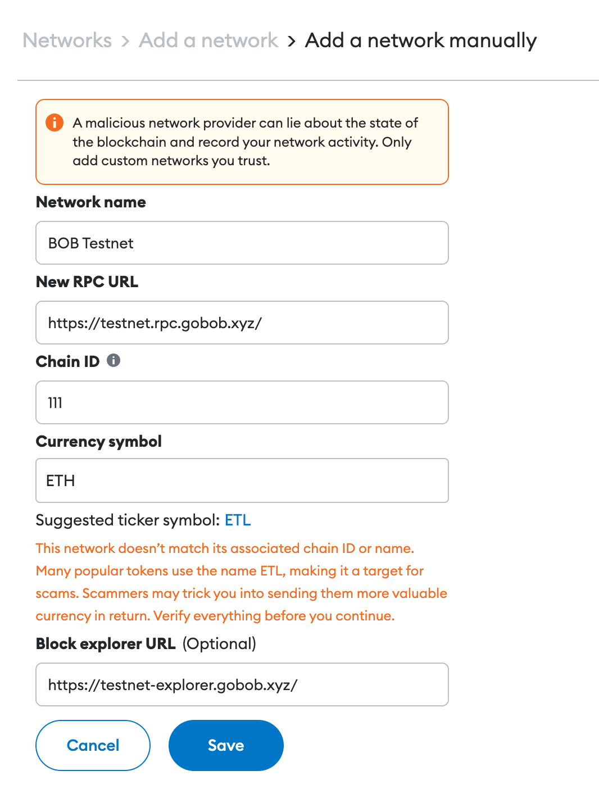
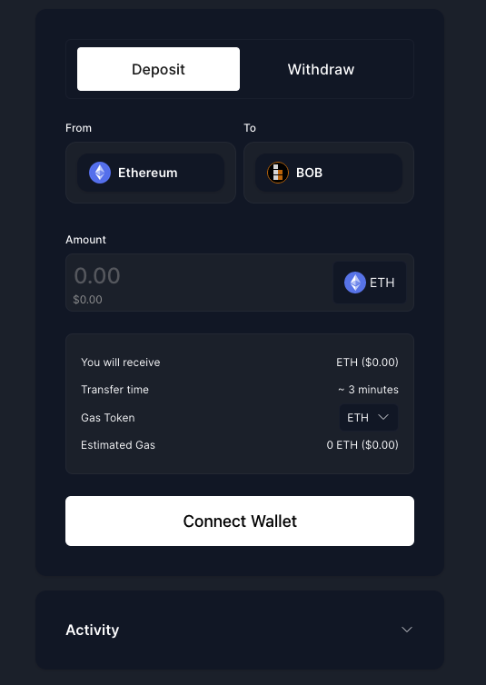

# Testing BOB

## P2P Swap Demo

The P2P swap demo shows how BOB enables swaps between BTC, ordinals, and ERC20 assets **without bridging**.

- [P2P Swap Demo](https://demo.gobob.xyz/)
- [User Guide](/docs/build/examples/btc-swap/)

## BOB Testnet

If you want to use the testnet to interact with other apps deployed on BOB or deploy your own contracts, please follow the following steps:

1. Install an EVM wallet such as [Metamask](https://metamask.io/).
2. Add the BOB testnet to MetaMask or other wallet:
   1. Open the MetaMask browser extension.
   2. Open the network selection dropdown menu by clicking the dropdown button at the top of the extension.
   3. Click the Add network button.
   4. Click Add a network manually.
   5. In the Add a network manually dialog that appears, enter the following information:
      - Network Name: BOB Testnet
      - New RPC URL: https://testnet.rpc.gobob.xyz
      - Chain ID: 111
      - Currency Symbol (optional): ETH
      - Block Explorer URL (optional): https://testnet-explorer.gobob.xyz/
   6. Click Save.

3. Get Sepolia ETH from one the faucets: https://faucetlink.to/sepolia
4. Connect your wallet to the Sepolia BOB bridge and bridge your ETH to the BOB testnet:
   - [BOB Bridge](https://app.gobob.xyz/)
5. You are now ready to use the BOB testnet

## Using the faucet and importing tokens

1. Click the Get Tokens button on the the [P2P swap UI](https://app.gobob.xyz/demo/p2p-swap). This will fund your account with testnet WBTC and USDC.
2. Import the ERC20 tokens from the following contract addresses:
   - WBTC: `0x2868d708e442A6a940670d26100036d426F1e16b`
   - USDC: `0x27c3321E40f039d10D5FF831F528C9CEAE601B1d`

## Bitcoin Testnet

If you want to connect BOB apps with Bitcoin testnet, please follow the steps below:

1. Install a Bitcoin wallet such as [Leather](https://leather.io/), [Xverse](https://www.xverse.app/), or [UniSat](https://unisat.io/). For a complete list of wallets, see [Bitcoin.org](https://bitcoin.org/en/choose-your-wallet).
2. Get some Bitcoin testnet coins from a faucet:
   - https://bitcoinfaucet.uo1.net/
   - https://coinfaucet.eu/en/btc-testnet/
   - https://kuttler.eu/en/bitcoin/btc/faucet/
   - https://tbtc.bitaps.com/
3. You are now ready to use the Bitcoin testnet
