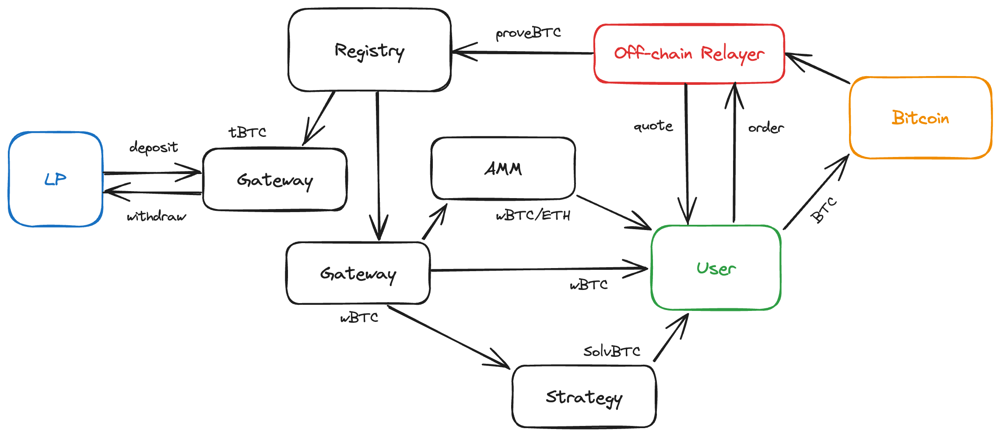
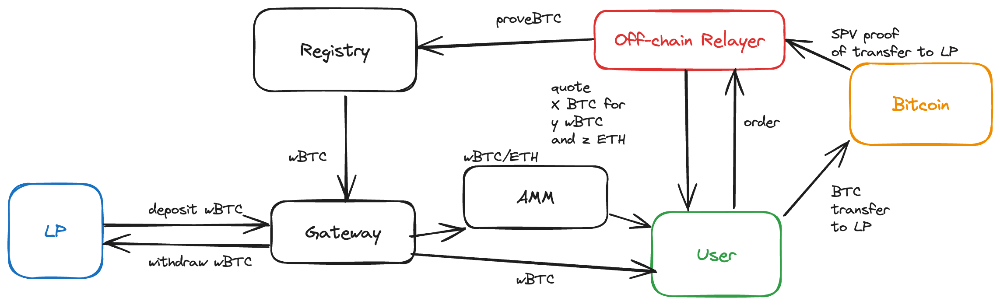
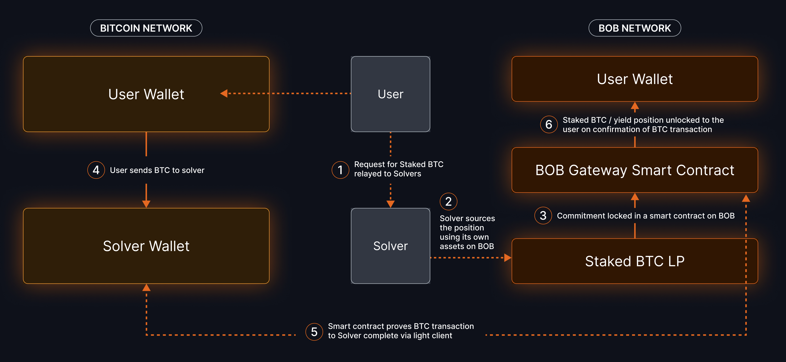

# BOB Gateway: Bitcoin Intents

## Introduction

Bitcoin users can easily onboard to the BOB Hybrid L2 without previously holding any Ethereum assets. This page explains the structure of _BOB Gateway_, an intent-based bridge that coordinates peer-to-peer swaps between users and liquidity providers (LPs). Cross-chain transfers are secured by verifying Bitcoin transaction proofs with an on-chain light client, avoiding the need for an oracle. Optional intents, such as staking, lending, and swapping a small amount of ETH for transaction fees can all be accomplished while only requiring a single Bitcoin transaction from the user.

## How Gateway Works

1. Liquidity providers (LPs) temporarily lock wrapped Bitcoin (WBTC or tBTC) in escrow smart contracts on BOB.
1. A user makes a request to the (trusted) relayer to reserve some of the available liquidity.
1. The user sends BTC to the liquidity provider's Bitcoin address. A hash of the user's order is included in the `OP_RETURN` of their transaction, including data such as the recipient's EVM address on BOB.
1. The relayer trustlessly verifies the user's Bitcoin transaction by submitting a merkle proof to an on-chain [Light Client](/learn/builder-guides/relay.md), granting the relayer permission to withdraw the LP's wrapped Bitcoin without needing to use an oracle.
1. Gateway sends the LP's wrapped Bitcoin to the user's EVM address. If the user requested a Bitcoin LST/LRT, that token is minted using the LP's wrapped Bitcoin _before_ it is sent to the user.

## Architecture

### User Flow

1. User requests to swap BTC for e.g. tBTC/WBTC or stake BTC for e.g., SolvBTC.BBN
2. User gets "quote" which gateway contract to use
3. User creates "order" with relayer based on available liquidity
4. User creates tx and updates order with txid - should be done before publishing tx to avoid conflicts
5. Relayer monitors Bitcoin chain and executes swap when txid seen

Any frontend can integrate with Gateway by following the [BOB docs](https://docs.gobob.xyz/learn/builder-guides/gateway).

### Liquidity Provider (LP) Flow

1. LP asks relayer to deploy a gateway contract (permissioned at the moment because BOB pays for fees).
2. LP deposits wrapped Bitcoin (WBTC, tBTC, FBTC) in the contract.
3. LP can only withdraw or update fees after a delay so that the relayer has time to finish open orders.
4. Relayer will not accept new orders during this delay until reset.

### Example Complex Order Flows

#### Swapping BTC for WBTC and gas

1. BOB creates a Gateway contract from the Registry
2. LP deposits WBTC into the Gateway contract
3. User request a quote from the off-chain relayer to swap BTC for WBTC and to add ETH for gas fees
4. Off-chain relayer provides the quote
5. Users places an order with the relayer
6. User sends BTC to the LPs Bitcoin address
7. Off-chain relayer monitors the Bitcoin chain for the transaction (user to LP)
8. Off-chain relayer sends the merkle proof to the Gateway contract which:

- Unlocks the WBTC from the Gateway contract
- Swaps a small portion of the WBTC to ETH and sends it to the user
- Sends the remaining WBTC to the user

#### Staking BTC for SolvBTC.BBN and swap for gas

All steps are the same as the swap flow, except for step 8 when the BTC proof is submitted:

- Unlocks the WBTC from the Gateway contract
- Swaps a small portion of the WBTC to ETH and sends it to the user
- Sends the remaining WBTC to the Solv contracts to stake WBTC for SolvBTC. Stakes the solvBTC for solvBTC.BBN. Sends the SolvBTC.BBN to the user.

