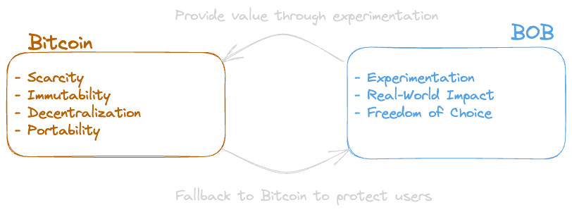
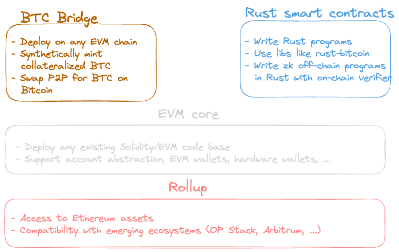

# Building on Bitcoin

BOB is the builder stack for experimentation, real-world impact, and freedom of choice. It launches as an OP Stack rollup connecting Bitcoin and Ethereum. The BOB tools can be deployed on any EVM chain or rollup to facilitate onboarding users from Bitcoin as well as accessing Bitcoin from the EVM.

1. **EVM compatibility**: The EVM is not the greatest VM ever created. However, it benefits from a large ecosystem that is focused on improving UX via smart contract wallets, innovations in rollups, DeFi tooling, audited libraries, and a maturing set of tooling. Instead of builders having to reinvent the wheel, BOB comes with the EVM built in to provide projects with access to EVM space innovations and not require them to rewrite code in a new programming language. As an added benefit, this eliminates vendor lock-in since projects can deploy on other EVM chains or spin up a BOB-compatible rollup.
2. **Rust off-chain programs with on-chain verification**: A key puzzle to the scaling problem is to compute complex programs off-chain and verify their correctness on-chain. BOB allows developers to use existing Bitcoin Rust SDKs and libraries. Extending Bitcoin with new apps (e.g., https://github.com/ordinals/ord and https://github.com/rust-nostr/nostr), libraries (e.g., https://github.com/rust-bitcoin), and SDKs (e.g., https://github.com/lightningdevkit and https://bitcoindevkit.org/) are primarily based on Rust. Existing L2 or sidechains fail to deliver on that as they are purely EVM-based or use other execution layers like Stacks and Liquid. BOB leverages Risc Zero's [zkVM](https://dev.risczero.com/api/zkvm/) to write complex programs like proofing ownership of multiple ordinals in Rust and verifying the proof on-chain in the EVM.
3. **Rollup**: Deploying an app-specific rollup will become as simple as deploying a smart contract. With the maturing of standardized rollup stacks, the enhancements made to rollup stacks will be the key differentiators. BOB provides a Bitcoin augmentation layer enabling access to Bitcoin types and data (e.g., BRC20s, ordinals, …). This allows builders to focus on the unique value of their application and its impact on users without worrying about the platform risk of BOB.
4. **Bitcoin access**: BOB will support a range of BTC bridges, both institutional and decentralized, enabling builders to pick the model that best suits their needs. BOB further provides trustless access to Bitcoin block and transactional data via a BTC light client (BTC Relay), as well as a range of specialized tools including but not limited to cross-chain P2P swap logic and support for advanced Bitcoin scripts such as DLCs (Discrete Log Contracts).
5. **Merged mining securtiy**: BOB facilitates merged mining capabilities to allow developers to anchor the security of their apps in the Proof of Work of Bitcoin.

## BOB: A Bitcoin L2 for Builders

BOB is three things:

- A builder platform that allows anyone to create novel applications:
  - BOB supports Rust off-chain programs with on-chain verification. Many Bitcoin innovations (ord, LN, nostr, BDK) happen in Rust, a mature and well-designed language. This allows innovation for new use cases without having to rewrite logic.
  - BOB is EVM-compatible. Novel applications and mature tooling already exist on EVM chains. Innovators can build on top of these applications without having to rewrite existing logic in other programming languages.
- A rollup that allows users and builders access to ETH, ERC20s, and Ethereum data (NFTs, ENS, …).
- A merged mining security provider for apps to anchor their security on Bitcoin's Proof of Work.

BOB will be the catalyst for the building on Bitcoin renaissance. The movement combines the Bitcoin core values with new avenues of thought. BOB is a Bitcoin-augmented rollup for free experimentation and innovation with real-world impact.

<!--  -->
