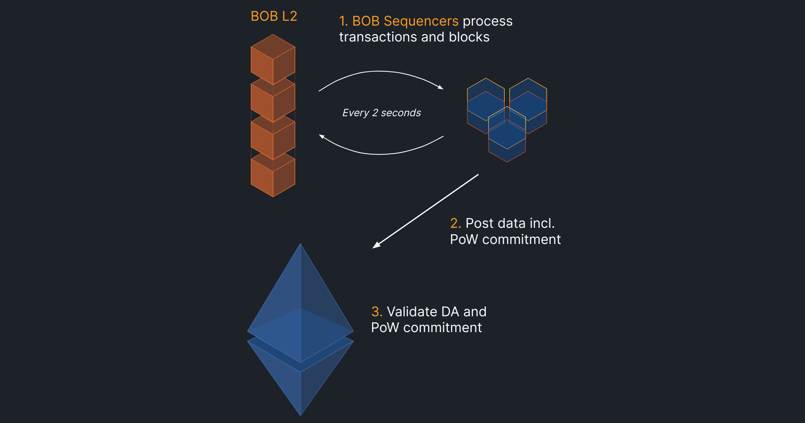
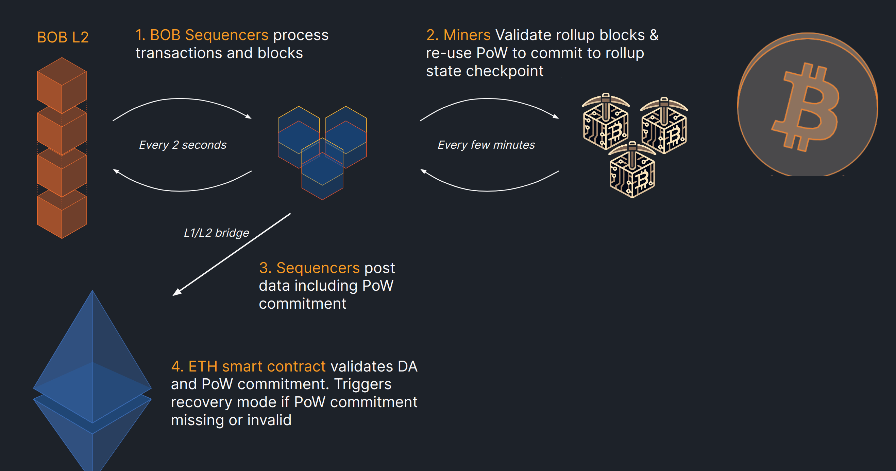
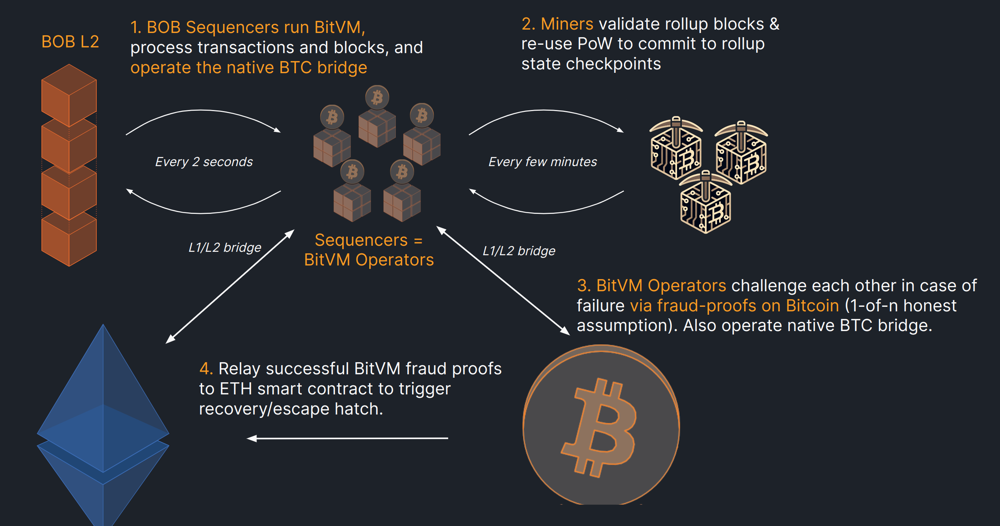

# Rollup Roadmap

The BOB L2 will launch in multiple phases, improving security with each release.

### Phase 1: Optimistic BOB 
*Bootstrapping as an Optimistic Rollup on Ethereum*

Initially, BOB will launch as an optimistic ETH rollup using the OP stack.
Settlement happens on the Ethereum L1, featuring a native L1/L2 bridge with access to stablecoins (USDT, USDC), ETH/stETH and ERC20 assets.
BOB tracks the state of Bitcoin via a BTC light client, verifying block headers and accepting transaction inclusion proofs. This enables trustless cross-chain swaps/auctions/contract execution. In addition, Bitcoin (BTC, Ordinals, BRC20s,...) assets are imported via a set of trust-minimized and trusted bridges.

### Phase 2: Bitcoin PoW Security + ETH Optimistic Rollup

*Hybrid rollup: ETH settlement plus Bitcoin PoW security.*

In phase 2, BOB will introduce Bitcoin PoW security to the ETH rollup, leveraging a new merged mining technique and aligning with Bitcoin miners. This allows to minimize trust in sequencers, as miners validate the state of the BOB rollup and only include commitments as part of the PoW if state transitions are correct. A full write up is currently being finalized.

### Phase 3: Bitcoin Optimistic Rollup + ETH ZK/Optimistic Rollup

*BitVM rollup: itcoin settlement & on-chain fraud proofs, ETH L1/L2 bridge and BTC fraud-proof handling*

Phase 3, already under active research, will aim to introduce Bitcoin as settlement layer to BOB. Specifically, [BitVM](https://bitvm.org/bitvm.pdf) showcased how fraud proofs can be encoded in Bitcoin script without requiring any Bitcoin forks. This allows a set of N operators (e.g. 100) to act as sequencers such that the rollup is guaranteed to be secure as long as there is at least one honest and online operator, who will challenge and kick out any potential malicious operators.

The first step to achieving BOB's transition to an optimistic rollup settling on Bitcoin is to design a BOB light client in BitVM, i.e., as an off-chain program committed to by N operators such that on-chain challenges can be executed. Once completed, the next step is to [use BitVM to create a 2-way bridge](https://github.com/BitVM/BitVM/blob/main/docs/sidechain_bridges.md) between Bitcoin and BOB using bi-directional light clients. From there, the final step is to expand the BitVM program from light client and bridge to fully validate the BOB rollup state / accept (ZK) fraud proofs.

Thereby it may be necessary to introduce ZK compression to BOB, most likely as part of the fraud proof mechanism to ensure more efficient equivocations in case of sequencer failure. This upgrade will occur in collaboration with ZK infrastructure providers, such as [RISC Zero](https://www.risczero.com/news/altlayer-zkfraudproofs).

BOB's vision is to ensure that Bitcoin assets bridged to the rollup are secured by Bitcoin, wheres ETH assets are secured by Ethereum.

