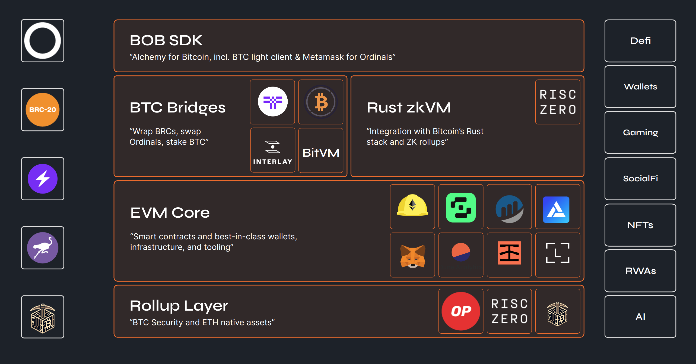

# Stack Overview

### Rollup Layer

_Bitcoin PoW security, native Ethereum bridge. Outlook: BitVM_

As the base layer, BOB can use any EVM rollup or chain. Initially, BOB launches on the [OP stack](https://docs.optimism.io/) including the upcoming ZK improvements by [RiscZero](https://www.risczero.com/) and can be rolled up to [Ethereum](https://www.risczero.com/) for 1-click onboarding of users, assets and liquidity. In addition, BOB can inherit Bitcoin security via a novel [merged mining](https://academy.binance.com/en/glossary/merged-mining) protocol (re-staking for Bitcoin). BOB's ultimate goal is to settle directly on the Bitcoin L1. While we believe in full-state validation via ZK rollups in the long run, it is very unlikely that Bitcoin will support a ZK verifier in the near future. As such, the currently best possible design is an optimistic rollup that leverages on-chain fraud-proofs via mechanisms like [BitVM](https://github.com/BitVM/BitVM).

### EVM Core

_Smart Contracts and Best-in-Class Infrastructure & Dev Tooling_

At the core, BOB leverages the [Ethereum Virtual Machine (EVM)](https://ethereum.org/en/developers/docs/evm/) to enable the creation and execution of smart contracts, primarily developed using the [Solidity smart contract programming language](https://soliditylang.org/). The EVM version deployed on BOB will be equivalent to that of Ethereum, ensuring compatibility with existing developer tooling ([Hardhat](https://hardhat.org/), [Foundry](https://getfoundry.sh/), [Remix](https://remix.ethereum.org/), …), wallets ([Metamask](https://metamask.io/), [WalletConnect](https://walletconnect.com/) supported wallets,...), best-in-class multisig ([Safe](https://www.safe.io/)), as well as key infrastructure, including block explorers like [BlockScout](https://www.blockscout.com/) and data analytics ([TheGraph](https://thegraph.com/), [Dune](https://dune.com/), [GoldSky](https://goldsky.com/)).

### Rust zkVM

_ZK tooling and support for Bitcoin's Rust libraries._

The majority of Bitcoin’s stack and applications built around it are implemented in Rust, including core [SDKs](https://github.com/rust-bitcoin/rust-bitcoin), [Lightning](https://github.com/lightningdevkit/rust-lightning), and [Ordinals](https://github.com/ordinals/ord). BOB can support Bitcoin’s Rust libraries, most notably via the [RISC Zero zkVM](https://dev.risczero.com/api/zkvm/) that allows off-chain execution of Rust programs while using [ZK proofs](https://ethereum.org/en/zero-knowledge-proofs/) to verify correct execution in EVM smart contracts. In the future, we see this as an avenue for [ZK rollups](https://vitalik.ca/general/2021/01/05/rollup.html) directly on Bitcoin where BOB itself can be proven in the zkVM and verified by Bitcoin consensus.

### Bitcoin Bridges

_Trustless P2P swaps, threshold cryptography and insurance for wrapping. Outlook: BitVM_

BOB provides trustless access to Bitcoin block and transactional data via a [BTC light client](https://blog.threshold.network/blockchain-relays-101/), allowing EVM contracts to process BTC transactions (e.g. P2P BTC swaps, Ordinal auctions, hashrate tokenization,...). BOB also supports a range of Bitcoin bridges, both decentralized and institutional. Through a native ETH L1/L2 bridge, BOB has access to market leader [wBTC](https://wbtc.network/) and the more secure, threshold-based version, [tBTC v2](https://threshold.network/). BOB will support advanced bridge models including opt-in collateralization (see [iBTC](https://www.interlay.io/)). In the future, BOB aims to introduce a 2-way light-client BTC bridge powered by [BitVM](https://github.com/BitVM/BitVM/blob/main/docs/sidechain_bridges.md).

### BOB SDK

_A smart contract deveopers' universal toolkit for all things building on Bitcoin_

Similar to [OpenZeppelin](https://www.openzeppelin.com/) and other great Solidity libraries, BOB provides a powerful SDK for all things building on Bitcoin. This includes a wide range of Solidity contracts that can be used to interact with Bitcoin including core, [Ordinals](https://docs.ordinals.com/), [BRC20s](https://brc20.gitbook.io/brc20/overview/introduction), [Runes](https://rodarmor.com/blog/runes/), and [Lightning](https://lightning.network/), as well as improved inscription APIs and tools for a unified BTC and EVM wallet experience (e.g., manage Ordinals in your MetaMask wallet via [Snaps](https://metamask.io/snaps/)). Plus the ability to leverage [Account Abstraction](https://ethereum.org/en/roadmap/account-abstraction/) with bridged BTC.
