# BOB Pay

:::warning Deprecation Notice
BOB Pay will be deprecated by May 22, 2025. Follow the steps to send your funds to a regular [wallet](/learn/user-guides/getting-started/wallet-guide): [Sending Bitcoin from an Email Address to a Wallet](#sending-bitcoin-from-an-email-address-to-a-wallet).
:::

## What is BOB Pay?

[BOB Pay](https://bob-pay.gobob.xyz/) aims to showcase how easy crypto UX can be by focusing on a simple use case popular within the Bitcoin ecosystem: payments.

With BOB Pay, you can send Bitcoin and stablecoins to someone's email address. No wallet, no app, no seed phrase - just simple, cheap, non-custodial, and lightning-fast payments. BOB Pay showcases the power of wallet abstraction with [Dynamic](https://www.dynamic.xyz/), smart accounts from [ZeroDev](https://zerodev.app/), and paymasters from [Pimlico](https://www.pimlico.io/).

We're offering projects on BOB free access to Dynamic and Pimlico if you'd like to do the same.

## Video Tutorial

<iframe width="560" height="315" src="https://www.youtube.com/embed/X7jqXHkOWUM" frameborder="0" allow="accelerometer; autoplay; clipboard-write; encrypted-media; gyroscope; picture-in-picture" allowfullscreen></iframe>

## High-Level Technical Summary

1. Alice logs into [BOB Pay](https://pay.gobob.xyz) and sends WBTC to John's email address.
2. [Dynamic generates](https://docs.dynamic.xyz/wallets/embedded-wallets/create-wallets/overview#during-signup-automatic) a deterministic [ZeroDev smart account wallet](https://docs.dynamic.xyz/account-abstraction/aa-providers/zerodev) for John on BOB.
3. John claims their WBTC by [sending their first transaction](https://docs.dynamic.xyz/wallets/embedded-wallets/pregenerated-wallets#after-signup) to Charlie. The transaction fees are paid to a [Paymaster](https://docs.pimlico.io/infra/paymaster/erc20-paymaster) in WBTC so John can transact without holding any ETH.
4. A [guarantor from Pimlico sponsors John's first transaction fees](https://docs.pimlico.io/infra/paymaster/erc20-paymaster/architecture#eoa-guarantor-signature), then claims back the funds after John's first transaction. This solves the problem of John needing ETH to approve the Paymaster's access to their WBTC.

## Step-by-Step Guides

### Sending Bitcoin from a wallet to an Email Address

1. Open the [BOB Pay website](https://pay.gobob.xyz).

2. Sign in with your wallet.

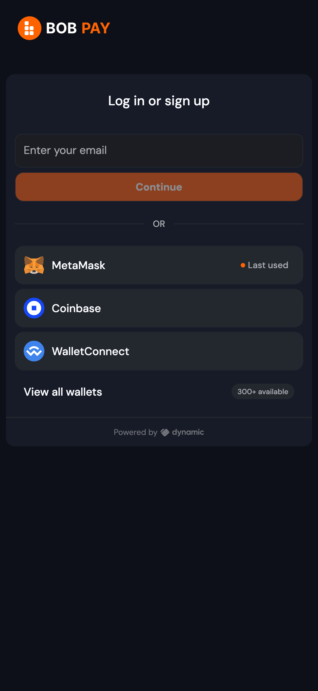

3. Sign to prove you own your wallet. You can toggle this security step off if you like.

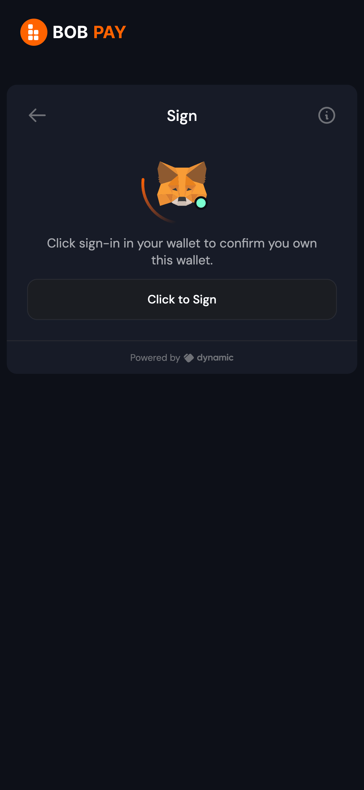

4. Click Send.

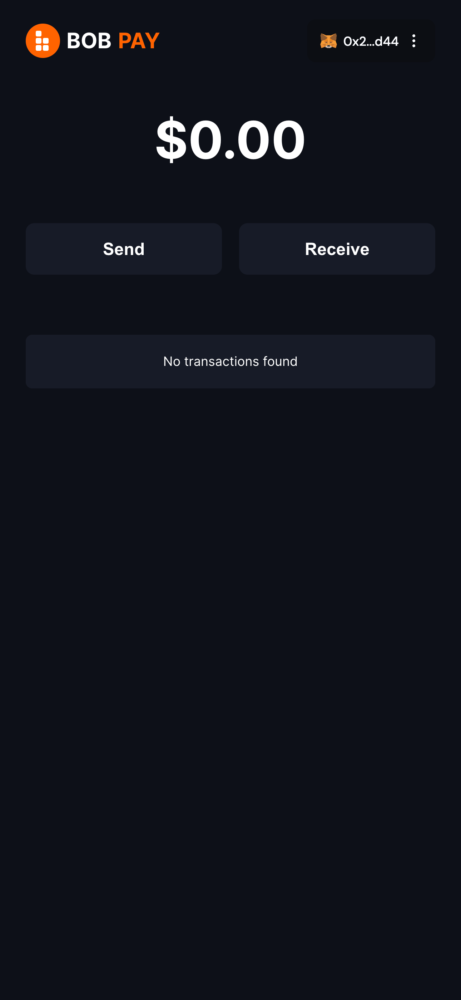

5. Enter the email address and amount of Bitcoin to transfer, then click Send.

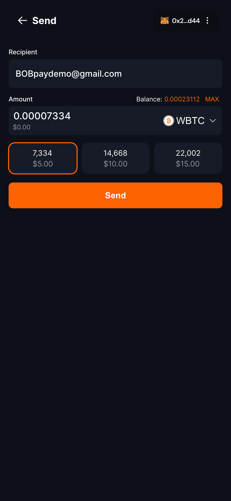

6. After signing the transaction, the transfer is complete.

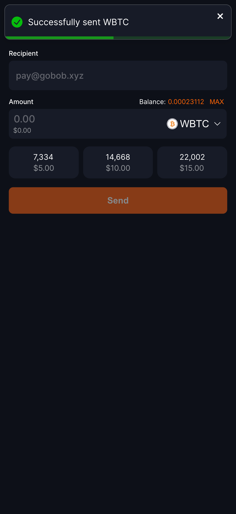

### Sending Bitcoin from an Email Address to a Wallet

1. Open the [BOB Pay website](https://pay.gobob.xyz).

2. Enter your email address.

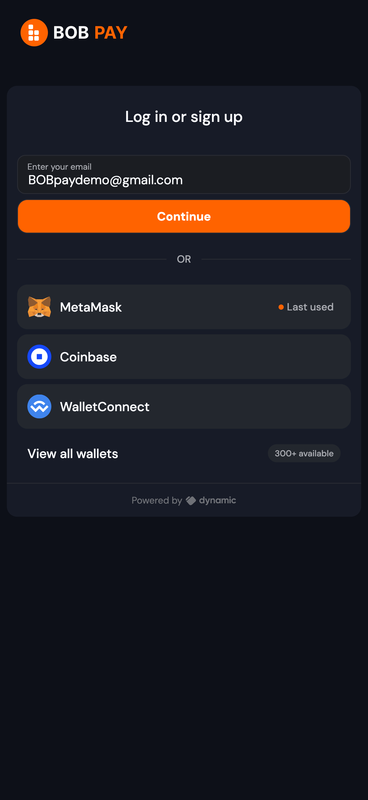

3. Enter the six-digit verification code sent to your email.

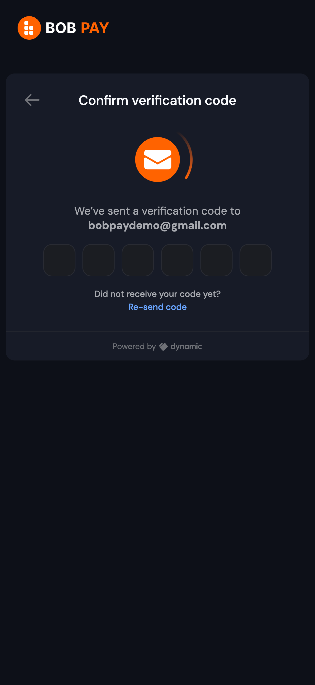

4. Click Send.

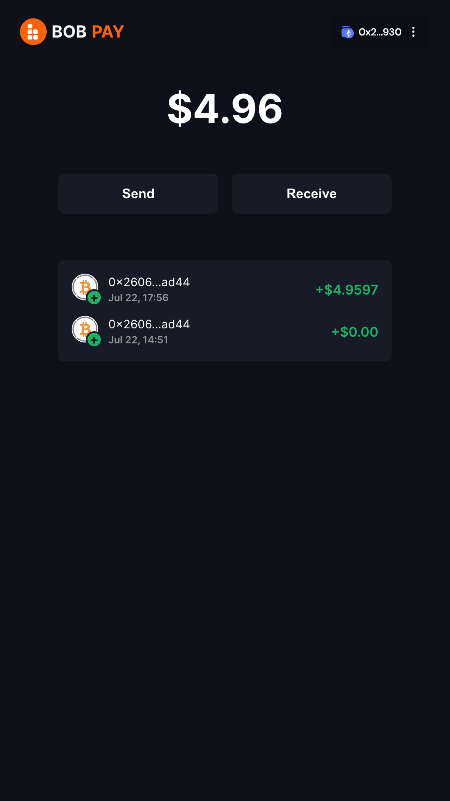

5. Enter the recipient's wallet address and the amount of Bitcoin you would like to transfer, then click Send.

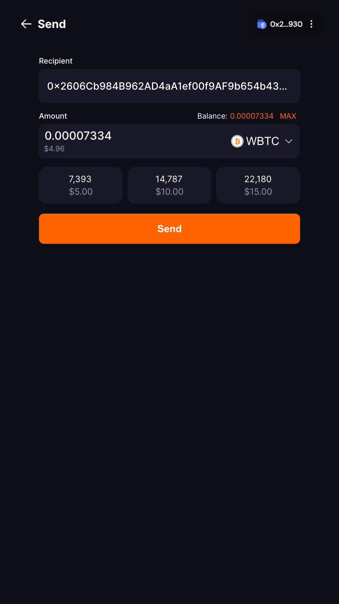

6. Click Sign.

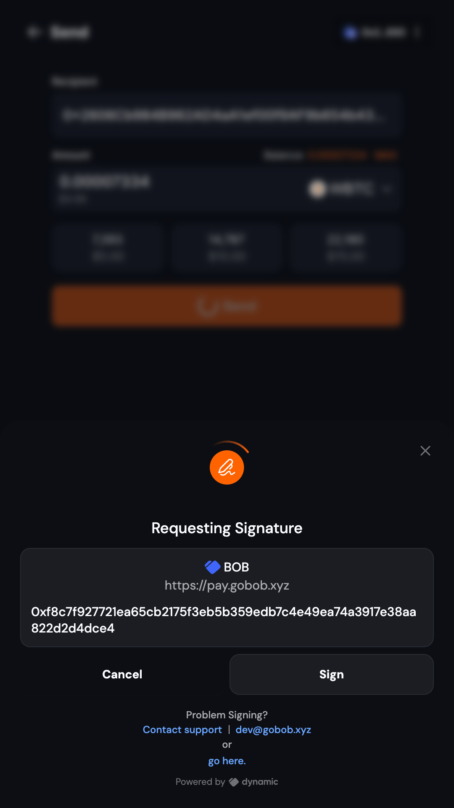

7. The transfer is complete.

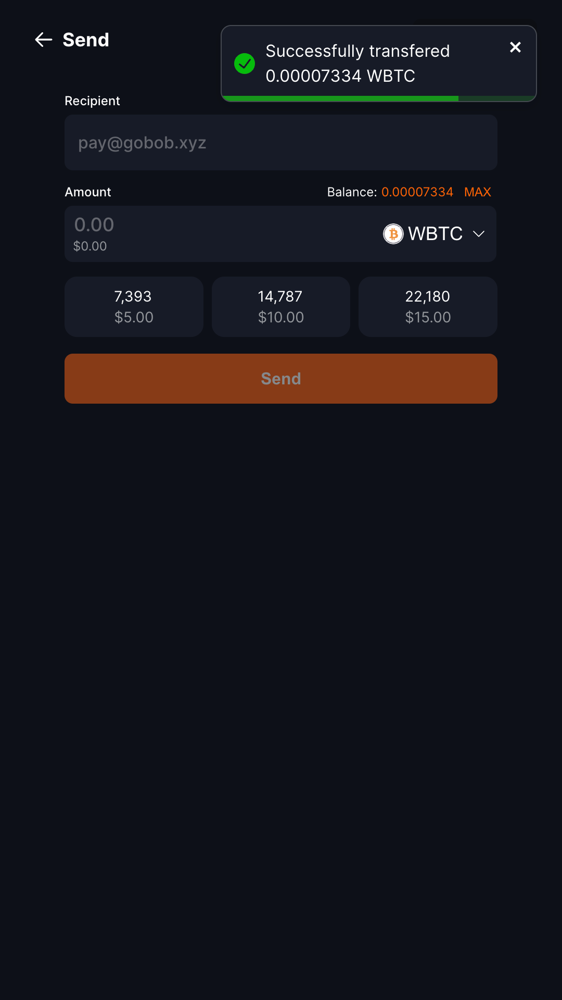

### Receiving Bitcoin or Stablecoins from Someone Else

1. Open the [BOB Pay website](https://pay.gobob.xyz).

2. Enter your email address and click Continue. You can also sign in with your wallet.

3. Enter the six-digit verification code sent to your email.

4. Click Receive.

5. Scan this QR code from the device that will send you tokens. This will open the BOB Pay website with your address already filled in for the sender. Alternatively, click Copy Address then send your address to the sender in a messaging app or email.

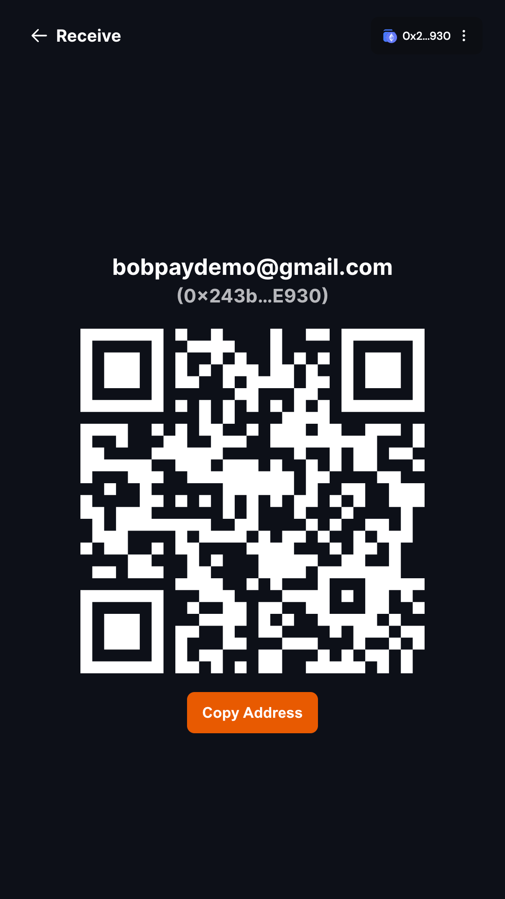

6. The sender can follow the rest of the steps in [the guide above](#sending-bitcoin-from-a-wallet-to-an-email-address) to finish sending you tokens.

## Conclusion

BOB offers a complete package for builders looking to bring world-class UX to Bitcoin. We're offering projects on BOB free access to Dynamic and Pimlico if you'd like to do the same.

We look forward to seeing what you Build on Bitcoin!

## Code References

- [BOB Pay](https://github.com/bob-collective/ui/pull/57/files) front-end and back-end code.
