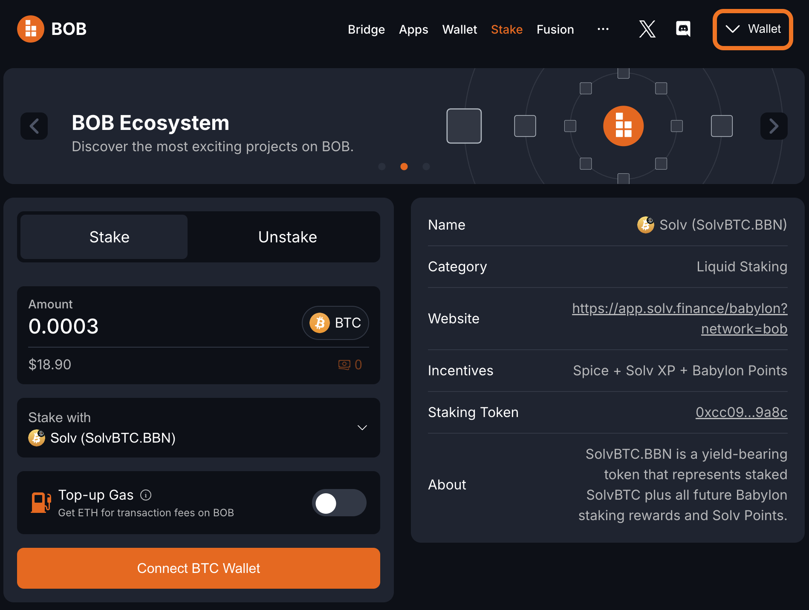
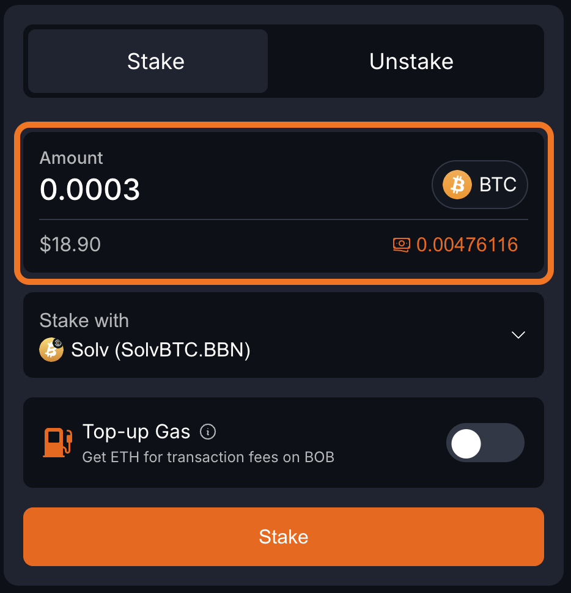

# Stake BTC

## One-Click BTC Staking

[BOB Stake](https://app.gobob.xyz/stake?type=stake&stakeWith=solv-solvbtcbbn) is a new 1-click Bitcoin staking portal and [SDK](/learn/builder-guides/gateway.md) for Bitcoin liquid staking. Harvest BOB Spice points in the final season of BOB Fusion by using BOB Stake and exploring the growing Bitcoin staking ecosystem on BOB.

It's built on a trustless, RFQ-based cross-chain swap protocol that connects professional LPs with users through a seamless swapping experience. LPs handle the complexities of bridging and staking on behalf of users in exchange for a fee.

All you need is a Bitcoin wallet with some BTC to send and an EVM-compatible wallet to receive your Bitcoin LST on BOB. We'll even send you some ETH to cover the fees of your first few transactions on BOB.

## Bonus Spice Points with Intract

You can harvest extra Spice by competing any of these [Intract Campaign](https://www.intract.io/explore?query=BOB&hideCompleted=true&hideExpired=true&sortBy=rankingB&entity_type=CAMPAIGN) tasks with BOB Stake.

| Task Name          | Description                                                         | Reward                        |
| ------------------ | ------------------------------------------------------------------- | ----------------------------- |
| Stake with Solv    | Stake 0.0003 BTC (~$20) with SolvBTC.BBN                            | 200 Intract XP (20,000 Spice) |
| Stake with Bedrock | Stake 0.0003 BTC (~$20) with uniBTC                                 | 200 Intract XP (20,000 Spice) |
| Restake with Pell  | Restake 0.0003 BTC (~$20) with Pell (either solv.btc.bbn or uniBTC) | 200 Intract XP (20,000 Spice) |

## Step-by-Step Guide

1. Open the [BOB Stake website](https://app.gobob.xyz/stake?type=stake&stakeWith=solv-solvbtcbbn).

1. Click `Connect Wallet` in the top-right corner.

2. Click `Connect your EVM Wallet (Mandatory)`.

3. Choose your EVM wallet provider.

:::tip Choosing your EVM address
You will receive your assets at the EVM address you connect at this step.
:::

4. Click `Wallet` in the top-right corner again to connect your Bitcoin wallet.

5. Click `Connect your Bitcoin Wallet (Optional)`.

6. Select your Bitcoin wallet provider.

7. Type the amount of BTC that you would like to stake. The minimum for [Intract Campaign](https://www.intract.io/explore?query=BOB&hideCompleted=true&hideExpired=true&sortBy=rankingB&entity_type=CAMPAIGN) tasks is 0.0003 BTC.

8. Click the "Stake with" box to open a menu of staking options.

9. Choose a BTC yield source. BOB has [Intract Campaign](https://www.intract.io/explore?query=BOB&hideCompleted=true&hideExpired=true&sortBy=rankingB&entity_type=CAMPAIGN) tasks for uniBTC, SolvBTC.BBN, and Pell restaking.

10. Toggle on "Top-up Gas" to convert a small amount of your BTC to ETH for transaction fees on BOB. You must do this if your EVM wallet has no ETH to make sure you can transact on BOB. If you already have ETH on BOB, this is optional.

11. Click “Stake”, then Confirm the transaction in your wallet.

12. Click "Close".

:::tip You're done!
The next steps are optional and show how to monitor the progress of your transaction.
:::

13. Click "Bridge".

14. Look in the "Activity" box to see the status of your transaction. After a few Bitcoin blocks your BTC will be finalized on BOB. You can also verify the bridging is complete by opening your EVM wallet and seeing that your balance of wrapped BTC on BOB has increased.

## Contact Us

If you have any questions, please reach out to us on [Discord](https://discord.gg/gobob) or [Telegram](https://t.me/+CyIcLW2nfaFlNDc1). Welcome to the Bitcoin Renaissance on BOB!
