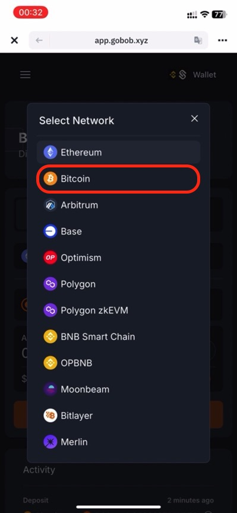

# Bridge with Binance Web3 Wallet

## Task: Bridge from Bitcoin to BOB

[BOB Gateway](https://app.gobob.xyz) lets you stake, swap, or lend your BTC from a single, unified interface so you can put your bitcoin to work earning yield faster than ever before.

We are partnering with Binance Web3 Wallet to offer this task to their users.

When you're done, you can complete [other Binance Web3 Wallet tasks](#more-tasks-on-bob) on BOB.

## Prerequisites

To complete this task you will need

- At least 0.0001 BTC on the Bitcoin Network in any wallet
- Binance Web3 Wallet (even if you have never used an EVM chain before)

That's it! You do not need any tokens on any EVM chain, including BOB. The Binance Web3 Wallet comes with an EVM address. You will have an option to receive ETH, the fee token on BOB, if you don't have any yet.

## Step-by-step Guide

1. Open your Binance Web3 Wallet app.

1. Tap "Wallets".

   

1. Tap "Web3".

   

1. Tap "Discover".

   

1. Tap the URL box.

   

1. Type `app.gobob.xyz` and press "return".

   

1. Tap "Connect Wallet".

   

1. Tap "Connect your EVM Wallet (Mandatory)".

   

1. Tap "Binance Web3 Wallet".

   

1. Tap "Connect your Bitcoin Wallet (Optional)".

   

1. Tap "Binance Web3 Wallet" or whatever wallet you use to hold your Bitcoin.

   

1. This is what the Connect Wallet screen looks like after connecting both EVM and Bitcoin wallets. If you are using a different Bitcoin wallet, your wallet icon may look different.

   

1. Change networks by tapping "Ethereum".

   

1. Tap "Bitcoin".

   

1. Type in the amount of BTC you will bridge. The minimum amount is 0.0001 BTC.

   

1. Tap "Bridge Asset".

   

1. A confirmation screen will appear, immediately followed by the next step.

   

1. Tap "Confirm".

   

1. Scroll down to see the Activity section, which shows the progress of your transaction.

   

1. After a few Bitcoin blocks your BTC will be finalised on BOB. You can verify the bridging is complete with the Activity section on the right of the page or by checking your WBTC balance on BOB.

   

## More Tasks on BOB

You can get even more Spice points by completing these other tasks on BOB.

<!-- TODO: Add links to other tasks -->

1. Solv: Mint at least 0.0001 Solvbtc and deposit to xSolvBTC on BOB.
1. Bedrock: Mint uniBTC greater than 0.0001 on BOB.
1. Pell: Deposit at least 0.0001 xSolvBTC or uniBTC into Pell on BOB.

We will add links to these tasks soon.

If you have any questions, please reach out to us on [Discord](https://discord.gg/gobob) or [Telegram](https://t.me/+CyIcLW2nfaFlNDc1). Welcome to the Bitcoin Renaissance on BOB!
