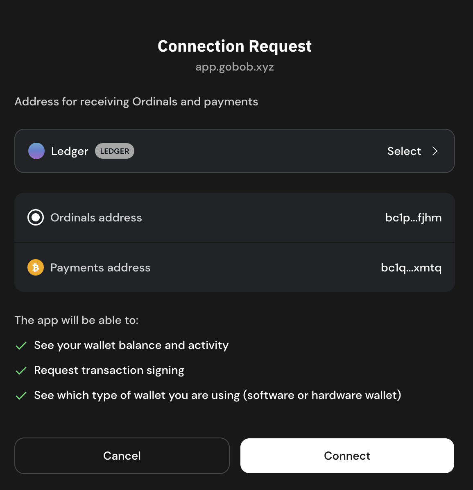
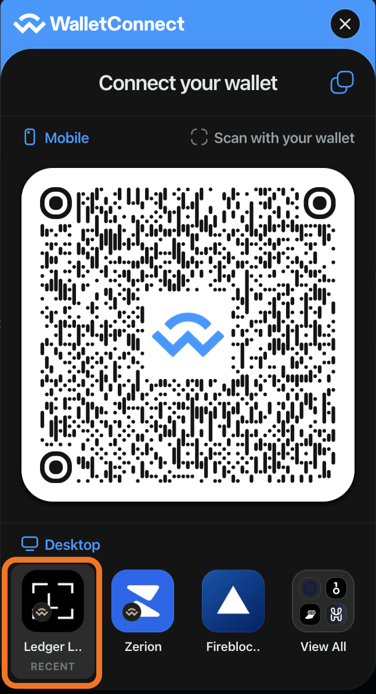
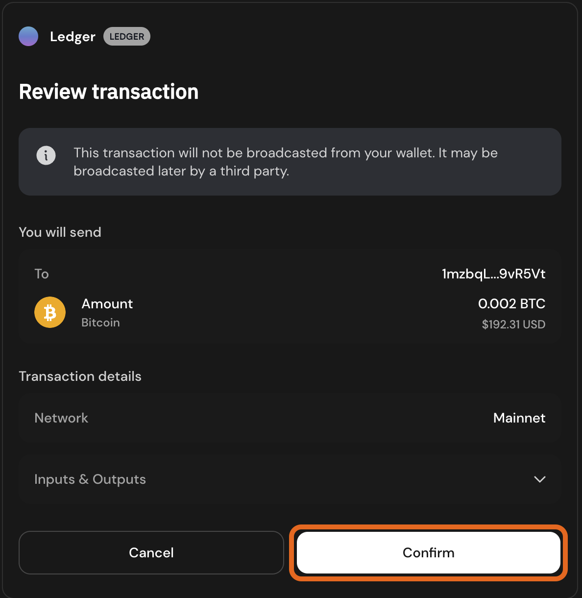

# Stake BTC with Ledger Wallet

## Earn Yield on Your BTC with BOB Stake

[BOB Stake](https://app.gobob.xyz) lets you stake, restake, or lend your BTC from a single, unified interface so you can put your BTC to work earning yield faster than ever before.

It's built on a trustless, RFQ-based cross-chain swap protocol that connects professional liquidity providers (LPs) with users through a seamless swapping experience. LPs handle the complexities of bridging and staking on behalf of users in exchange for a fee.

All you need is a Bitcoin wallet with some BTC to send and an EVM-compatible wallet to receive your Bitcoin LST on BOB. We'll even send you some ETH to cover the fees of your first few transactions on BOB.

## Prerequisites

To complete this task you will need

- A Ledger Hardware wallet with BTC on the Bitcoin network

That's it! You do not need any tokens on any EVM chain, including BOB. If you don't have an Ethereum or EVM address yet, this guide will show you how to create one in Ledger Live.

## Step-by-Step Guide

### Part One: Set Up Accounts

1. [Download the XVerse wallet](https://www.xverse.app/ledger-hardware-wallet-support). This will allow you to connect your Ledger's BTC account to the BOB Stake app.
1. [Connect your Ledger device to the XVerse wallet](https://support.xverse.app/hc/en-us/articles/17819233917965-How-to-Connect-Your-Ledger-Device-to-Xverse).
1. Create an EVM account for your Ledger device. This is sometimes also called an Ethereum address. We recommend these options.
   - Ledger Live: [Create an EVM account in Ledger Live](https://support.ledger.com/article/360009576554-zd)
   - MetaMask: [Connect your Ledger to MetaMask](https://support.ledger.com/article/4404366864657-zd)
   - Rabby: [Set up and use Rabby wallet to access your Ledger Ethereum (ETH) account](https://support.ledger.com/article/4409801559569-zd)

### Part Two: Stake

1. [Open the BOB Stake page](https://app.gobob.xyz/en/stake).

   

1. Click `Connect Wallet` in the top-right corner of the page.
1. Select BTC, then select XVerse.

   

1. Select your Ledger account and click `Connect` in the XVerse window that pops open.

   

1. Click your Bitcoin address in the top-right corner of the page.

   

1. Click `Connect EVM Wallet` in the sidebar that opens.

   

1. Choose your EVM account to connect. It will depend on the wallet software you chose in [Part One](#part-one-set-up-accounts). The next few steps will show how to connect to Ledger Live's Ethereum account with WalletConnect.

   

1. Click `Ledger Live`.

   

1. Click the EVM address you would like to use, then click `Connect`.

   

1. Back on the BOB Stake page, click the icon of two arrows to close the wallet drawer.

   

1. Click on your preferred staking strategy. This guide will use `Liquid Staking Solv-Babylon` as an example.

   

1. Enter the amount of BTC you would like to stake, then click `Stake`.

:::info Top up gas
We recommend leaving `Top up Gas` toggled on to convert a small amount of your BTC to ETH, which enables you to pay for transaction fees on BOB.
:::

1. Click `Confirm` in the XVerse window that opens.

   

1. Follow the steps on your Ledger device to sign the transaction.

:::tip staking complete
BOB will handle the rest of the process, including broadcasting your Bitcoin transaction staking wrapped BTC on BOB for you.
:::

1. To monitor the progress of the staking process, click the clock icon on the Stake page to open the Activity section in the sidebar.

   

1. This reveals the Activity section of the sidebar, which summarizes your ongoing and past staking transactions.

   

1. To see your staked BTC positions, open the "My Deposits" tab of the Stake page.

   

## Contact Us

If you have any questions, please reach out to us on [Discord](https://discord.gg/gobob) or [Telegram](https://t.me/+CyIcLW2nfaFlNDc1). Welcome to the Bitcoin Renaissance on BOB!
