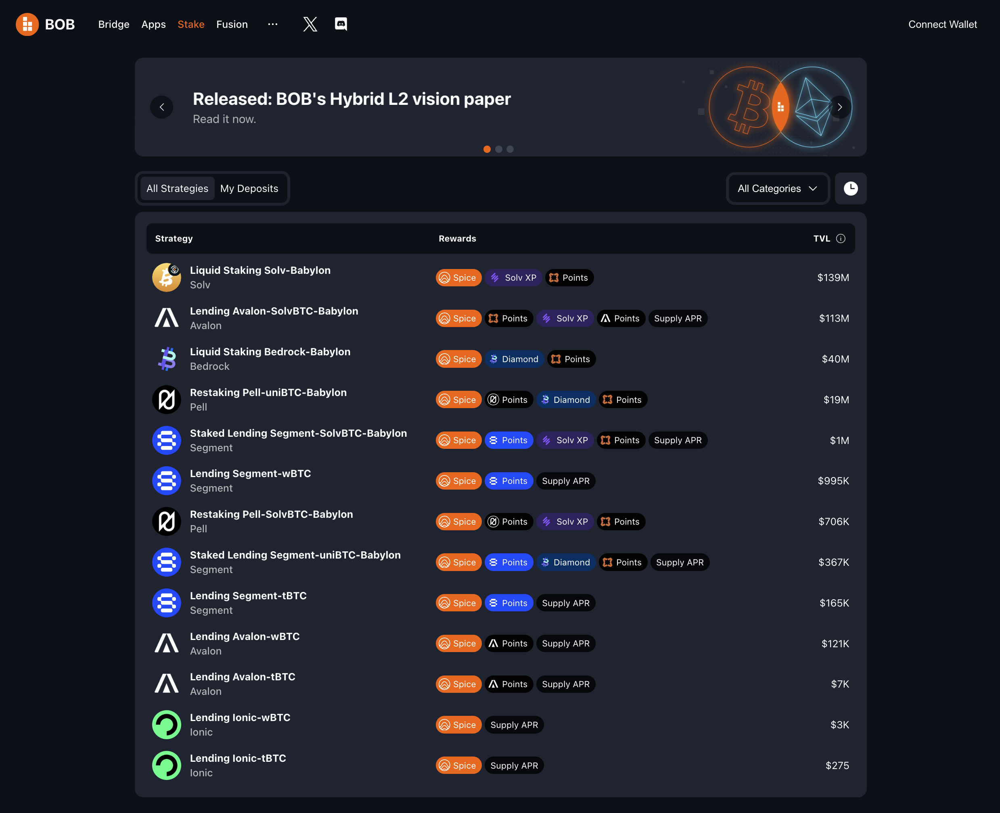

# Stake BTC with Ledger Wallet

## Earn Yield on Your BTC with BOB Stake

[BOB Stake](https://app.gobob.xyz) lets you stake, restake, or lend your BTC from a single, unified interface so you can put your BTC to work earning yield faster than ever before.

It's built on a trustless, RFQ-based cross-chain swap protocol that connects professional liquidity providers (LPs) with users through a seamless swapping experience. LPs handle the complexities of bridging and staking on behalf of users in exchange for a fee.

All you need is a Bitcoin wallet with some BTC to send and an EVM-compatible wallet to receive your Bitcoin LST on BOB. We'll even send you some ETH to cover the fees of your first few transactions on BOB.

## Prerequisites

To complete this task you will need

- A Ledger Hardware wallet with at least 0.0001 BTC on the Bitcoin network

That's it! You do not need any tokens on any EVM chain, including BOB. If you don't have an Ethereum or EVM address yet, this guide will show you how to create one in Ledger Live.

## Step-by-Step Guide

### Part One: Set Up Accounts

1. [Download the XVerse wallet](https://www.xverse.app/ledger-hardware-wallet-support). This will allow you to connect your Ledger's BTC account to the BOB Stake app.
   <!--  -->
1. [Connect your Ledger device to the XVerse wallet](https://support.xverse.app/hc/en-us/articles/17819233917965-How-to-Connect-Your-Ledger-Device-to-Xverse).
1. [Create an EVM account in Ledger Live](https://support.ledger.com/article/360009576554-zd).

### Part Two: Stake

1. [Go to the BOB Stake page](https://app.gobob.xyz/en/stake).
1. Connect your BTC account to BOB using XVerse.
1. Connect your EVM account to BOB using Ledger Live.
1. (rest of BOB Stake flow)
1. To monitor your staked BTC positions, open the "My Deposits" tab of the Stake page.

## Contact Us

If you have any questions, please reach out to us on [Discord](https://discord.gg/gobob) or [Telegram](https://t.me/+CyIcLW2nfaFlNDc1). Welcome to the Bitcoin Renaissance on BOB!
