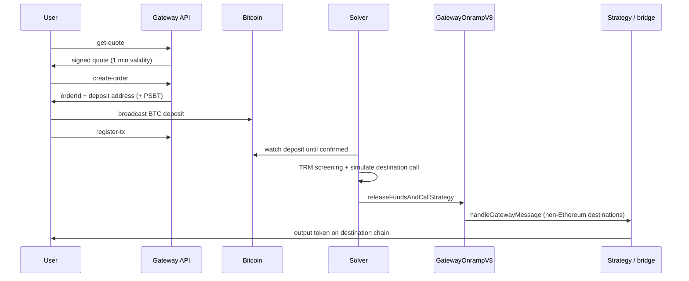
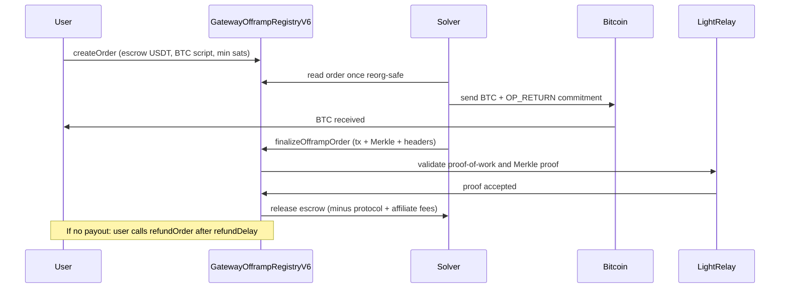

## Overview

BOB Gateway is an intents protocol for native BTC swaps. A user states what they want — BTC for a token, or a token for BTC — and a solver fills it from its own inventory. The solver holds BTC in a Bitcoin wallet and **USDT on Ethereum as the reserve asset**; every other token and chain is reached by swapping or bridging that USDT through third-party providers (Velora, Bungee, LayerZero OFT).

Two things follow from that design, and they shape everything below:

- **Nothing is pooled or locked in a vault.** The solver's own EOA is the custodian of the USDT, and its own Bitcoin wallet holds the BTC. Gateway's contracts never hold funds between transactions, except for the X-to-BTC escrow described below.
- **The two directions have different settlement mechanics.** X-to-BTC releases escrowed USDT only against an SPV proof verified by an on-chain Bitcoin Light Client. BTC-to-X settles on Bitcoin confirmations, with an automatic refund if the payout can't be delivered.

<Callout>
Custom strategies (`strategyTarget` / `strategyMessage`) and gas refills were removed. The API rejects them on every version — see [Migration](/gateway/migration).
</Callout>

## BTC to X

<Steps>
  <Step>

### Quote

    Your app calls `get-quote`. The solver prices the route against live markets and returns the guaranteed minimum output, an `estimatedTimeInSecs`, and a full `feeBreakdown` — solver pricing, protocol fee, affiliate fees, the destination gas priced in USDT (`executionFee`), and any bridge fee. The quote is signed by the API and valid for one minute; that signature travels back in `create-order`, so an order can only be created on terms Gateway actually issued.
  </Step>

  <Step>

### Order creation

    `create-order` returns an `orderId` and a **unique Bitcoin deposit address belonging to the solver's wallet**. If you passed the user's `sender` address, the response also carries a ready-to-sign PSBT (`psbtHex`) with coin selection already done.
  </Step>

  <Step>

### Bitcoin payment

    The user signs and broadcasts one Bitcoin transaction. Your app reports it with `register-tx`, which links the transaction to the order. Nothing on the destination chain has happened yet — the user has spent only their BTC and the Bitcoin miner fee.
  </Step>

  <Step>

### Screening and simulation

    Before anything is released, the deposit's UTXO sources and the payout recipients are screened with TRM Labs (up to 3 hops), and the destination call is pre-executed in a simulator so a route that would revert is caught before funds move.
  </Step>

  <Step>

### Atomic release

    Once the deposit is confirmed — cross-checked across independent Bitcoin explorer sources so a single API can't fake it — the solver sends **one** Ethereum transaction calling `releaseFundsAndCallStrategy` on `GatewayOnrampV8`:

    - USDT is pulled from the solver's EOA with `safeTransferFrom`
    - for an Ethereum destination it goes straight to the recipient; otherwise it's handed to a Gateway strategy contract that swaps or bridges onwards (a multicall wrapping Velora or Bungee, or a LayerZero OFT send)
    - the destination gas is withheld from the fill (`tokenWithheldForGasAmount`) to reimburse the solver, so the user never needs the destination gas token
    - affiliate and protocol fees are paid in the same transaction when the destination is Ethereum, and in a follow-up `payFees` call otherwise

    The whole release is all-or-nothing. The contract even reverts if the strategy fails to consume the payout it was handed, so tokens can't be stranded mid-flow.
  </Step>

  <Step>

### If it can't land

    A release that fails — prices drifted past the quoted minimum, the onward swap reverts — is re-quoted and retried with backoff for about an hour, then settled as a refund: BTC to the order's `refundAddress` if one was given, otherwise USDT to the order owner on Ethereum. See [Refunds](/gateway/refunds).
  </Step>
</Steps>

<Callout type="warn">
This direction is not SPV-verified: the user's BTC lands in the solver's own wallet, and the solver then releases USDT. What protects the user is the signed quote and the automatic refund path — not an on-chain proof. The on-chain Bitcoin Light Client secures the other direction, where the solver is the one who must prove it paid.
</Callout>

### Architecture diagram

## X to BTC

<Steps>
  <Step>

### Quote and order creation

    `get-quote` returns the minimum sats the user will receive, plus the solver fee, the Bitcoin miner fee for the payout (`inclusionFee`), and protocol and affiliate fees. `create-order` returns an EVM transaction that calls `createOrder` on `GatewayOfframpRegistryV6`, **escrowing the user's USDT in the contract** together with their Bitcoin output script, the minimum sat output, the affiliate fee list, and a creation deadline.

    Users starting from a different chain or token don't create the order themselves: their token is swapped and bridged to USDT on Ethereum through a third-party provider, and the arriving message is executed by a Gateway composer contract that creates the order on their behalf.
  </Step>

  <Step>

### Bitcoin payout

    The solver waits until the order creation is reorg-safe, screens the destination address, then sends BTC to the user's script with an `OP_RETURN` output committing to `keccak256(orderId, registryAddress)` — that's what ties an on-chain Bitcoin payment to this specific order and this specific registry.

    The payout txid is persisted before broadcast, so a crash degrades to "recorded but maybe unsent" rather than "sent but forgotten". The solver also refuses to pay within a 12-hour safety margin of the order's refund deadline, where the user could reclaim their USDT before the proof lands.
  </Step>

  <Step>

### SPV-verified settlement

    After confirmation, the solver submits the proof to `finalizeOfframpOrder`: the Bitcoin transaction, its Merkle proof, the coinbase transaction and its proof, and a chain of block headers. The `LightRelay` light client checks the headers' accumulated proof-of-work against the registry's on-chain `txProofDifficultyFactor`, and the registry then verifies that the paid output is at least `satOutputMinimum` and that the `OP_RETURN` hash matches the order.

    Only then does the escrow move: protocol fee, affiliate fees, and the remainder to the solver. A `spentTxHashes` mapping means one Bitcoin transaction can never settle two orders.
  </Step>

  <Step>

### Self-serve refund

    The order owner can call `refundOrder` once the on-chain `refundDelay` has passed (configurable between 12 hours and 7 days), returning the full escrowed amount. This is the user's unilateral exit — it needs no solver and no relayer.
  </Step>
</Steps>

<Callout>
This is where the trustlessness lives: the solver cannot touch the escrowed USDT without proving on-chain that it paid the user's Bitcoin address, and the user can always walk away with their funds after the refund delay.
</Callout>

### Architecture diagram

<Callout type="warn">
Users cannot currently submit Bitcoin proofs themselves, so an order can sit unsettled if proof submission stalls. Funds stay safe either way — the escrow can only be released against a valid proof, and it becomes reclaimable by the owner after the refund delay.
</Callout>

## Controls

Every order passes a fixed set of controls before funds move, in both directions:

| Control | What it does |
|---|---|
| Address screening | TRM Labs, up to 3 hops, on every inbound and outbound flow — BTC senders, USDT recipients, Bitcoin payout addresses, affiliate recipients |
| Simulation | The destination call is pre-executed in a sandbox and every address that touches funds inside it is screened |
| Rate limiting | Volume-based, per-account and global |
| Geo-IP blocking | Restricted jurisdictions are refused — see the [FAQ](/gateway/faq) for the current list |
| Circuit breaker | The solver can be shut down at the infrastructure level on anomaly detection |

## Contracts

| Contract | Role |
|---|---|
| `GatewayOnrampV8` | Releases the solver's USDT for a BTC deposit, directly or through a strategy, and settles fees |
| `GatewayOfframpRegistryV6` | Escrows USDT, verifies the Bitcoin payout proof, releases to the solver, and handles owner refunds |
| `LightRelay` | On-chain Bitcoin light client — validates block headers and their accumulated proof-of-work |
| Strategy contracts | Gateway-owned multicall and LayerZero targets that swap or bridge the payout onwards |
| Composer contracts | Execute an inbound bridge message to create an X-to-BTC order for users arriving from another chain |

Both Gateway contracts have been audited by Pashov and Common Prefix — see the [audit reports](https://docs.gobob.xyz/docs/reference/audits#bob-gateway).

## Next Steps

<Cards>
  <Card title="Integration Guide" icon="code" href="/gateway/integration">
    Start integrating Gateway into your app
  </Card>
  <Card title="Refunds" icon="arrow-rotate-left" href="/gateway/refunds">
    What happens when a swap can't be completed
  </Card>
  <Card title="Fees" icon="money-check-dollar" href="/gateway/fees">
    The full fee breakdown, quote-first
  </Card>
  <Card title="API Reference" icon="book" href="/api-reference/overview">
    Explore the complete API
  </Card>
</Cards>
